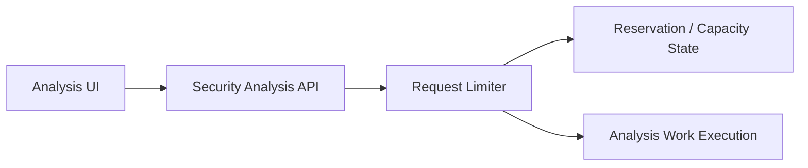
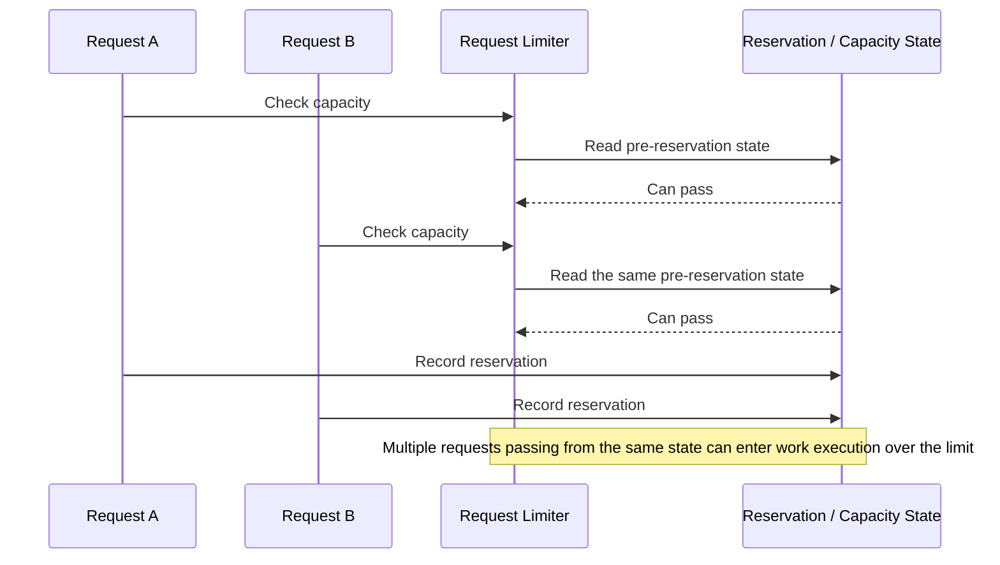
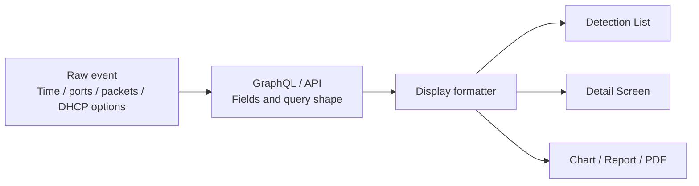
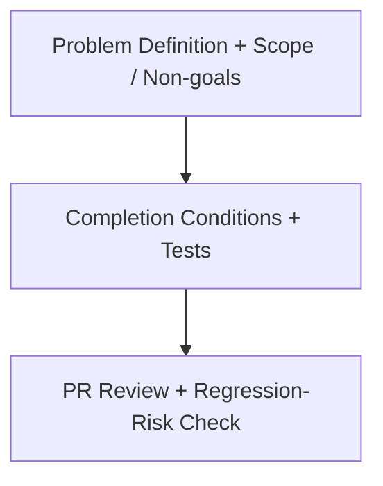

# ClumL

- Role: Software Engineer
- Period: 2025.03 - 2026.07

## Overview

In a security event analysis product suite, I narrowed operational symptoms into concrete technical problems and organized them with reproduction conditions and validation methods. The core of this recent ClumL work is not to describe the whole system, but to turn operational symptoms into narrow technical problems with verifiable conditions.

The representative work here is request-limiting concurrency. Detection/report display consistency, Rust service configuration workflow cleanup, compatibility checks, requirements/completion conditions, and PR review are separate changes where I checked the problem scope and compatibility with existing behavior.

## Representative Work

### AI Security Analysis Engine Request-Limiting Concurrency Issue

I separated a check-and-reserve race in request limiting from a long-wait symptom observed during customer demo server operation.

#### Problem Context

#### Failure Flow

**Problem Definition:** I reframed a long-wait operational symptom as a correctness problem in request limiting. If multiple requests read the same pre-reservation state, they can all pass before the reservation state is updated, allowing more work to enter execution than the effective limit allows.

**Solution:** I defined the invariant that capacity checks and reservation updates must operate against one reservation state. The fix direction was to remove the stale-state gap between checking capacity and recording reservation state.

**Rationale:** Reducing wait time or hiding the symptom in the UI would leave the limit-checking gap in place. I narrowed the issue to the decision point before work execution, where the request limiter must decide from one reservation state whether a request can pass.

**Selection:** The representative case is over-limit requests passing through the check-and-reserve race. Other long-wait failure modes, such as a TPM wait cap, were separated as follow-up work.

**Implementation:** From the operational symptom and logs, I organized reproduction conditions, the fix direction, and acceptance conditions around same-state capacity check and reservation update. I reflected that condition in the implementation change, then reviewed whether the PR change satisfied the acceptance condition and regression tests.

**Validation:** I captured the condition where requests could pass more than 10x beyond the allowed limit as a reproducible correctness problem. I checked whether over-limit requests were blocked and whether concurrent requests reading the same state could no longer over-reserve.

**Result:** The long-wait symptom was reframed as a rate-limit correctness problem, with acceptance conditions and regression tests that stop over-limit requests before work execution.

## Additional Work

### Detection And Report Display Consistency

Separately from the request-limiting concurrency work, I checked whether a detection result stayed readable as the same event across lists, detail screens, charts, and reports. In this context, the same event means detection time, source/destination ports, packet/body fields, DHCP options, and report filters carrying the same meaning across screens and generated outputs.

**Problem Definition:** Analysts choose an event in the detection list and then confirm the same result in detail screens, charts, and reports. If the time range, ports, packet fields, DHCP options, or chart labels differ across that path, users have to re-check whether they are still looking at the same detection result.

**Solution:** I did not treat the issues as isolated display typos. I split the path from raw event data to GraphQL/API fields, formatters, and list/detail/report output.

**Rationale:** The Report tab needed only the first event time, but its previous query also requested fields for the full event list, which could slow initial entry and customer selection. For DHCP options, adding the API field was not enough if the UI query and formatter did not show the same value in raw event, detection list, and detail views. That is why query shape, formatter behavior, fallback, localization, and visible output had to be reviewed together.

**Selection:** For Report tab, I used a screen-specific lightweight query and incremental rendering instead of broad server-schema changes. For DHCP options, I kept the change in the presentation formatter and aligned the visible format as `code: value`.

**Implementation:** I separated first-event query behavior, customer dropdown loading, and DHCP options API/display contract into separate issues. In PR review, I checked unused GraphQL field removal, paging caps, fallback behavior, formatter placement, missing localization keys, and cargo check/clippy/tests.

**Validation:** For DHCP options, I checked raw event lookup, detection list display, and detail display together. For Report tab, I reviewed whether the screen-specific query fetched only the needed values and whether the customer dropdown could work without waiting for every page to be collected.

**Result:** I separated Report tab query and customer-dropdown delay into distinct problems, then checked DHCP options API/display behavior from raw event data through visible screen output. Later display-change PRs had concrete review items for catching mismatches between API fields and product-visible output.

### Simplifying Detection-Decision Configuration Changes In A Rust Service

During operational validation, operators often needed to adjust the value used by a Rust service to decide when repeated network events should become a detection. Previously, even lowering that value to replay a pcap and inspect DB-published detection events required a code edit, build, binary replacement, and service restart.

**Problem Definition:** The occurrence-count-based detection decision value was hardcoded, so a small operational validation step expanded into code edits, builds, binary replacement, and service restarts.

**Solution:** I moved the operationally adjusted detection decision value out of hardcoded code and into externally supplied configuration.

**Rationale:** When the value had to be lowered for pcap replay and checked through DB-published detection events, the repeated build, binary replacement, and service restart work cost more than the value change itself. External configuration reduced the operational validation unit without rewriting detection logic.

**Selection:** I moved only the repeatedly adjusted decision value into external configuration. The detection logic stayed in place, while the part that previously required code edits, builds, and binary replacement moved to configuration input.

**Implementation:** I changed the Rust service to read the detection decision value from external configuration, reducing repeated operational changes to config-centered edits.

**Validation:** I compared the before/after workflow for one adjustment: lowering the decision value, replaying the pcap, and checking DB-published detection events. Before the change, that required code edits, a build, binary replacement, service restart, and then the same pcap/DB check. After the change, I could change the config value and run the same pcap/DB check without rebuilding or replacing the binary.

**Result:** One repeated setting change no longer required code edits, builds, or binary replacement, reducing the work before pcap replay and DB-publish verification by more than 30%.

### Problem Definition And PR Review

- Reviewed configuration, date/time handling, serialization, and test boundaries in Rust services to check compatibility risk against existing behavior.
- Clarified the problem, scope, non-goals, completion conditions, and test expectations before implementation so implementation and review used the same agreement.
- Reviewed PR scope, API/protocol compatibility, test coverage, lint/clippy results, and regression risk so changes did not move beyond the agreed problem scope.

## Skills

Rust, GraphQL, Yew, TypeScript, PostgreSQL, RocksDB
