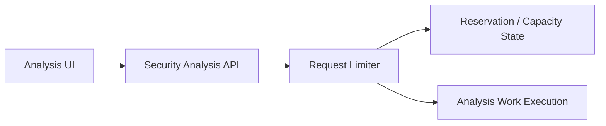
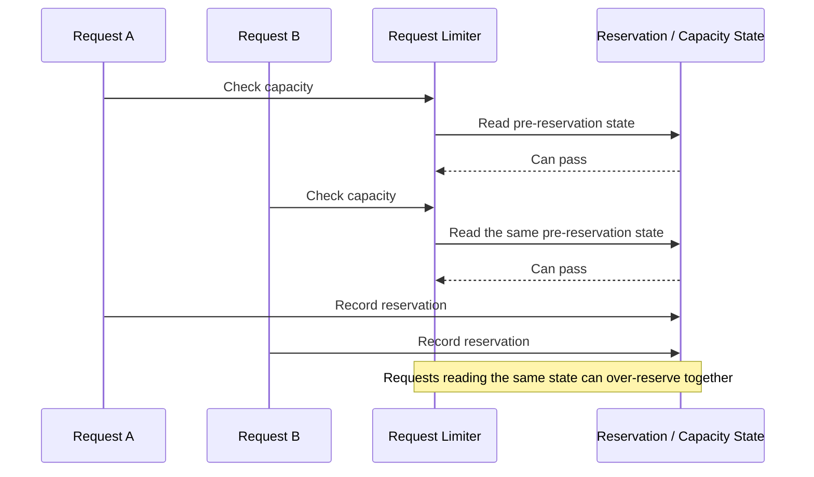

# ClumL

- Role: Software Engineer
- Period: 2025.03 - 2026.07

## Overview

In a security event analysis product suite, I narrowed production-facing symptoms to code-level causes, implemented focused fixes, and verified them with reproducible regression tests.

The representative implementations are a request-limiting concurrency fix and external configuration for repeated Rust-service operations. An additional Rust implementation migrated time handling from Chrono to Jiff. In detection and report work, I validated that query and formatter changes reached the visible output correctly.

## Representative Implementations

### Request-Limiting Concurrency in an AI Security Analysis Engine

I separated a check-and-reserve race in request limiting from a long-wait symptom observed during customer demo server operation.

#### Problem Context

#### Failure Flow

**Problem Definition:** Multiple requests could read the same pre-reservation state and pass together, allowing more work to enter execution than the effective limit allowed. I reframed the apparent long-wait symptom as a request-limiting correctness problem.

**Solution:** I moved the capacity check and reservation-state update into the same lock scope, removing the stale-state gap between those operations.

**Selection:** This change addressed the check-and-reserve race only. Other long-wait failure modes, such as a TPM wait cap, remained separate follow-up work.

**Implementation:** I changed request limiting so capacity checking and reservation updates used one locked state, then checked the implementation against the reproduction tests.

**Validation:** I reproduced a case where requests passed at more than 10x the allowed limit. Regression tests then checked that concurrent requests reading the same state could no longer over-reserve and that requests outside the limit did not pass.

**Result:** The fix kept requests within the allowed limit and locked the failure mode into regression tests. The 10x figure measures requests that passed beyond the limit before the fix.

### Externalizing a Detection-Decision Setting in a Rust Service

Operational validation required lowering an occurrence-count threshold, replaying a pcap, and checking DB-published detection events.

**Problem Definition:** Because the setting was hardcoded, a small adjustment expanded into a code edit, build, binary replacement, and service restart.

**Solution:** I moved the repeatedly adjusted setting out of code and into externally supplied configuration.

**Selection:** I kept the detection logic intact and moved only the setting repeatedly changed during pcap-based validation.

**Implementation:** I changed the Rust service to read the detection-decision setting from external configuration, reducing repeated changes to config edits.

**Validation:** I compared the same pcap replay and DB-publish check before and after the change. Afterward, the same validation could run after a config edit without rebuilding or replacing the binary.

**Result:** One repeated setting change no longer required a code edit, build, or binary replacement, reducing the operational work before pcap replay and DB verification by more than 30%.

## Additional Implementation

### Migrating Time Handling from Chrono to Jiff

**Problem Definition:** A successful compile was not enough to show that existing timestamp conversion and visible output remained compatible after changing a Rust time-handling dependency.

**Solution:** I first added Chrono baseline tests for MITRE and clustering timestamp helpers in the web application, moved the implementation to Jiff while retaining those tests, and removed the old dependency after the new behavior matched.

**Selection:** I kept the change to the MITRE and clustering timestamp helpers used by the UI, covering baseline tests, the Jiff implementation, and old-dependency cleanup in one migration flow.

**Implementation:** I split the change into three reviewable stages: Chrono baseline coverage, Jiff implementation, and removal of the Chrono dev-dependency plus transition-only comparison tests.

**Validation:** I ran tests for each stage and checked affected visible output, feature coverage, and server compatibility. Before/after screenshots and the affected surface were reviewed alongside the code change.

**Result:** I migrated the MITRE and clustering timestamp helpers to Jiff and removed Chrono from those modules.

## Supporting Validation Work

### Detection and Report Display

The Report tab needed only the first event time, while its existing query also requested fields for the full event list. I separated customer-dropdown loading as another problem and reviewed a screen-specific lightweight query plus incremental rendering.

For DHCP options, I checked GraphQL/API fields, formatter behavior, raw-event output, detection lists, and detail screens together. PR review covered unused fields, paging caps, fallbacks, formatter placement, localization, and cargo check, clippy, and test results.

My role in this work was to validate that query and formatter changes reached the visible output correctly.

### Problem Definition and PR Review

- Clarified the problem, scope, non-goals, completion conditions, and test expectations before implementation.
- Checked PR scope, API and protocol compatibility, test coverage, lint and clippy results, and regression risk.
- Kept direct implementation, review, and operational validation as separate contribution types.

## Skills

Rust, GraphQL, Yew, TypeScript, PostgreSQL, RocksDB
