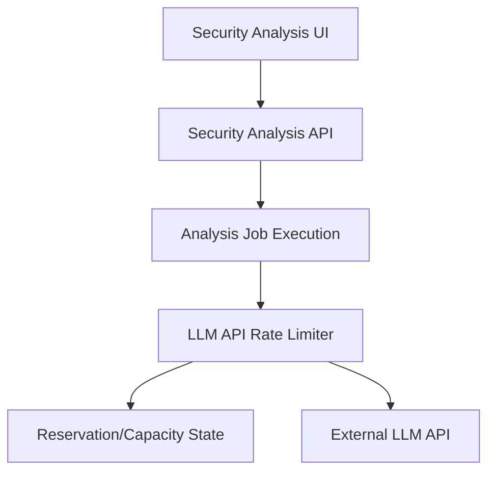
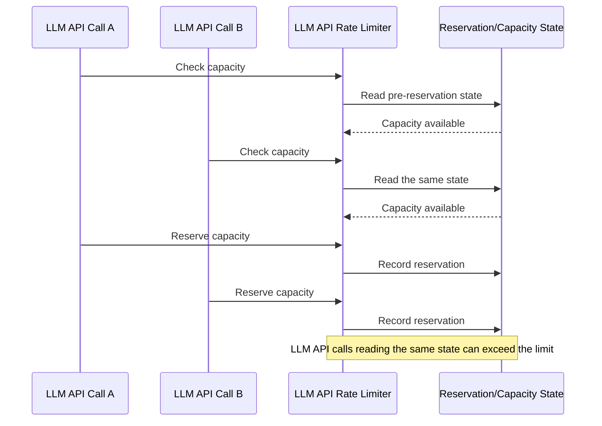

# ClumL

- Period: Mar 2025 - Jul 2026

## Fixing a Concurrency Bug in Outbound LLM API Rate Limiting

**Problem and diagnosis:** I analyzed outbound LLM API calls from an AI security analysis engine that remained pending for an extended time on a customer demo server. I isolated a check-and-reserve race in which concurrent calls read the same pre-reservation state, causing both the in-flight call count and pending token reservations to exceed their limits. I treated the maximum wait imposed by the fixed window as a separate cause.

**Constraints and decision:** The in-flight call count and estimated token reservation had to be checked against one current state, but holding the lock while waiting would block other calls. I kept only the check and reservation in the same lock section and released the lock before waiting.

**Failure flow before the fix:** Capacity checks and reservation updates ran in separate lock sections, allowing concurrent calls to read the same pre-reservation state.

On mobile, scroll horizontally to view the full sequence diagram.
{ .diagram-scroll-hint }

**Implementation:** I changed the outbound LLM API rate limiter to check one shared state and immediately reserve an in-flight slot and estimated tokens.

**Validation and result:** Before the fix, I reproduced over-reservation in which the in-flight call count and pending token reservations each reached at least ten times their respective limits. After the fix, regression tests confirmed that both values stayed within their respective limits under the same concurrency load.

## Moving a Network-Event Detection Threshold to External Configuration

**Problem and diagnosis:** Even a small threshold adjustment required a code change and a new binary deployment. The recurring cost came from fixing the value adjusted during pcap replay in code, rather than from the detection logic itself.

**Constraints and decision:** The recurring adjustment applied to the occurrence-count threshold. I kept the detection model intact and moved that value outside the code boundary into external configuration.

**Implementation:** I changed the Rust service to read the threshold from external configuration.

- Before: edit code → build → replace binary → restart service → replay pcap and check the database
- After: edit configuration → restart service → replay pcap and check the database

**Validation and result:** I compared the workflow before and after the change using the same pcap replay and DB event check. For one recurring setting change, removing the code edit, build, and binary replacement reduced the operational change time before pcap replay and the database check by at least 30%.

## Additional Work

### Migrating Time Handling from Chrono to Jiff

**Problem and diagnosis:** A successful compile did not prove that timestamp conversion and visible UI output remained unchanged after the dependency migration.

**Constraints and decision:** I first captured the existing Chrono behavior in tests for the timestamp helpers used by the MITRE and clustering views, then separated the Jiff migration from old-dependency cleanup.

**Implementation and validation:** I migrated those timestamp helpers to Jiff and removed their Chrono dependency. I compared stage-level tests, affected screens, feature behavior, server compatibility, and before-and-after screenshots.

### Report Query Scope and DHCP Option Display Validation

I separated the report's first-event-time query from customer-list loading, then reviewed a lightweight, report-specific query and incremental rendering for the customer list. For DHCP options, I compared the GraphQL API's `options` field, formatting logic, raw event, detection list, and detail view to confirm that the API change reached the rendered output.
