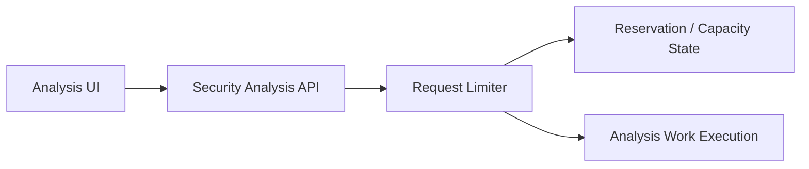
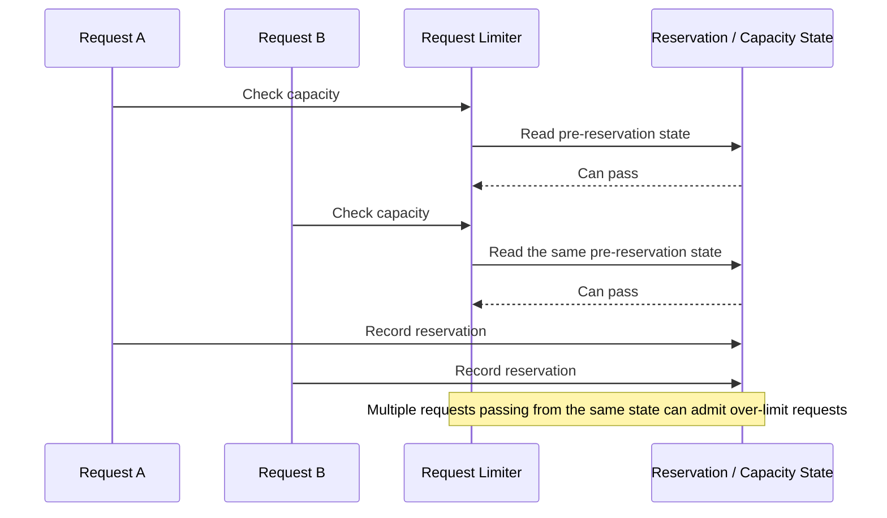
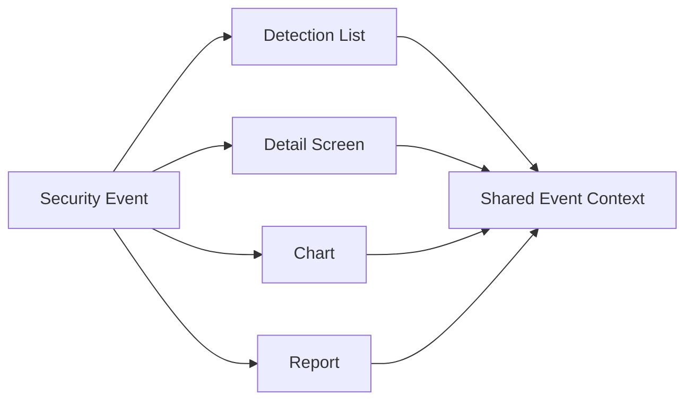
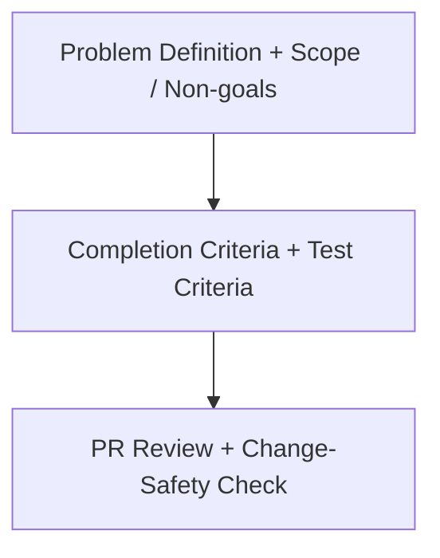

# ClumL

- Role: Software Engineer
- Period: 2025.03 - 2026.07

## Overview

I work on change-safety criteria in a security event analysis product suite. The core of my current role is not to describe the whole system, but to narrow operational symptoms into concrete technical problems and close them with verifiable criteria.

The representative work here is request-limiting concurrency. Detection/report display consistency, Rust service configuration workflow cleanup, compatibility checks, requirements/completion criteria, and PR review support those changes by keeping them inside the agreed problem scope and compatible with existing behavior.

## Representative Work

### AI Security Analysis Engine Request-Limiting Concurrency Issue

I separated a check-and-reserve race in request limiting from a long-wait symptom observed during customer demo server operation.

#### Problem Context

#### Failure Flow

**Problem Definition:** I reframed a long-wait operational symptom as a correctness problem in request limiting. If multiple requests read the same pre-reservation state, they can all pass before the reservation state is updated, admitting more work than the effective limit allows.

**Solution:** I defined the invariant that capacity checks and reservation updates must operate against the same state. The fix direction was to remove the stale-state gap between checking capacity and recording reservation state.

**Rationale:** Reducing wait time or hiding the symptom in the UI would not close over-limit admission. The issue had to be handled before work execution, where the request limiter decides whether a request may pass.

**Selection:** I narrowed the representative scope to over-limit admission caused by the check-and-reserve race. Other long-wait concerns, such as a TPM wait cap, were separated as follow-up failure modes.

**Implementation:** From the operational symptom and logs, I organized reproduction conditions and acceptance criteria around same-state capacity check and reservation update. I reviewed whether the PR change matched those criteria and the regression-test criteria.

**Validation:** I captured the condition where requests could pass more than 10x beyond the allowed limit as a reproducible correctness problem. The validation criterion was whether over-limit requests were blocked and whether concurrent requests reading the same state could no longer over-reserve.

**Result:** The long-wait symptom was closed as a rate-limit correctness problem, with invariants and regression-test criteria that prevent over-limit request admission.

**Limitation:** This is an admission-correctness result, not a latency, throughput, or incident-rate metric. I do not present it as p95/p99 latency improvement without a separate benchmark or operating log.

## Supporting Work Criteria

### Display-Consistency Review Criteria

This is a change-safety criterion that supports the request-limiting concurrency representative work. If detection lists, detail screens, charts, and reports show the same security event through different criteria, analyst trust can break, so I organized the review around whether event context stays consistent through the display path.

**Problem Definition:** If detection lists, detail screens, charts, and reports show the same security event through different criteria, analysts can lose trust in the result.

**Solution:** I grouped display issues around whether the same event context is preserved from lists through reports, instead of treating them as isolated screen bugs.

**Rationale:** Fixing each screen separately can leave drift in time ranges, port/packet display, or chart criteria. Analysis results and reports need API/query contracts and display rules to stay aligned.

**Selection:** I scoped this as change-safety work around display consistency, not as a new detection feature or detection-accuracy claim.

**Implementation:** I separated causes and change scope for detection list/detail views, time ranges, port/packet display, and chart/report behavior. I included API/query contract drift and display-rule drift in review criteria.

**Validation:** I checked whether analysis screens and reports preserved the same event context, and whether screen-level fixes changed the meaning of analysis results or report outputs.

**Result:** Detection/report display issues became reviewable through shared event-context criteria, reducing the risk that product changes weaken trust in analysis results and report outputs.

**Limitation:** This work defines display and review criteria. It is not a detection-accuracy, throughput, or latency metric.

### Simplifying Rust Service Configuration Changes

I separated HOG detection-period settings that previously led to code edits and build-centered deployment work into a configuration boundary.

**Problem Definition:** HOG detection-period settings that operators adjusted frequently still required code edits, builds, binary replacement, and service restarts.

**Solution:** I moved the detection-period setting out of hardcoded code and into externally supplied configuration.

**Rationale:** When frequently adjusted values stay inside the code boundary, small operating experiments create build-centered deployment work. Separating the configuration boundary reduces the operating change unit without rewriting detection logic.

**Selection:** I limited the result to simplifying the operational change workflow. I do not present this as a detection-accuracy, throughput, or latency improvement.

**Implementation:** I moved HOG detection-period settings into externally supplied configuration, reducing repeated operational changes to config-centered edits.

**Validation:** I checked that the configuration boundary did not break existing behavior and compared the repeated adjustment workflow before and after the change.

**Result:** Repeated adjustment work time was reduced by more than 30%.

**Limitation:** The 30%+ metric applies only to operating work for configuration changes, not to detection quality or runtime performance.

### Problem Definition And Review Criteria

- Reviewed configuration, date/time handling, serialization, and test boundaries in Rust services to check compatibility risk against existing behavior.
- Clarified the problem, scope, non-goals, completion criteria, and test expectations before implementation so implementation and review used the same criteria.
- Reviewed PR scope, API/protocol compatibility, test coverage, lint/clippy results, and change-safety risk so changes did not drift beyond the agreed problem scope.

## Skills

Rust, GraphQL, Yew, TypeScript, PostgreSQL, RocksDB
