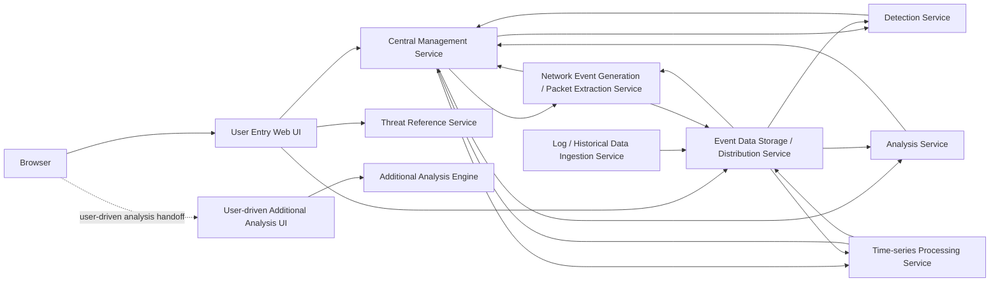

# ClumL

- Role: Software Engineer
- Period: 2025.03 - Present

## Overview

I work on a security event analysis product suite, focusing on detection/report display consistency, Rust service compatibility checks, GitHub-issue-based work definition, and PR review.

This page presents the current role as a display-consistency and change-safety case. It does not publish private implementation details; it documents the problem scope and verification criteria around keeping security analysis screens and reports aligned to the same event context.

## Key Work

- Improved analysis screen and report reliability by fixing display issues around detection list/detail views, time ranges, port/packet display, and chart/report behavior.
- Documented user entry, central management, event-data storage/distribution, and detection/analysis result flows with role-based names instead of publishing private service names.
- Clarified work scope and verification criteria through GitHub issues that include the problem, scope, completion criteria, and test expectations.
- Reviewed PR scope, API/protocol compatibility, test coverage, lint/clippy results, and change-safety risk.

## Representative Structure

Internal repository and service names are not published; this diagram uses role-based names only.

Within this public scope, I describe the part where security events need to keep the same context across the user-facing screens, central management service, event-data storage/distribution service, detection/analysis services, and report display rules.

## Work Areas

### Analysis UI and Report Display Consistency

I worked on detection list/detail views, time ranges, port/packet display, and chart/report behavior used by security analysts. This was not only screen cleanup; the goal was to keep analysis results and report outputs aligned around the same event context.

The core risk was that if list views, detail views, charts, and reports represented the same security event through different criteria, analyst trust could break. I therefore checked not only the screen-level fix but also whether the display rules and data flow stayed aligned to the same event context.

### Product Structure and Data-flow Documentation

I did not publish security details such as authentication, authorization, or certificate-operation procedures. Instead, I separated the user request path, control/status exchange with the central management service, event-data storage/distribution, and detection/analysis result return flow using role-based names.

### Rust Service Compatibility Checks

I reviewed configuration, date/time handling, serialization, and test boundaries in Rust services to check compatibility risk against existing behavior. Dependency, lint/clippy, CI failure, and compatibility risks are treated as explicit PR review checks.

### GitHub-Issue-Based Work Definition

Before implementation starts, I document the problem, scope, out-of-scope items, completion criteria, and test expectations in GitHub issues. These criteria help teammates and AI agents implement within the same scope and help PR review check scope and change-safety risk.

### PR Review and Quality Control

I review consistency between GitHub issues and PR diffs, API/protocol compatibility, test coverage, lint/clippy results, and change-safety risk so changes stay aligned with the agreed scope and verification criteria.

## Result and Boundaries

Within the public scope, this page focuses on product-quality and change-safety work: detection/report display consistency, Rust service compatibility checks, GitHub-issue-based work definition, and PR review criteria.

## Skills

Rust, GraphQL, Yew, TypeScript, PostgreSQL, RocksDB
