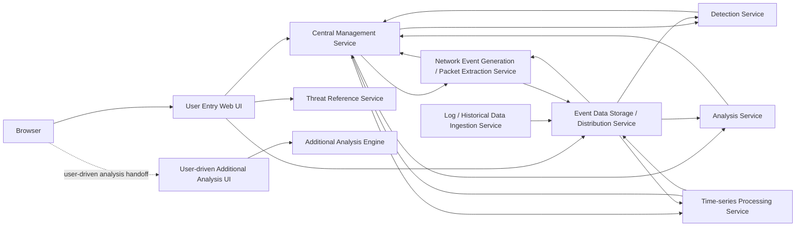

# ClumL

- Role: Software Engineer
- Period: 2025.03 - Present

## Overview

I work on change-safety criteria in a security event analysis product suite. I reframed a wait symptom observed during customer demo server operation as a rate-limiter concurrency problem, then organized detection/report display consistency, Rust service compatibility, requirements/completion criteria, and PR review into verifiable checks.

The core of this current role is separating the problem definition, validation criteria, and review scope I directly handled. The work is not just screen cleanup or delay handling; it narrows race conditions, API/query contracts, and compatibility risks into criteria that can improve product quality and change safety.

## Key Work

- Reframed a long-wait symptom observed during customer demo server operation as a check-and-reserve race in request limiting, then organized concurrency invariants and regression-test criteria to prevent over-limit request admission.
- Separated causes and change scope for display issues around detection list/detail views, time ranges, port/packet display, and chart/report behavior, then reviewed whether analysis screens and reports stayed aligned to the same event context.
- Documented user entry, central management, event-data storage/distribution, and detection/analysis result flows by role.
- Clarified work scope and verification criteria by documenting the problem, scope, out-of-scope items, completion criteria, and test expectations.
- Reviewed PR scope, API/protocol compatibility, test coverage, lint/clippy results, and change-safety risk so changes did not drift beyond the agreed problem scope.

## Representative Structure

The security event analysis flow can be summarized by role as follows.

My focus in this structure is keeping security events aligned across user-facing screens, the central management service, event-data storage/distribution, detection/analysis services, and report display rules.

## Work Areas

### Request-limiting concurrency and validation criteria

I separated a long-wait symptom observed during customer demo server operation into a check-and-reserve race in the request-limiting logic instead of treating it as a vague latency issue. The problem was captured as a reproducible invariant: concurrent callers could observe the same pre-reservation state and admit requests beyond the effective limit.

My scope was to reframe the symptom as a race condition and define the validation criteria: capacity checks and reservation updates should operate against the same state. In PR review, I checked whether that direction was applied together with regression tests. This work is about correctness criteria that prevent over-limit request admission, not a latency-metric claim.

### Analysis UI and Report Display Consistency

I worked on detection list/detail views, time ranges, port/packet display, and chart/report behavior used by security analysts. This was not only screen cleanup; the goal was to keep analysis results and report outputs aligned around the same event context.

The core risk was that if list views, detail views, charts, and reports represented the same security event through different criteria, analyst trust could break. I therefore checked not only the screen-level fix but also whether the display rules and data flow stayed aligned to the same event context.

### Product Structure and Data-flow Documentation

I separated the user request path, control/status exchange with the central management service, event-data storage/distribution, and detection/analysis result return flow by role.

### Rust Service Compatibility Checks

I reviewed configuration, date/time handling, serialization, and test boundaries in Rust services to check compatibility risk against existing behavior. Dependency, lint/clippy, CI failure, and compatibility risks are treated as explicit PR review checks.

### Work Criteria Definition

Before implementation starts, I document the problem, scope, out-of-scope items, completion criteria, and test expectations. These criteria help teammates and AI agents implement within the same scope and help PR review check scope and change-safety risk.

### PR Review and Quality Control

I review consistency between agreed criteria and PR diffs, API/protocol compatibility, test coverage, lint/clippy results, and change-safety risk so changes stay aligned with the agreed scope and verification criteria.

## Result

I framed the request-limiting concurrency issue with reproducible invariants and regression criteria, and reviewed detection/report display issues against a shared event context. Rust service compatibility checks, work criteria definition, and PR review became change-safety criteria that help product changes stay compatible with existing behavior and agreed requirements.

## Skills

Rust, GraphQL, Yew, TypeScript, PostgreSQL, RocksDB
