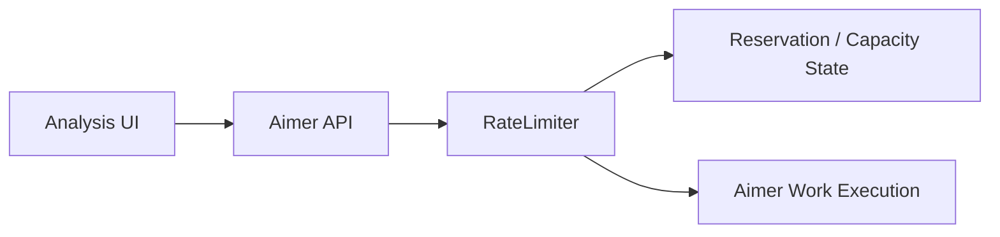
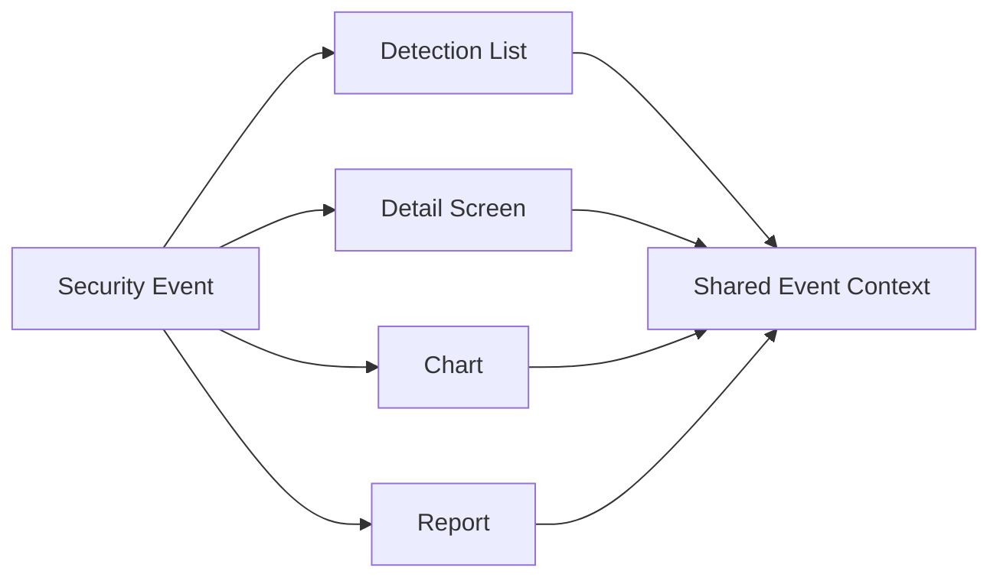
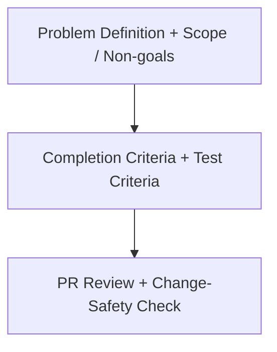

# ClumL

- Role: Software Engineer
- Period: 2025.03 - Present

## Overview

I work on change-safety criteria in a security event analysis product suite. The core of my current role is not to describe the whole system, but to narrow operational symptoms into concrete technical problems and close them with verifiable criteria.

The representative work here is request-limiting concurrency. Detection/report display consistency, Rust service configuration workflow cleanup, compatibility checks, requirements/completion criteria, and PR review support those changes by keeping them inside the agreed problem scope and compatible with existing behavior.

## Representative Work

### Aimer RateLimiter Over-Limit Request Admission

I separated a check-and-reserve race in request limiting from a long-wait symptom observed during customer demo server operation.

#### Problem Context

#### Failure Flow

What I did:

- Separated the long-wait symptom into a check-and-reserve race in `RateLimiter`.
- Defined the validation criterion that capacity checks and reservation updates must operate against the same state.
- Reviewed whether the PR change matched the acceptance criteria and regression-test criteria.

Validation/result:

- Captured the condition where requests could pass more than 10x beyond the allowed limit as a reproducible correctness problem.
- Framed the result as a correctness criterion that prevents over-limit request admission.

## Supporting Work Criteria

### Detection Screen and Report Display Consistency

If detection lists, detail screens, charts, and reports show the same security event through different criteria, analyst trust can break. This work checks whether event context stays consistent through the display path.

What I did:

- Separated causes and change scope for detection list/detail views, time ranges, port/packet display, and chart/report behavior.
- Reviewed whether analysis screens and reports stayed aligned to the same event context, rather than checking only screen-level fixes.
- Included API/query contracts and display-rule drift in review criteria.

Validation/result:

- Organized detection/report display issues around whether the same event context was preserved.
- Connected those checks to change-safety criteria so product changes would not weaken trust in analysis results and report outputs.

### Simplifying Rust Service Configuration Changes

I separated HOG detection-period settings that previously led to code edits and build-centered deployment work into a configuration boundary.

What I did:

- Moved HOG detection-period settings into externally supplied configuration, reducing repeated operational changes to config-centered edits.
- Kept the claim scoped to simplifying the operational change workflow, not to detection accuracy, throughput, or latency.

Validation/result:

- Reduced repeated adjustment work time by more than 30%.

### Problem Definition And Review Criteria

- Reviewed configuration, date/time handling, serialization, and test boundaries in Rust services to check compatibility risk against existing behavior.
- Clarified the problem, scope, non-goals, completion criteria, and test expectations before implementation so implementation and review used the same criteria.
- Reviewed PR scope, API/protocol compatibility, test coverage, lint/clippy results, and change-safety risk so changes did not drift beyond the agreed problem scope.

## Skills

Rust, GraphQL, Yew, TypeScript, PostgreSQL, RocksDB
