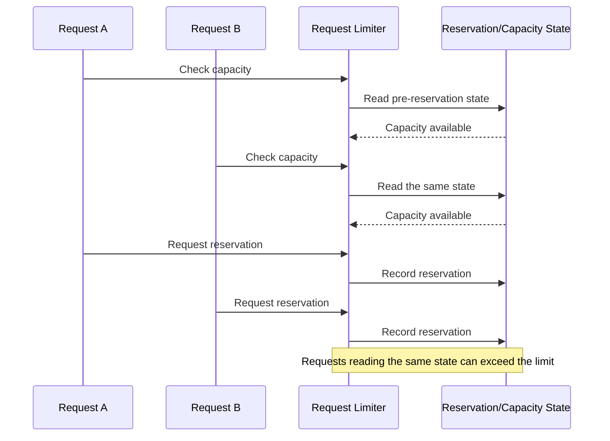

# ClumL

- Period: Mar 2025 - Jul 2026

## Overview

I traced operational issues in a security-event analysis product suite to code-level causes and implemented fixes. Depending on the problem, I verified the result with reproduction and regression tests or a before-and-after operational check. The primary examples are a request-limiting concurrency fix and external configuration for a recurring Rust service setting.

## Fixing a Request-Limiting Concurrency Bug in an AI Security Analysis Engine

I separated a long-wait symptom observed on a customer demo server into two failure modes. This work addressed over-limit requests passing because of a check-and-reserve race; a fixed-window wait-cap issue was a separate failure mode.

**Problem:** When concurrent requests read the same pre-reservation state, more requests than the configured limit could proceed to execution.

**Decision:** I placed the capacity check and reservation update in the same lock section, removing the gap where another request could read stale state.

**Implementation:** I changed the request-limiting logic to decide and immediately reserve against one shared state.

**Validation and result:** Before the fix, I reproduced over-reservation in which the check passed at least ten times the allowed number of requests. After the fix, regression tests verified that the number passing under the same concurrency stayed at or below the limit.

## Moving a Rust Detection Threshold to External Configuration

**Problem:** A network-event detection threshold was fixed in code, so even a small adjustment required a code change, build, binary replacement, and service restart.

**Decision:** I kept the detection logic intact and moved only the value repeatedly adjusted during pcap replay into external configuration.

**Implementation:** I changed the Rust service to read the threshold from configuration, reducing recurring changes to configuration updates.

**Validation and result:** I compared the before-and-after workflow using the same pcap replay and DB event check. For one recurring setting change, removing the code edit, build, and binary replacement reduced the operational change time before pcap replay and the DB check by at least 30%.

## Additional Work

### Migrating Time Handling from Chrono to Jiff

**Problem:** A successful compile did not prove that timestamp conversion and visible UI output remained unchanged after the dependency migration.

**Implementation and decision:** I first fixed the existing Chrono behavior in tests for the MITRE and clustering timestamp helpers, then split the Jiff migration and old-dependency cleanup into separate stages.

**Validation and result:** I compared tests at each stage, affected screens, feature-specific behavior, server compatibility, and before-and-after screenshots. The helpers were migrated to Jiff and the module's Chrono dependency was removed.

### Detection Screen and Report Review

I separated the report's first-event-time query from customer-list loading, then reviewed a lightweight query and incremental rendering approach for the data each screen needed. For DHCP options, I compared the GraphQL/API field, formatter, raw event, detection list, and detail view to confirm that the API change reached visible output.

## Technologies

Rust, GraphQL
