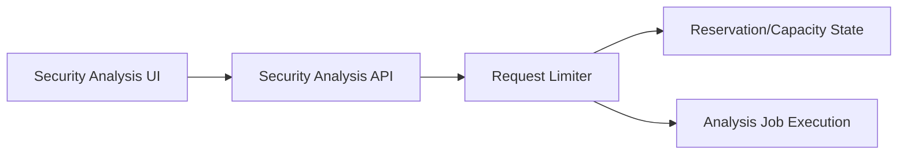
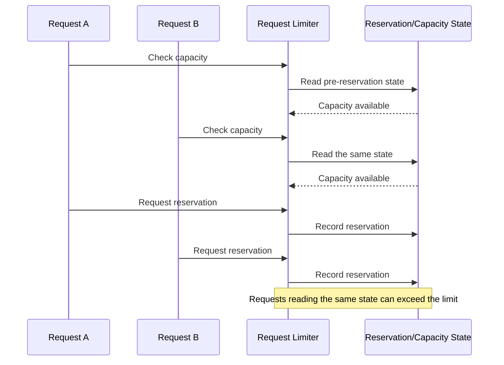
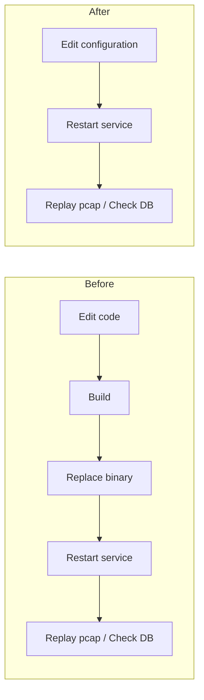

# ClumL

- Period: Mar 2025 - Jul 2026

## Overview

I traced operational issues in a security-event analysis product suite to code-level causes and implemented fixes. Depending on the problem, I verified the result with reproduction and regression tests or a before-and-after operational check. The primary examples are a request-limiting concurrency fix and moving a network-event detection threshold in a Rust service to external configuration.

## Fixing a Request-Limiting Concurrency Bug in an AI Security Analysis Engine

I analyzed requests that remained pending for an extended time on a customer demo server, isolated a check-and-reserve race that allowed more requests than the configured limit to pass, and fixed it. I treated the maximum wait caused by the fixed window as a separate cause.

An analysis request reaches job execution only after the API passes it through the limiter's capacity check and reservation update.

**Problem:** When concurrent requests read the same pre-reservation state, more requests than the configured limit could proceed to execution.

**Decision:** I placed the capacity check and reservation update in the same lock section, removing the gap where another request could read stale state.

**Implementation:** I changed the request-limiting logic to decide and immediately reserve against one shared state.

**Validation and result:** Before the fix, I reproduced over-reservation that allowed at least ten times as many requests as configured through the limiter. After the fix, regression tests confirmed that the limiter allowed no more requests than configured under the same concurrency load.

## Moving a Network-Event Detection Threshold to External Configuration

**Problem:** A network-event detection threshold was fixed in code, so even a small adjustment required a code change, build, binary replacement, and service restart.

**Decision:** I kept the detection logic intact and moved only the value repeatedly adjusted during pcap replay into external configuration.

**Implementation:** I changed the Rust service to read the threshold from configuration, reducing recurring changes to configuration updates.

**Validation and result:** I compared the before-and-after workflow using the same pcap replay and DB event check. For one recurring setting change, removing the code edit, build, and binary replacement reduced the operational change time before pcap replay and the DB check by at least 30%.

## Additional Work

### Migrating Time Handling from Chrono to Jiff

**Problem:** A successful compile did not prove that timestamp conversion and visible UI output remained unchanged after the dependency migration.

**Implementation and decision:** I first captured the existing Chrono behavior in tests for the timestamp helpers used by the MITRE and clustering views, then separated the Jiff migration from the old-dependency cleanup.

**Validation and result:** I compared stage-level tests, affected screens, feature behavior, server compatibility, and before-and-after screenshots. I migrated those timestamp helpers to Jiff and removed their Chrono dependency.

### Report Query Scope and DHCP Option Display Validation

I separated the report's first-event-time query from customer-list loading, then reviewed a lightweight, report-specific customer query and incremental rendering for the customer list. For DHCP options, I compared the GraphQL API's `options` field, formatting logic, raw event, detection list, and detail view to confirm that the API change reached the rendered output.

## Technologies

Rust, concurrency control, rate limiting, external configuration for a network-event detection threshold, GraphQL, pcap replay, regression testing, Chrono/Jiff dependency migration
