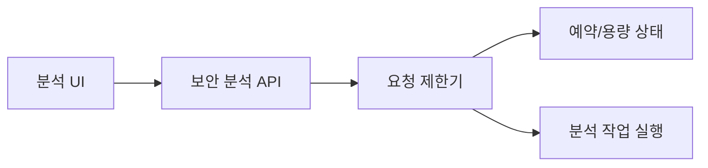
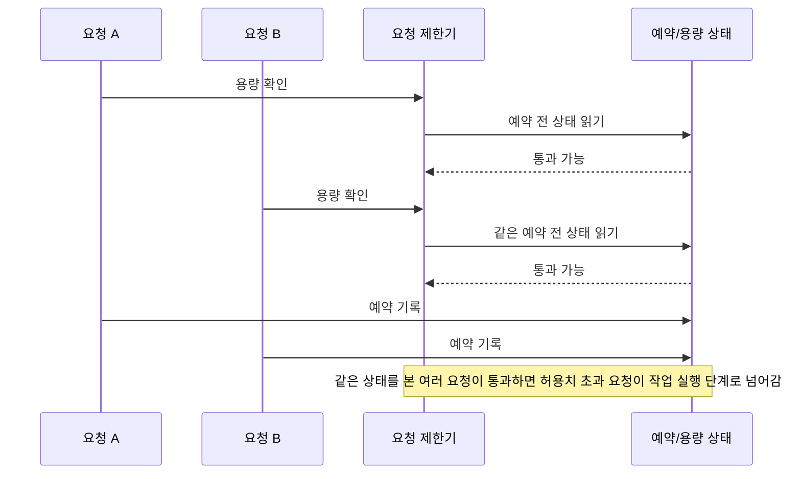
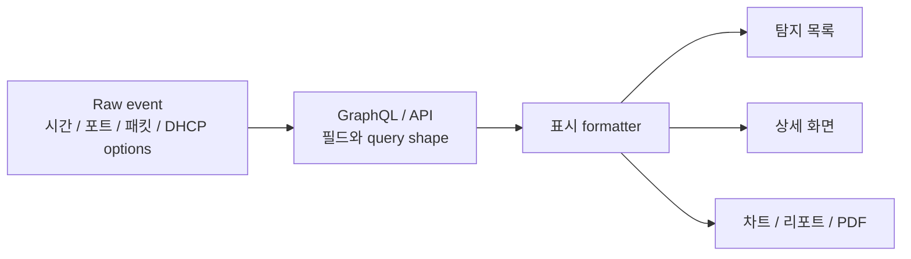
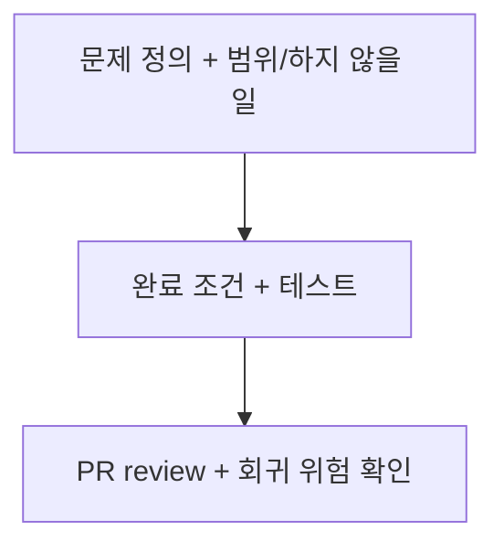

# ClumL

- 역할: Software Engineer
- 기간: 2025.03 - 2026.07

## 개요

보안 이벤트 분석 제품군에서 운영 증상을 구체적인 기술 문제로 좁히고, 재현 조건과 검증 방법을 정리했습니다. 최신 경력의 핵심은 전체 시스템 설명이 아니라, 운영 중 드러난 문제를 좁은 기술 문제로 재정의하고 확인 가능한 조건으로 정리하는 일입니다.

대표 작업은 요청 제한 동시성 문제입니다. 탐지 화면·리포트 표시 일관성, Rust 서비스 설정 변경 절차 단순화, compatibility 확인, 요구사항·완료 조건 정리, PR review는 각각 별도 변경에서 문제 범위와 기존 동작을 확인한 작업입니다.

## 대표 작업

### AI 보안 분석 엔진 요청 제한 동시성 문제

고객사 데모 서버 운영 중 관찰된 장시간 대기 증상에서 요청 제한 로직의 확인-예약 경합을 분리했습니다.

#### 문제 맥락

#### 실패 흐름

**문제 정의:** 장시간 대기처럼 보이던 운영 증상을 요청 제한 로직의 정확성 문제로 다시 정의했습니다. 여러 요청이 같은 예약 전 상태를 보고 동시에 통과하면, 실제 허용치보다 많은 요청이 작업 실행 단계로 넘어갈 수 있었습니다.

**해결 방법:** 용량 확인과 예약 상태 갱신이 같은 예약 상태를 보고 처리되어야 한다는 불변 조건을 세웠습니다. 수정 방향은 확인과 예약 사이에 낡은 상태를 읽는 틈을 없애는 것이었습니다.

**근거:** 대기 시간을 임의로 줄이거나 UI에서 증상만 숨기면 요청 제한 로직이 허용치를 넘긴 요청을 통과시키는 지점은 남습니다. 그래서 작업 실행 전에 요청 제한기가 하나의 예약 상태로 통과 여부를 결정해야 한다는 조건으로 문제 위치를 좁혔습니다.

**선택:** 이 작업에서는 확인-예약 경합으로 허용치 초과 요청이 통과하던 문제를 다뤘습니다. TPM 대기 상한처럼 다른 장시간 대기 실패 모드는 별도 후속 문제로 분리했습니다.

**구현:** 운영 증상과 로그를 바탕으로 재현 조건과 수정 방향을 정리하고, 용량 확인과 예약 상태 갱신이 하나의 예약 상태를 보도록 수용 조건을 만들었습니다. 이 조건을 구현 변경에 반영한 뒤, PR 변경이 수용 조건과 회귀 테스트를 만족하는지 검토했습니다.

**검증:** 허용치 대비 10배 이상 초과 요청 통과가 발생하던 상황을 재현 가능한 조건으로 고정했습니다. 확인할 점은 허용치 바깥의 요청을 통과시키지 않는지, 그리고 같은 상태를 본 동시 요청이 과다 예약을 만들지 않는지였습니다.

**결과:** 장시간 대기 증상을 요청 제한 정확성 문제로 재정의하고, 허용치 초과 요청이 작업 실행 단계로 넘어가지 않도록 수용 조건과 회귀 테스트를 정리했습니다.

## 추가 작업

### 탐지 화면·리포트 표시 일관성

요청 제한 동시성 작업과 별개로, 탐지 결과가 목록·상세 화면·차트·리포트에서 같은 이벤트로 읽히는지 확인했습니다. 여기서 같은 이벤트란 탐지 시각, 출발지/목적지 포트, packet/body field, DHCP options, 리포트 필터가 화면과 산출물 사이에서 같은 의미로 전달되는 상태입니다.

**문제 정의:** 분석자는 탐지 목록에서 이벤트를 고르고 상세 화면, 차트, 리포트로 같은 결과를 확인합니다. 이 흐름에서 시간 범위, 포트, packet field, DHCP options, chart label이 서로 다르게 보이면 사용자는 같은 탐지 결과를 보고 있는지 다시 대조해야 합니다.

**해결 방법:** 표시 문제를 화면 단위 오탈자처럼 나누지 않고, raw event에서 GraphQL/API field, formatter, 목록·상세·리포트 출력으로 이어지는 흐름으로 나눠 확인했습니다.

**근거:** Report tab은 first event time만 필요했지만 기존 query가 전체 event list용 field까지 함께 요청해 초기 진입과 customer 선택이 늦어질 수 있었습니다. DHCP options는 API field가 생겨도 UI query와 formatter가 따라오지 않으면 raw event, 탐지 목록, 상세 화면에서 보이는 값이 어긋납니다. 그래서 query shape, formatter, fallback, localization, 표시 확인을 한 흐름으로 봐야 했습니다.

**선택:** Report tab은 server schema를 넓게 바꾸지 않고 화면 전용 lightweight query와 incremental rendering으로 처리했습니다. DHCP options는 새 parser를 붙이지 않고 presentation formatter에서 `code: value` 형식을 맞추는 변경으로 정리했습니다.

**구현:** first event query, customer dropdown loading, DHCP options 표시/API contract를 별도 문제로 나눴습니다. PR review에서는 unused GraphQL field 제거, paging cap, fallback, formatter 위치, missing localization key, cargo check/clippy/tests 수행 여부를 확인했습니다.

**검증:** DHCP options는 raw event 조회, 탐지 목록, 상세 화면 표시를 함께 확인했습니다. Report tab은 기존 shared query를 무리하게 바꾸지 않고 화면 전용 query가 필요한 값만 가져오는지, customer dropdown이 전체 page 수집을 기다리지 않아도 동작하는지 검토했습니다.

**결과:** Report tab query와 customer dropdown 지연을 별도 문제로 나누고, DHCP options 표시/API contract를 raw event부터 화면 표시까지 이어서 확인했습니다. 이후 표시 변경 PR에서 화면 출력과 API field가 어긋나는 회귀를 확인할 수 있는 review 항목을 남겼습니다.

### Rust 서비스 탐지 판정값 설정 변경 절차 단순화

운영 검증 중 네트워크 이벤트가 일정 횟수를 넘으면 탐지로 판정하는 값을 자주 조정해야 했습니다. 기존에는 값을 낮춰 pcap을 재생하고 DB에 publish된 이벤트로 결과를 확인하려 해도, 코드 수정과 build를 거쳐 실행 중인 서버의 binary를 교체하고 service를 다시 시작해야 했습니다.

**문제 정의:** 발생 횟수 기반 탐지 판정값이 코드에 하드코딩되어 있어, 작은 운영 검증도 code edit, build, binary 교체, service restart를 포함한 배포성 절차로 커졌습니다.

**해결 방법:** 운영에서 조정하는 탐지 판정값을 코드 하드코딩에서 분리하고 외부 config로 주입할 수 있게 바꿨습니다.

**근거:** 판정값을 낮춰 pcap 재생 결과와 DB에 publish된 탐지 이벤트를 확인하는 작업에서는 값 자체보다 build, binary 교체, service restart가 더 큰 반복 비용이 됐습니다. 설정을 외부로 분리하면 탐지 로직을 재작성하지 않고 운영 검증 단위를 줄일 수 있었습니다.

**선택:** pcap 재생으로 반복 확인하던 판정값만 외부 config로 뺐습니다. 탐지 로직은 유지하고, 코드 수정과 build, binary 교체가 필요하던 부분을 설정값 주입으로 옮겼습니다.

**구현:** Rust 서비스가 탐지 판정값을 외부 config에서 읽도록 바꾸고, 반복 운영 변경을 config 수정 중심으로 낮췄습니다.

**검증:** 판정값을 한 번 낮춰 pcap을 재생하고 DB에 publish된 탐지 이벤트를 확인하는 작업을 기준으로 전후 절차를 비교했습니다. 변경 전에는 code edit, build, binary 교체, service restart 후 같은 pcap/DB 확인을 진행했고, 변경 후에는 build와 binary 교체 없이 config 값을 바꾼 뒤 같은 pcap/DB 확인 흐름으로 검증했습니다.

**결과:** 반복 설정 변경 1회에서 code edit, build, binary 교체가 빠졌고, pcap 재생과 DB publish 확인에 들어가기까지의 설정 변경 작업 시간이 30% 이상 줄었습니다.

### 문제 정의와 PR 리뷰

- Rust 서비스의 설정, 날짜·시간 처리, serialization, 테스트 경계를 검토하며 기존 동작과의 compatibility risk를 확인했습니다.
- 작업을 시작하기 전에 문제, 범위, 하지 않을 일, 완료 조건, 테스트 기대값을 정리해 구현과 review가 같은 합의를 보게 했습니다.
- PR 변경 범위, API/protocol compatibility, test coverage, lint/clippy, 회귀 위험을 검토해 변경이 합의된 문제 범위 밖으로 번지지 않게 했습니다.

## 기술

Rust, GraphQL, Yew, TypeScript, PostgreSQL, RocksDB
