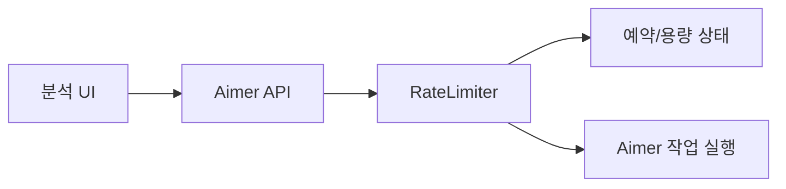
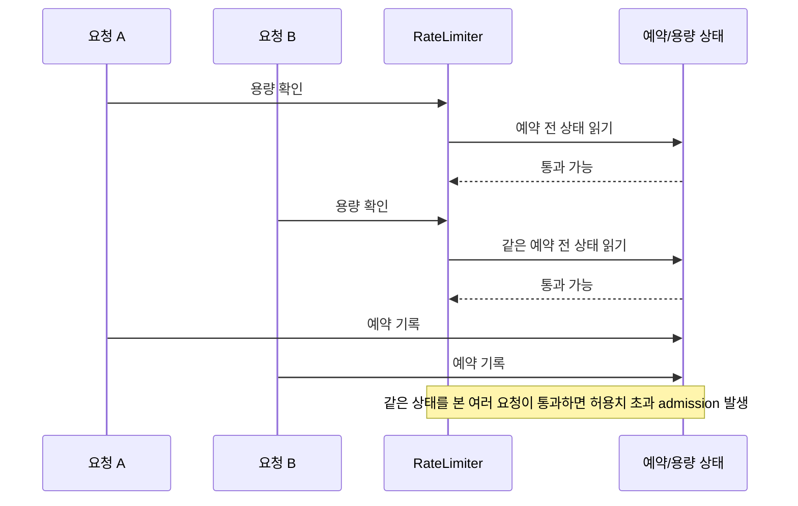
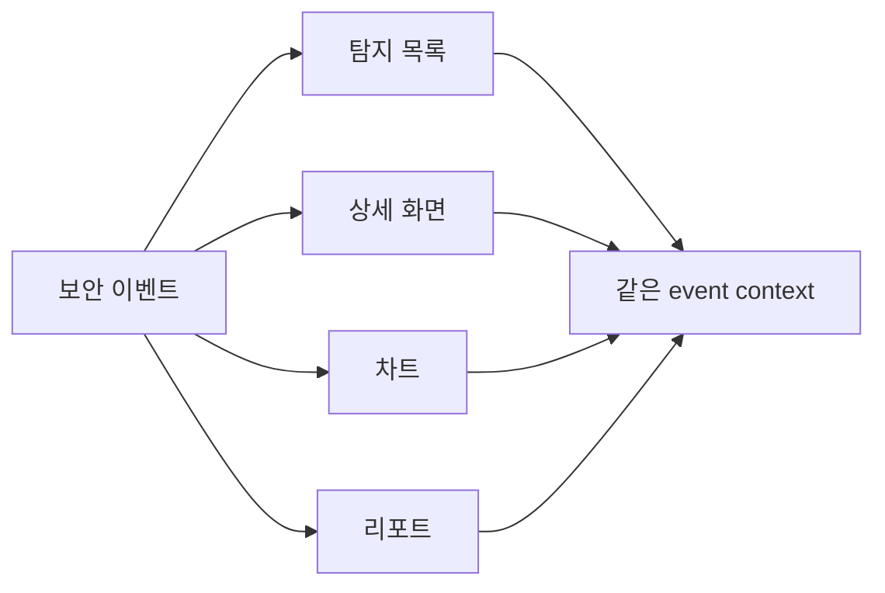
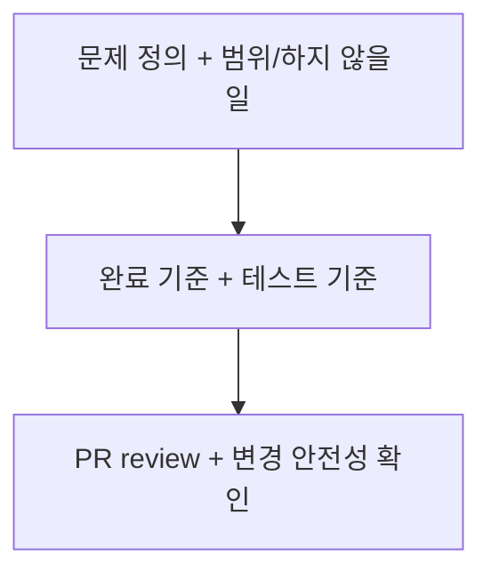

# ClumL

- 역할: Software Engineer
- 기간: 2025.03 - Present

## 개요

보안 이벤트 분석 제품군에서 변경 안전성 기준을 다룹니다. 최신 경력의 핵심은 전체 시스템 설명이 아니라, 운영 중 드러난 문제를 좁은 기술 문제로 재정의하고 검증 가능한 기준으로 닫는 일입니다.

대표 작업은 요청 제한 동시성 문제입니다. 탐지 화면·리포트 표시 일관성, Rust 서비스 compatibility, 요구사항·완료 기준 정리, PR review는 각 변경이 합의된 문제 범위와 기존 동작을 깨지 않도록 확인하는 보조 기준으로 연결했습니다.

## 대표 작업

### Aimer RateLimiter 동시 요청 초과 통과 문제

고객사 데모 서버 운영 중 관찰된 장시간 대기 증상에서 요청 제한 로직의 확인-예약 경합을 분리했습니다.

#### 문제 맥락

#### 실패 흐름

내가 한 일:

- 장시간 대기 증상을 `RateLimiter`의 확인-예약 경합으로 분리했습니다.
- 용량 확인과 예약 상태 갱신이 같은 상태 기준에서 처리되어야 한다는 검증 기준을 세웠습니다.
- PR 변경이 수용 기준과 회귀 테스트 기준에 맞는지 검토했습니다.

검증/결과:

- 허용치 대비 10배 이상 초과 요청 통과가 발생하던 상황을 재현 가능한 조건으로 정리했습니다.
- 허용치 바깥의 요청을 통과시키지 않는 정확성 기준으로 결과를 닫았습니다.

## 보조 작업 기준

### 탐지 화면과 리포트 표시 일관성

탐지 목록, 상세 화면, 차트, 리포트가 같은 보안 이벤트를 서로 다른 기준으로 보여주면 분석 신뢰성이 깨질 수 있습니다. 이 작업은 event context가 끝까지 유지되는지 확인하는 표시 기준 정리입니다.

내가 한 일:

- 탐지 목록/상세, time range, port/packet, chart/report 표시 문제에서 원인과 수정 범위를 분리했습니다.
- 화면 단위 수정만 보지 않고, 분석 화면과 리포트가 같은 이벤트 맥락을 유지하는지 검토했습니다.
- API/query contract와 표시 기준이 어긋날 수 있는 변경을 review 기준에 포함했습니다.

검증/결과:

- 탐지 화면·리포트 표시 문제를 같은 event context 유지 여부로 검토할 수 있게 정리했습니다.
- 제품 변경이 분석 결과와 보고서 산출물의 신뢰성을 깨지 않도록 변경 안전성 기준으로 연결했습니다.

### 문제 정의와 리뷰 기준

- Rust 서비스의 설정, 날짜·시간 처리, serialization, 테스트 경계를 검토하며 기존 동작과의 compatibility risk를 확인했습니다.
- 작업을 시작하기 전에 문제, 범위, 하지 않을 일, 완료 기준, 테스트 기준을 정리해 구현과 review가 같은 기준으로 진행되게 했습니다.
- PR 변경 범위, API/protocol compatibility, test coverage, lint/clippy, change-safety risk를 검토해 변경이 합의된 문제 범위 밖으로 번지지 않게 했습니다.

## 기술

Rust, GraphQL, Yew, TypeScript, PostgreSQL, RocksDB
