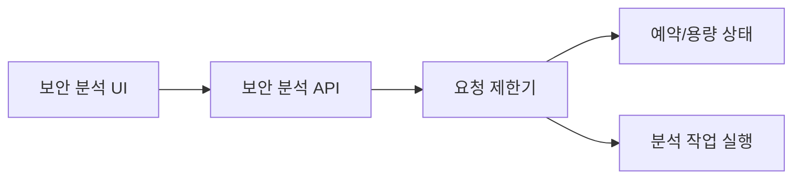
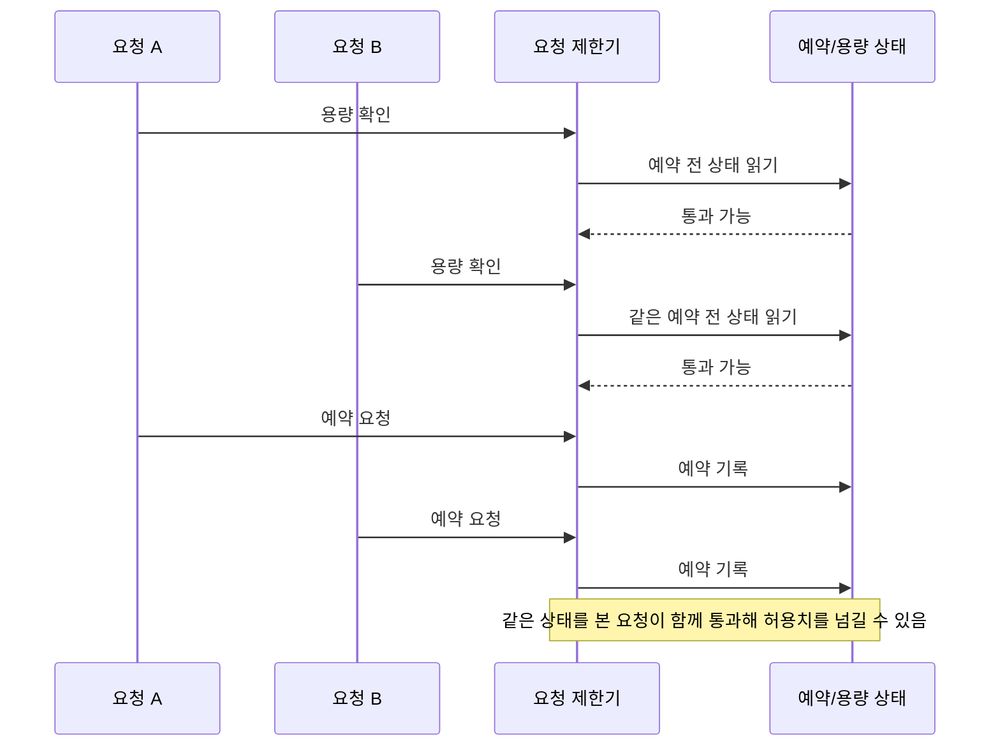
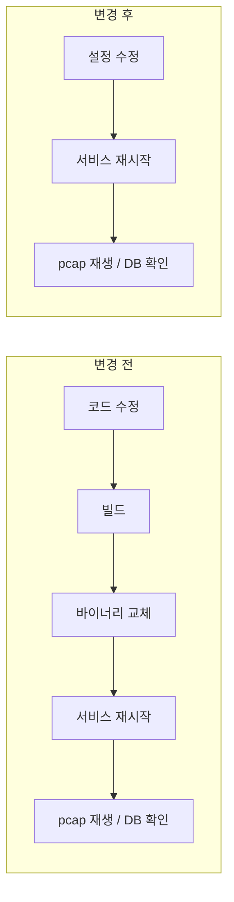

# ClumL

- 기간: 2025.03 - 2026.07

## 개요

보안 이벤트 분석 제품군에서 운영 중 발견한 문제를 코드 수준의 원인으로 좁히고 수정했습니다. 결과는 문제에 따라 재현·회귀 테스트 또는 동일 운영 절차의 전후 비교로 확인했습니다. 대표 작업은 요청 제한 동시성 수정과 Rust 서비스의 반복 운영 설정 외부화입니다.

## AI 보안 분석 엔진 요청 제한 로직의 동시성 문제

고객사 데모 서버의 장시간 대기 증상을 분석해, 허용치보다 많은 요청을 통과시키는 확인-예약 경합을 원인 중 하나로 분리하고 수정했습니다. 고정 시간창의 대기 상한 문제는 별도 실패 모드로 구분했습니다.

분석 요청은 API에서 요청 제한기의 용량 확인과 예약 기록을 통과해야 작업 실행으로 이어집니다.

**문제:** 여러 요청이 같은 예약 전 상태를 읽으면 실제 허용치보다 많은 요청이 작업 실행 단계로 넘어갈 수 있었습니다.

**판단:** 용량 확인과 예약 기록을 같은 잠금 구간에서 처리해 낡은 상태를 읽는 틈을 없앴습니다.

**구현:** 요청 제한 로직이 하나의 예약 상태를 기준으로 통과 여부를 확인하고 즉시 예약을 기록하도록 수정했습니다.

**검증과 결과:** 수정 전에는 허용치보다 10배 이상 많은 요청이 통과하는 과다 예약을 재현했습니다. 수정 후에는 같은 동시성 조건에서 통과 요청 수가 허용치 이하로 유지되는지 회귀 테스트로 확인했습니다.

## Rust 서비스의 탐지 판정값을 외부 설정으로 분리

**문제:** 네트워크 이벤트의 탐지 판정값이 코드에 고정돼 있어 작은 변경도 코드 수정, 빌드, 바이너리 교체, 서비스 재시작이 필요했습니다.

**판단:** 탐지 로직 전체는 유지하고, pcap 재생 과정에서 반복 조정하던 판정값만 외부 설정으로 옮겼습니다.

**구현:** Rust 서비스가 판정값을 외부 설정에서 읽도록 바꿔 반복 변경 절차를 설정 수정 중심으로 단순화했습니다.

**검증과 결과:** 동일한 pcap 재생과 DB 이벤트 확인을 기준으로 변경 전후 절차를 비교했습니다. 반복 설정 변경 1회에서 코드 수정, 빌드, 바이너리 교체를 제거해 pcap 재생과 DB 확인 전까지의 운영 변경 작업 시간을 30% 이상 줄였습니다.

## 추가 작업

### Chrono에서 Jiff로 시간 처리 의존성 전환

**문제:** 컴파일 성공만으로는 의존성 전환 뒤에도 timestamp 변환과 화면 표시가 유지되는지 확인하기 어려웠습니다.

**구현과 판단:** MITRE·clustering timestamp 변환 모듈의 Chrono 동작을 테스트로 먼저 고정하고, Jiff 전환과 기존 의존성 정리를 단계별 변경으로 나눴습니다.

**검증과 결과:** 각 단계의 테스트, 영향받는 화면, 기능별 동작, 서버 호환성, 변경 전후 화면을 대조했습니다. 해당 시간 변환 모듈을 Jiff 기반으로 전환하고 Chrono 의존성을 제거했습니다.

### 탐지 화면·리포트 검토

리포트 첫 이벤트 시간 조회와 고객 목록 로딩을 서로 다른 문제로 분리하고, 화면에 필요한 field만 요청하는 query와 점진적 렌더링 방향을 검토했습니다. DHCP options는 GraphQL/API field, formatter, raw event, 탐지 목록, 상세 화면을 함께 대조해 API 변경이 실제 표시까지 이어지는지 확인했습니다.

## 기술

Rust, GraphQL
