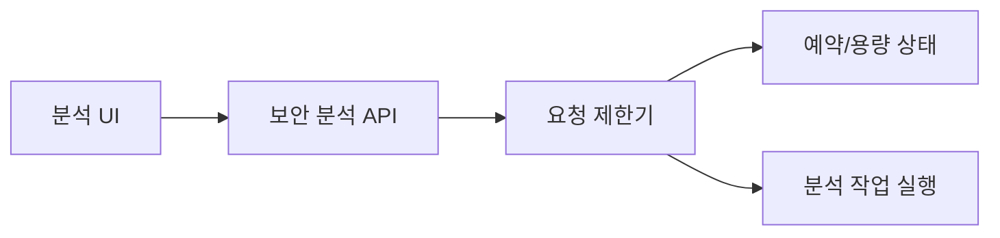
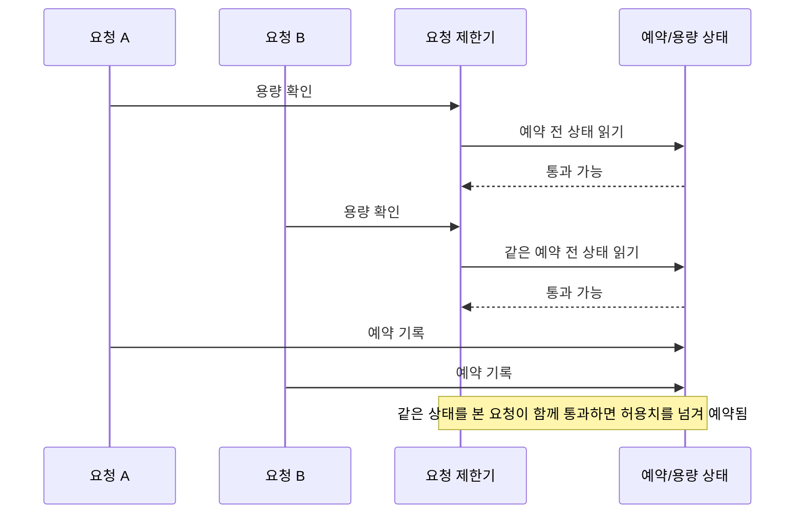

# ClumL

- 역할: Software Engineer
- 기간: 2025.03 - 2026.07

## 개요

보안 이벤트 분석 제품군에서 운영 중 발견한 문제를 코드 수준의 원인으로 좁히고, 직접 수정한 뒤 재현·회귀 테스트로 검증했습니다.

대표 구현은 요청 제한 동시성 수정과 Rust 서비스의 반복 운영 설정 외부화입니다. Chrono에서 Jiff로의 시간 처리 의존성 전환은 Rust 관련 추가 구현입니다. 화면·리포트 작업에서는 query와 formatter 변경이 실제 화면 출력까지 이어지는지 검증했습니다.

## 대표 구현

### AI 보안 분석 엔진 요청 제한 동시성

고객사 데모 서버 운영 중 관찰된 장시간 대기 증상에서 요청 제한 로직의 확인-예약 경합을 분리했습니다.

#### 문제 맥락

#### 실패 흐름

**문제 정의:** 여러 요청이 같은 예약 전 상태를 읽고 동시에 통과하면 실제 허용치보다 많은 요청이 작업 실행 단계로 넘어갈 수 있었습니다. 장시간 대기처럼 보이던 증상을 요청 제한 정확성 문제로 다시 정의했습니다.

**해결 방법:** 용량 확인과 예약 상태 갱신을 같은 잠금 구간에서 처리해, 두 동작 사이에 낡은 상태를 읽는 틈을 없앴습니다.

**선택:** 이 작업에서는 확인-예약 경합만 수정했습니다. TPM 대기 상한처럼 원인이 다른 장시간 대기 문제는 별도 후속 작업으로 분리했습니다.

**구현:** 요청 제한 로직이 하나의 예약 상태를 기준으로 통과 여부를 확인하고 즉시 예약을 기록하도록 수정했습니다. 구현 결과는 재현 테스트와 대조했습니다.

**검증:** 허용치 대비 10배 이상 초과 요청이 통과하던 상황을 재현했습니다. 수정 후에는 같은 상태를 읽은 동시 요청이 과다 예약을 만들지 않고 허용치 바깥의 요청이 통과하지 않는지 회귀 테스트로 확인했습니다.

**결과:** 허용치 대비 10배 이상 초과 요청이 통과하던 경합을 허용치 이하로 제한하고, 같은 실패가 다시 발생하지 않도록 회귀 테스트로 고정했습니다. 10배 수치는 수정 전 허용치 초과 통과량을 나타냅니다.

### Rust 서비스 탐지 판정값 설정 외부화

운영 검증에서는 네트워크 이벤트가 일정 횟수를 넘으면 탐지로 판정하는 값을 낮춘 뒤, pcap을 재생하고 DB에 publish된 이벤트로 결과를 확인해야 했습니다.

**문제 정의:** 판정값이 코드에 하드코딩되어 있어 작은 설정 변경도 code edit, build, binary 교체, service restart를 포함한 배포성 절차로 커졌습니다.

**해결 방법:** 운영에서 반복적으로 조정하는 판정값을 코드에서 분리하고 외부 config로 주입했습니다.

**선택:** 탐지 로직 전체를 바꾸지 않고, pcap 재생 과정에서 반복 조정하던 판정값만 설정 경계로 옮겼습니다.

**구현:** Rust 서비스가 탐지 판정값을 외부 config에서 읽도록 바꿔 반복 변경을 config 수정 중심으로 단순화했습니다.

**검증:** 동일한 pcap 재생과 DB publish 확인을 기준으로 전후 절차를 비교했습니다. 변경 후에는 build와 binary 교체 없이 config 값을 수정한 뒤 같은 검증을 진행했습니다.

**결과:** 반복 설정 변경 1회에서 code edit, build, binary 교체를 제거했고, pcap 재생과 DB publish 확인 전에 필요한 운영 변경 작업 시간을 30% 이상 줄였습니다.

## 추가 구현

### Chrono에서 Jiff로 시간 처리 의존성 전환

**문제 정의:** Rust 웹 애플리케이션의 시간 처리 의존성을 바꿀 때 compile 성공만으로는 기존 timestamp 변환과 화면 표시가 유지됐는지 확인하기 어려웠습니다.

**해결 방법:** 웹 애플리케이션의 MITRE·clustering timestamp helper에 Chrono 기준 테스트를 먼저 추가하고, 기존 테스트를 유지한 상태에서 처리 로직을 Jiff로 옮긴 뒤 기존 의존성을 제거했습니다.

**선택:** 화면에서 사용하는 MITRE·clustering timestamp helper를 대상으로 baseline test, Jiff 전환, 기존 의존성 정리를 하나의 변경 흐름으로 다뤘습니다.

**구현:** 변경을 Chrono 기준 동작 고정, Jiff 로직 전환, Chrono dev-dependency와 전환용 비교 테스트 제거의 세 단계로 나눴습니다.

**검증:** 각 단계에서 테스트를 실행하고, 영향받는 화면 결과와 feature·server compatibility를 확인했습니다. 변경 전후 screenshot과 적용 범위를 함께 검토해 UI에 보이는 timestamp 동작도 대조했습니다.

**결과:** MITRE·clustering timestamp helper를 Jiff 기반으로 전환하고, 해당 모듈의 Chrono 의존성을 제거했습니다.

## 보조 검증 작업

### 탐지 화면·리포트 표시

Report tab은 first event time만 필요했지만 기존 query가 전체 event list용 field까지 요청하고 있었습니다. Customer dropdown loading은 별도 문제로 분리하고, 화면 전용 lightweight query와 incremental rendering 방향을 검토했습니다.

DHCP options는 GraphQL/API field, formatter, raw event, 탐지 목록, 상세 화면을 함께 확인했습니다. PR review에서는 unused field, paging cap, fallback, formatter 위치, localization, cargo check·clippy·test 결과를 대조했습니다.

이 작업에서 맡은 역할은 query와 formatter 변경이 실제 화면 출력까지 이어지는지 검증하는 것이었습니다.

### 문제 정의와 PR review

- 구현 전에 문제, 범위, 제외 범위, 완료 조건, 테스트 기대값을 정리했습니다.
- PR 변경 범위, API·protocol compatibility, test coverage, lint·clippy, 회귀 위험을 확인했습니다.
- 직접 구현, review, 운영 검증의 역할을 같은 성과로 합치지 않았습니다.

## 기술

Rust, GraphQL, Yew, TypeScript, PostgreSQL, RocksDB
