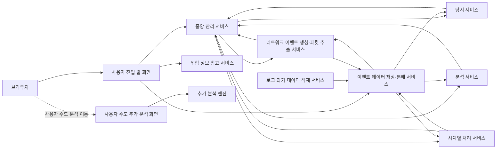

# ClumL

- 역할: Software Engineer
- 기간: 2025.03 - Present

## 개요

보안 이벤트 분석 제품군에서 탐지 화면·리포트 표시 일관성, Rust 서비스 compatibility 확인, 요구사항·완료 기준 정리, PR review를 수행하고 있습니다.

이 페이지는 현재 경력의 표시 일관성과 변경 안전성 작업입니다. 비공개 제품의 내부 구현 세부사항은 공개하지 않고, 보안 분석 화면과 리포트가 같은 이벤트 맥락을 유지하도록 다룬 문제 범위와 검증 기준만 정리합니다.

## 주요 업무

- 탐지 목록/상세, time range, port/packet 표시, chart/report 표시 문제를 수정해 분석 화면과 보고서 신뢰성을 개선했습니다.
- 비공개 제품의 내부 service 이름을 공개하지 않는 범위에서 사용자 진입, 중앙 관리, 이벤트 데이터 저장·분배, 탐지·분석 결과 흐름을 역할 기준으로 문서화했습니다.
- 문제, 범위, 완료 기준, 테스트 기준을 정리해 작업 범위와 검증 기준을 명확화했습니다.
- PR 변경 범위, API/protocol compatibility, test coverage, lint/clippy, change-safety risk를 검토했습니다.

## 대표 구조

내부 repository와 service 이름은 공개하지 않고, 역할 기반 이름으로 일반화해 표현합니다.

이 구조에서 제가 공개 범위로 설명하는 부분은 보안 이벤트가 사용자 화면, 중앙 관리 서비스, 이벤트 데이터 저장·분배 서비스, 탐지·분석 서비스, 리포트 표시 기준 사이에서 같은 맥락을 유지하도록 확인한 범위입니다.

## 작업 영역

### 분석 UI와 리포트 표시 일관성

보안 분석자가 확인하는 탐지 목록, 상세 화면, time range, port/packet, chart/report 표시를 다뤘습니다. 이 작업은 단순 화면 수정이 아니라 분석 결과와 보고서 산출물이 같은 이벤트 맥락을 보여주도록 맞추는 표시 기준 정리 작업입니다.

문제의 핵심은 같은 보안 이벤트를 목록, 상세, 차트, 리포트가 서로 다른 기준으로 보여줄 때 분석 신뢰성이 깨질 수 있다는 점입니다. 그래서 화면 단위 수정만 보지 않고, 표시 기준과 event context가 일관되게 유지되는지 확인했습니다.

### 제품 구조와 데이터 흐름 정리

인증, 권한, 인증서 운영 같은 보안 세부사항은 공개하지 않고, 사용자 요청 경로, 중앙 관리 서비스의 제어·상태 교환, 이벤트 데이터 저장·분배, 탐지·분석 결과 반환을 역할 기준으로 분리해 정리했습니다.

### Rust 서비스 compatibility 확인

Rust 서비스의 설정, 날짜·시간 처리, serialization, 테스트 경계를 검토하며 기존 동작과의 compatibility risk를 확인하는 방향으로 작업했습니다. dependency, lint/clippy, CI failure, compatibility risk는 PR review에서 별도 확인 항목으로 다룹니다.

### 작업 기준 정리

작업을 시작하기 전에 문제, 범위, 하지 않을 일, 완료 기준, 테스트 기준을 정리합니다. 이 기준은 동료와 AI agent가 같은 범위 안에서 구현하고, 리뷰 단계에서 변경 범위와 변경 안전성을 확인하기 위한 기준으로 사용합니다.

### PR review와 품질 관리

작업 기준과 PR diff 사이의 정합성, API/protocol compatibility, test coverage, lint/clippy, change-safety risk를 검토하며 변경 범위가 합의된 요구사항과 검증 기준 안에 머물도록 확인합니다.

## 결과와 한계

공개 범위에서는 탐지 화면·리포트 표시 일관성, Rust 서비스 compatibility 확인, 작업 기준 정리와 PR review 기준처럼 제품 품질과 변경 안전성에 직접 연결되는 범위를 중심으로 설명합니다.

## 기술

Rust, GraphQL, Yew, TypeScript, PostgreSQL, RocksDB
