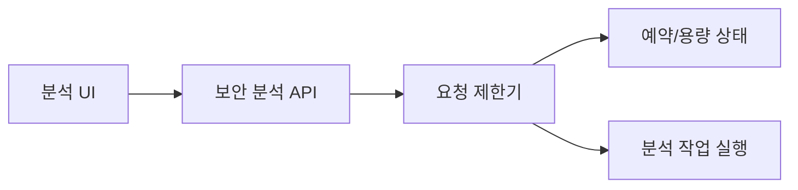
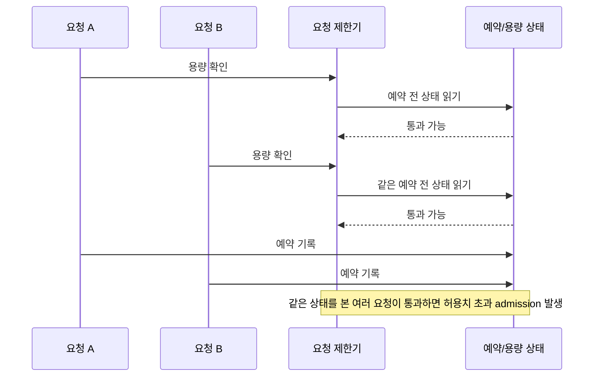
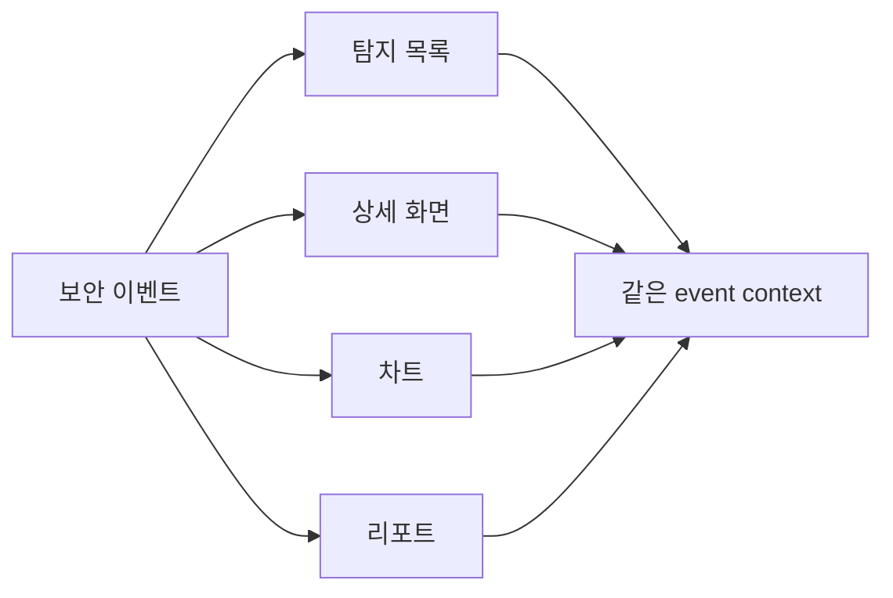
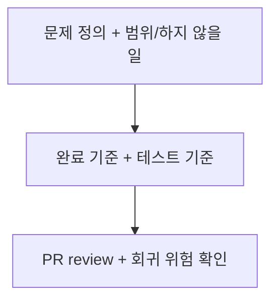

# ClumL

- 역할: Software Engineer
- 기간: 2025.03 - 2026.07

## 개요

보안 이벤트 분석 제품군에서 운영 증상을 구체적인 기술 문제로 좁히고, 재현 조건과 검증 기준을 정리했습니다. 최신 경력의 핵심은 전체 시스템 설명이 아니라, 운영 중 드러난 문제를 좁은 기술 문제로 재정의하고 검증 가능한 기준으로 정리하는 일입니다.

대표 작업은 요청 제한 동시성 문제입니다. 탐지 화면·리포트 표시 일관성, Rust 서비스 설정 변경 절차 단순화, compatibility 확인, 요구사항·완료 기준 정리, PR review는 각각 별도 변경에서 문제 범위와 기존 동작을 확인한 작업입니다.

## 대표 작업

### AI 보안 분석 엔진 요청 제한 동시성 문제

고객사 데모 서버 운영 중 관찰된 장시간 대기 증상에서 요청 제한 로직의 확인-예약 경합을 분리했습니다.

#### 문제 맥락

#### 실패 흐름

**문제 정의:** 장시간 대기처럼 보이던 운영 증상을 단순 latency 문제가 아니라 요청 제한 로직의 정확성 문제로 다시 정의했습니다. 여러 요청이 같은 예약 전 상태를 보고 동시에 통과하면, 실제 허용치보다 많은 요청이 admission될 수 있었습니다.

**해결 방법:** 용량 확인과 예약 상태 갱신이 같은 상태 기준에서 처리되어야 한다는 불변 조건을 세웠습니다. 수정 방향은 확인과 예약 사이에 낡은 상태를 읽는 틈을 없애는 것이었습니다.

**근거:** 대기 시간을 임의로 줄이거나 UI에서 증상만 숨기면 허용치 초과 admission 자체는 남습니다. 요청이 작업 실행 단계로 들어가기 전에 요청 제한기가 같은 예약 상태를 기준으로 통과 여부를 결정해야 문제를 정확히 해결할 수 있었습니다.

**선택:** 대표 범위는 장시간 대기 전체가 아니라 확인-예약 경합으로 인한 허용치 초과 요청 통과로 좁혔습니다. TPM 대기 상한처럼 다른 실패 모드는 별도 후속 문제로 분리했습니다.

**구현:** 운영 증상과 로그를 바탕으로 재현 조건과 수정 방향을 정리하고, 용량 확인과 예약 상태 갱신을 같은 상태 기준에서 처리해야 한다는 수용 기준을 만들었습니다. 이 기준을 구현 변경에 반영한 뒤, PR 변경이 수용 기준과 회귀 테스트 기준을 만족하는지 검토했습니다.

**검증:** 허용치 대비 10배 이상 초과 요청 통과가 발생하던 상황을 재현 가능한 조건으로 고정했습니다. 검증 기준은 허용치 바깥의 요청을 통과시키지 않는지, 그리고 같은 상태를 본 동시 요청이 과다 예약을 만들지 않는지였습니다.

**결과:** 장시간 대기 증상을 요청 제한 정확성 문제로 재정의하고, 허용치 초과 요청 통과를 막는 불변 조건과 회귀 테스트 기준으로 정리했습니다.

**한계:** 이 결과는 지연 시간, 처리량, 장애율 개선 수치가 아니라 요청 admission 정확성 개선입니다. 별도 benchmark나 운영 로그 없이 p95/p99 latency 개선으로 주장하지 않습니다.

## 관련 작업 기준

### 표시 일관성 검토 기준

요청 제한 동시성 대표 작업과 별개로 정리한 제품 표시 검증 기준입니다. 탐지 목록, 상세 화면, 차트, 리포트가 같은 보안 이벤트를 서로 다른 기준으로 보여주면 분석 신뢰성이 깨질 수 있기 때문에, event context가 끝까지 유지되는지 확인하는 기준으로 정리했습니다.

**문제 정의:** 탐지 목록, 상세 화면, 차트, 리포트가 같은 보안 이벤트를 서로 다른 기준으로 보여주면 분석자가 결과를 신뢰하기 어려워집니다.

**해결 방법:** 표시 문제를 화면 단위 버그로만 보지 않고, event context가 목록에서 리포트까지 유지되는지 확인하는 기준으로 묶었습니다.

**근거:** 각 화면을 따로 고치면 같은 이벤트를 서로 다른 time range, port/packet, chart 기준으로 보여주는 drift가 남을 수 있습니다. 분석 결과와 리포트가 같은 의미를 유지하려면 API/query contract와 표시 기준을 함께 봐야 했습니다.

**선택:** 대표 성과는 새로운 분석 기능 추가가 아니라 표시 일관성 기준을 세우는 제품 검증 작업으로 제한했습니다.

**구현:** 탐지 목록/상세, time range, port/packet, chart/report 표시 문제에서 원인과 수정 범위를 분리했습니다. API/query contract와 표시 기준이 어긋날 수 있는 변경을 review 기준에 포함했습니다.

**검증:** 탐지 화면과 리포트가 같은 event context를 유지하는지, 화면 단위 수정이 분석 결과와 보고서 산출물의 의미를 바꾸지 않는지 확인했습니다.

**결과:** 탐지 화면·리포트 표시 문제를 같은 event context 유지 여부로 검토할 수 있게 정리했고, 제품 변경이 분석 결과와 보고서 산출물의 신뢰성을 깨지 않도록 review 기준에 반영했습니다.

**한계:** 이 작업은 탐지 정확도나 처리 성능 개선 수치가 아니라 표시 기준과 review 기준을 정리한 작업입니다.

### Rust 서비스 설정 변경 절차 단순화

운영에서 자주 조정하던 HOG 탐지 주기 설정이 code edit와 build를 포함한 배포성 절차로 이어지던 문제를 config 경계로 분리했습니다.

**문제 정의:** 운영에서 자주 조정하던 HOG 탐지 period 설정이 code edit, build, binary 교체, service restart를 포함한 배포성 절차로 이어졌습니다.

**해결 방법:** 탐지 period 설정을 코드 하드코딩에서 분리하고 외부 config로 주입할 수 있게 바꿨습니다.

**근거:** 반복 조정 값이 code boundary 안에 남아 있으면 작은 운영 실험에도 빌드와 배포성 작업이 반복됩니다. 설정 경계를 분리하면 탐지 로직을 재작성하지 않고 운영 변경 단위를 줄일 수 있습니다.

**선택:** 성과 범위는 탐지 성능 개선이 아니라 운영 변경 절차 단순화로 제한했습니다. 구체 config key나 운영 서버 정보는 공개하지 않고 역할 기반 설명으로 일반화했습니다.

**구현:** HOG 탐지 period 설정을 외부 config로 주입할 수 있게 바꾸고, 반복 운영 변경을 config 수정 중심으로 낮췄습니다.

**검증:** 설정 경계가 기존 동작을 깨지 않는지 확인하고, 변경 전후의 반복 조정 절차를 비교했습니다.

**결과:** 반복 조정 작업 시간이 30% 이상 줄어든 것을 확인했습니다.

**한계:** 이 수치는 탐지 정확도, 처리량, latency 개선이 아니라 운영자가 설정을 바꾸는 작업 시간에만 적용됩니다.

### 문제 정의와 리뷰 기준

- Rust 서비스의 설정, 날짜·시간 처리, serialization, 테스트 경계를 검토하며 기존 동작과의 compatibility risk를 확인했습니다.
- 작업을 시작하기 전에 문제, 범위, 하지 않을 일, 완료 기준, 테스트 기준을 정리해 구현과 review가 같은 기준으로 진행되게 했습니다.
- PR 변경 범위, API/protocol compatibility, test coverage, lint/clippy, 회귀 위험을 검토해 변경이 합의된 문제 범위 밖으로 번지지 않게 했습니다.

## 기술

Rust, GraphQL, Yew, TypeScript, PostgreSQL, RocksDB
