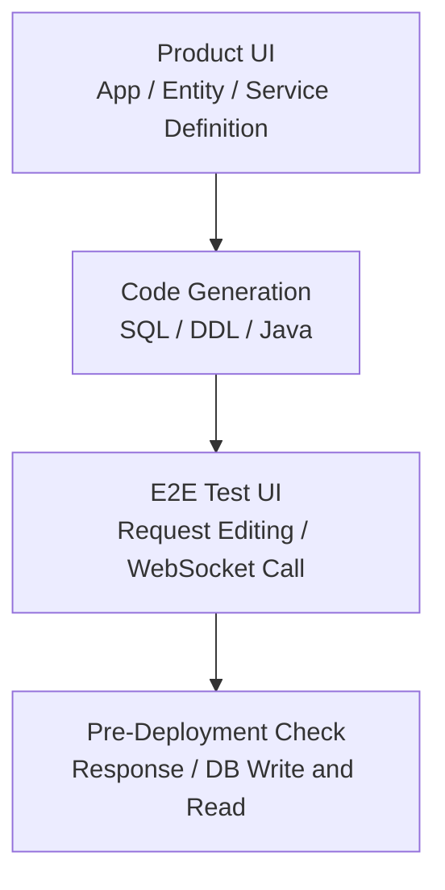
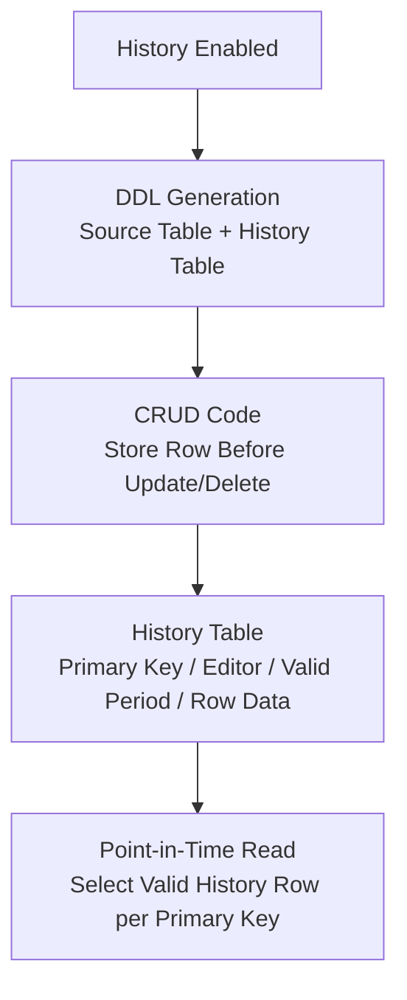

# TmaxCloud

- Period: Oct 2021 - Nov 2024

## Overview

On a Java/TypeScript no-code platform, I built pre-deployment verification for Java service code and SQL/DDL generated from UI definitions. I implemented history storage for rows before updates and deletions in generated CRUD applications and defined how point-in-time reads select the valid history row for each primary key. The entity export/import feature lets a Studio user export an entity, import it into another generated application, and use the imported entity in service definitions. It copies selected-attribute data at import time and synchronizes later changes to those attributes through a message broker. I contributed to the DB schema and API for storing exported and imported entity information, designed selected-attribute metadata and broker-mediated linkage between exported and imported entities, and implemented the export UI. I also helped separate SQL generation into a backend library.

## Service Code Verification

**Problem:** A UI-defined service could only be checked against its real API response and database writes and reads after JAR creation and a separate deployment. With roughly 200–300 services/APIs to verify, one build, deploy, and verify cycle took about 20 minutes, and finding an invalid definition or request/response shape required repeating it.

**Decision:** I built a React and WebSocket-based E2E test UI that called the generated API before deployment and checked JSON request/response shapes and DB writes and reads.

**Implementation:** I implemented WebSocket URL and connection validation, service-list loading, per-service JSON request templates, Monaco Editor request editing, API calls, response inspection, and database write/read checks.

**Validation and result:** I moved request/response, DB write/read, and definition-to-code linkage checks before deployment. At the time, this helped reduce the recurring design-to-verification cycle from about four weeks to about two.

## Data-Change History Storage and Point-in-Time Read Design

**Problem:** Generated CRUD applications kept only current values. Showing earlier values and the last editor after an update or delete required separate history storage and a way to query it.

**Decision:** I implemented the history table and CRUD write SQL against the entity's columns and primary key. For point-in-time reads, I defined how to choose the valid history row for each primary key. Instead of a Tibero DB trigger or procedure, I placed the write query in the CRUD code, which already carried the requesting user's identity, so it stored the row before an update or deletion together with the editor and valid period.

**Implementation:** Deploying an entity with history enabled created both its source and history tables. I connected FreeMarker templates and code-generation logic so CRUD services stored the row before an update or deletion with its primary key, editor, and valid period.

**Validation and result:** I checked that the source and history table DDL and CRUD write SQL reflected the same entity columns and primary key.

## Additional Work

### Entity Export/Import and Selected-Attribute Synchronization

Studio users can export an entity, import it into another generated application, and use the imported entity in service definitions. At import time, the feature copies selected attribute data; when a connected service later changes data, it synchronizes changes to those attributes through a message broker. I contributed to the DB schema and API for storing exported and imported entity information, designed selected-attribute metadata and broker-mediated linkage between exported and imported entities, and implemented the export UI. The message-synchronization service and the redeployment migration strategy for later schema changes were separate areas of work.

### SQL Generation Library

I helped separate SQL generation into a library imported directly by the backend. I wrote JUnit tests for JSON-input SQL generation and added JaCoCo coverage configuration so the generation logic could be verified independently.

### Standardizing Exception Log Output

I standardized exception log output for messages, error codes, SQL states, and stack traces, and visually distinguished error logs from general terminal output.

## Technologies

Java, TypeScript, React, WebSocket, Monaco Editor, FreeMarker, Tibero, SQL/DDL generation, JUnit, JaCoCo
