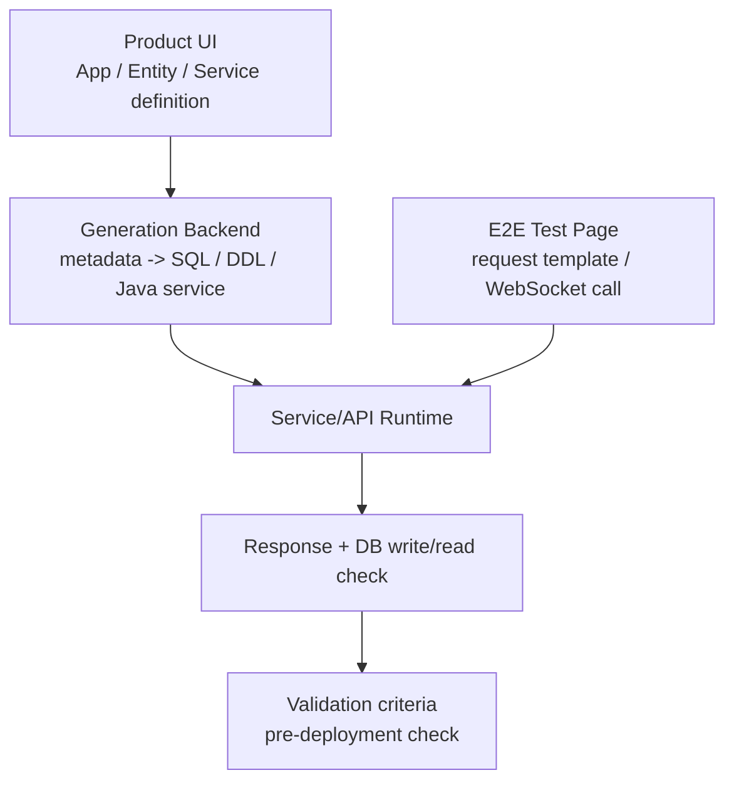
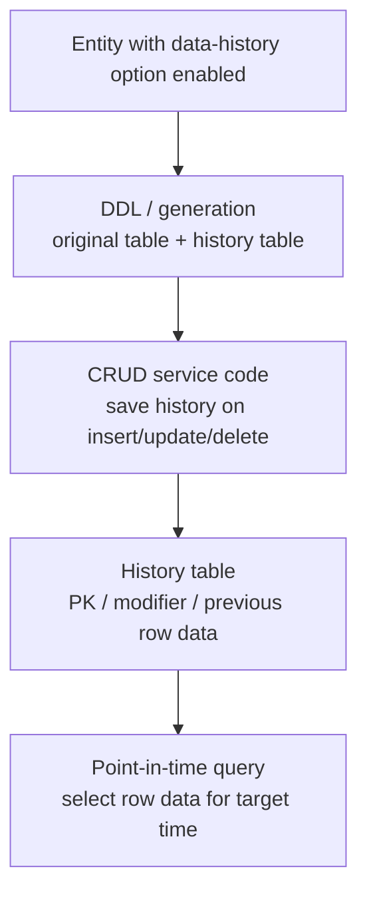

# TmaxCloud

- Role: Software Engineer
- Period: 2021.10 - 2024.11

## Overview

I implemented backend/platform features in a Java/TypeScript-based No-code platform, connecting app, entity, and service/API definitions from the UI to Java service code, SQL/DDL, DB verification, and data-change history storage/query.

The representative axes are service/API code-generation validation and data-change history storage/query. I also include additional work examples for entity export/import data copy, the SQL/DDL Generator, and the error logger.

## Why This Is Representative Work

The core problem in the No-code platform was that design information defined through the UI had to remain consistent as it turned into executable code, SQL, DB state, and test request formats.

The representative scope is the backend/platform boundary that made UI-designed service/API definitions become executable Java code and SQL, made that behavior verifiable before deployment, and connected insert/update/delete service code to change-history tables. I also worked on entity export/import data copy between generated applications, SQL/DDL generation, and error diagnostics.

Representative outcomes:

- Built a WebSocket-based E2E test page to verify request/response shape and DB write/read behavior before deployment.
- Designed and implemented source tables, history tables, and insert/update/delete service-code flows that save previous row data.
- Defined point-in-time query criteria that choose valid row data per primary key when showing table state at a target time.
- In the entity export/import MVP, split cross-app entity data copy/sync requirements into export entity, Broker App, and import entity links, and owned the metadata schema and Export client page scope.
- Separated SQL/DDL generation responsibility into a backend-importable library structure, and organized terminal error highlighting and exception formatting as a developer diagnostics case.

## Representative Work Flows

This work moved service/API request/response and DB-effect checks from post-deployment verification into a pre-deployment validation step.

The data-change history work created the source table and history table together when the option was enabled, then made insert/update/delete service code save previous row data into the history table. Studio could query that history table to show table state at a target point in time.

## Service/API Code-Generation Validation

**Problem Definition:** In the No-code platform, service/API behavior produced from UI definitions could previously be verified only after jar generation and a separate deployment flow.

As the number of services/APIs grew, finding incorrect service definitions or request/response shape issues required repeated build/deploy/verify cycles, increasing design and validation lead time.

**Solution:** I built a WebSocket-based E2E test page that moved verification before deployment. Users could select a service, generate and edit a JSON request, call the service/API code produced by the platform, and check the response and DB write/read behavior.

**Rationale:** If validation happens only after jar generation and deployment, service-definition errors and request/response shape issues surface late. The code produced from UI definitions had to be callable before deployment so the design-validation cycle could become shorter.

**Selection:** I scoped the work to service/API request/response behavior, DB write/read effects, and consistency between service definitions and code execution, not to the entire No-code platform.

**Implementation:**

- Implemented WebSocket URL format validation and connection-state checks.
- Fetched service lists after a successful connection and displayed service test items in an Accordion UI.
- Generated JSON request templates per service and allowed edits in Monaco Editor.
- Sent service/API requests through WebSocket and checked response and DB write/read behavior.

**Validation:**

- Request/response shape validation
- DB write/read verification
- Consistency between service definitions and code execution
- Pre-deployment detection of missing links between service definitions and executable code, or request/response shape issues
- Avoiding unnecessary connection attempts through WebSocket URL validation

**Result:** I moved service/API request/response and DB write/read verification into the design and validation stage. Under the working conditions at the time, this contributed to reducing the repeated design-validation cycle from roughly 4 weeks to roughly 2 weeks.

**Limitation:** The 4-week to 2-week metric belongs to the service/API code-generation validation scope. I do not generalize it into all No-code platform productivity or runtime performance.

## Data-Change History Storage And Query

**Problem Definition:** CRUD applications produced by the platform primarily operate on current values. To show table state at a specific point in time, the last modifier, or previous values of deleted records after insert/update/delete operations, the platform needed a separate change-history storage and query rule.

**Solution:** For entities with the data-history option enabled, I created the source table and history table together. Insert/update/delete service code saved previous row data into the history table, and point-in-time queries showed table state by choosing valid row data for each primary key at the target time.

**Rationale:** The requirement was not just to list change events, but to let CRUD applications show what a table looked like at a target point in time. That required write operations to save previous row data and query operations to choose which row data was valid for each primary key at the target time. If those rules came from different entity definitions, column, PK, and validity-period interpretation could drift, so I created the source table, history table, history-save SQL, and point-in-time query from the same entity definition.

**Selection:** DB triggers or procedures could save previous row data, but request/user context and point-in-time query generation would move into separate DB artifacts or session conventions. I chose to make the history-save query explicit in CRUD service code and to generate the history-table DDL and query criteria from the same generator input.

**Implementation:**

- Implemented a DDL/generation flow that creates both the source table and a history table for entities with the data-history option enabled.
- Structured the history table with the original PK, validity metadata, modifier metadata, and previous row data.
- Connected CRUD service SQL so insert/update/delete operations save affected previous row data into the history table through Freemarker templates and generation logic.
- Defined point-in-time query criteria that choose valid row data per primary key to show table state.

**Validation:** I checked whether the source table, history table, CRUD service SQL, and query criteria for choosing valid row data per primary key stayed connected in one generation flow. The validation focus was keeping current-value CRUD behavior and historical table-state query behavior from splitting into separate responsibilities.

**Result:** The CRUD application produced by the platform could keep current-value behavior and historical table-state query behavior inside the same generation flow. The history table, history-save SQL, and point-in-time query criteria were created from the same entity definition.

**Limitation:** This work is framed around history-table generation, history-save SQL in CRUD service code, and point-in-time query criteria. It does not extend to every audit-log policy or a DB-trigger-based audit system.

## Additional Work Examples

### Entity Export/Import Data Copy

The entity export/import MVP supported initial entity-data copy between generated applications and connected that flow to change-event synchronization. My direct scope was participation in the DB schema/API for exported/imported entity information, metadata schema and `selected_attr_ids` design for copying selected attributes, direct implementation of the Export client page, and the `export entity -> Broker App -> import entity` connection structure.

The import-cancel detail page, `syncservice.ftl` or message sync service implementation, complete message ordering/retry resolution, and a completed migration strategy are outside my direct scope.

### SQL/DDL Generator

I separated SQL/DDL generation responsibility into a backend-importable library structure so it would not remain mixed into the application backend flow. I also added JSON-input-based SQL generation tests and coverage checks to make the generation responsibility and test criteria explicit.

### Error Logger

During service/API code-generation development, ordinary logs and error logs could make it difficult to locate exception context quickly. I organized exception messages, error codes, SQL state, and stack traces through an ErrorLogger and made terminal error logs visually distinct.

## Result

Service/API code-generation validation moved request/response and DB write/read verification from post-deployment checks into the design and validation stage. Under the working conditions at the time, this contributed to reducing the repeated design-validation cycle from roughly 4 weeks to roughly 2 weeks.

For data-change history, I created the source table, history table, CRUD service history-save flow, and point-in-time query criteria from the same entity definition. This kept the previous row data saved by write operations aligned with the row data selected by query operations, so current-value CRUD behavior and historical table-state query behavior could be validated in one generation flow.

## Skills

Java, TypeScript, React, Material UI, WebSocket, Monaco Editor, Freemarker, Tibero, SQL generation, JUnit
