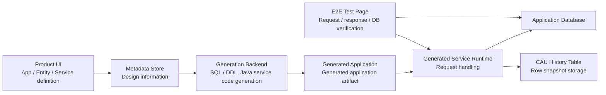

# TmaxCloud

- Role: Software Engineer
- Period: 2021.10 - 2024.11

## Overview

I implemented backend/platform features in a Java/TypeScript-based No-code platform, connecting app, entity, and service/API definitions from the UI to SQL/DDL, generated Java service code, DB verification, and change-history criteria.

This page expands the TmaxCloud entry in my resume. The center is generated-service E2E validation and CAU table history; the SQL/DDL Generator and error logger are kept as supporting structural work.

## Why This Is Representative Work

The core problem in the No-code platform was that design information defined through the UI had to remain consistent as it turned into executable code, SQL, DB state, and test request formats.

My scope was the backend/platform boundary that made generated service/API behavior verifiable before deployment and made generated CRUD services work with change-history tables.

Representative outcomes:

- Built a WebSocket-based generated-service E2E test page to verify request/response shape and DB write/read behavior before deployment.
- Designed and implemented the CAU change-history table and the insert/update/delete row-snapshot copy flow in generated CRUD service SQL.
- Defined select SQL criteria for reconstructing a point-in-time table snapshot from the needed snapshots.
- Separated SQL/DDL generation responsibility into a backend-importable library structure, and organized terminal error highlighting and exception formatting as developer diagnostics support.

## Representative Structure

This structure shows how design information from the UI flows into the generation backend, generated application, runtime, database, E2E test page, and change-history table.

## Generated-Service E2E Validation

### Generated-Service Validation Problem

In the No-code platform, generated service/API behavior could previously be verified only after jar generation and a separate deployment flow.

As the number of services/APIs grew, finding incorrect service definitions or request/response shape issues required repeated build/deploy/verify cycles, increasing design and validation lead time.

### Implementation Scope

- Implemented WebSocket URL format validation and connection-state checks.
- Fetched service lists after a successful connection and displayed service test items in an Accordion UI.
- Generated JSON request templates per service and allowed edits in Monaco Editor.
- Sent generated-service requests through WebSocket and checked response and DB write/read behavior.

### Validation Criteria

- Request/response shape validation
- DB write/read verification
- Consistency between service definitions and generated-service behavior
- Pre-deployment detection of missing links between service definitions and generated-service behavior, or request/response shape issues
- Avoiding unnecessary connection attempts through WebSocket URL validation

## CAU Change History And Table Snapshot

### Change-History Reconstruction Problem

Generated CRUD applications primarily operate on current values. To reconstruct the table state at a specific point in time, the last modifier, or previous values of deleted records after insert/update/delete operations, the platform needed a separate change-history storage and query rule.

### Design And Implementation

- Implemented a DDL/generation flow that creates both the original table and a change-history table for entities with the CAU option enabled.
- Structured the CAU table with the original PK, `UP_TO`, `LAST_MODIFIED_BY`, and `DATA_SNAPSHOT`.
- Connected generated CRUD service SQL so insert/update/delete operations copy affected row snapshots into the change-history table.
- Defined select SQL criteria to reconstruct a point-in-time table snapshot by selecting only the needed snapshots.

### Rationale

DB triggers or procedures were possible alternatives, but this feature was not just an audit log. It was a generation feature for reconstructing No-code platform generated entities as point-in-time table snapshots.

The request/user context, snapshot copy query, and point-in-time select SQL formula needed to stay within the same generation boundary, so I chose to make the snapshot copy query explicit in generated CRUD service SQL.

## Supporting Structure

### SQL/DDL Generator

I separated SQL/DDL generation responsibility into a backend-importable library structure so it would not remain mixed into the application backend flow. I also added JSON-input-based SQL generation tests and coverage checks to make the generation responsibility and test criteria explicit.

### Error Logger

During generated-service development, ordinary logs and error logs could make it difficult to locate exception context quickly. I organized exception messages, error codes, SQL state, and stack traces through an ErrorLogger and made terminal error logs visually distinct.

## Skills

Java, TypeScript, React, Material UI, WebSocket, Monaco Editor, Freemarker, Tibero, SQL generation, JUnit
