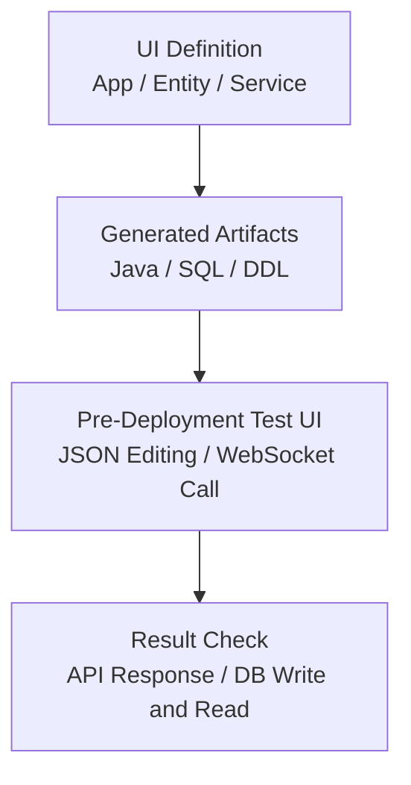
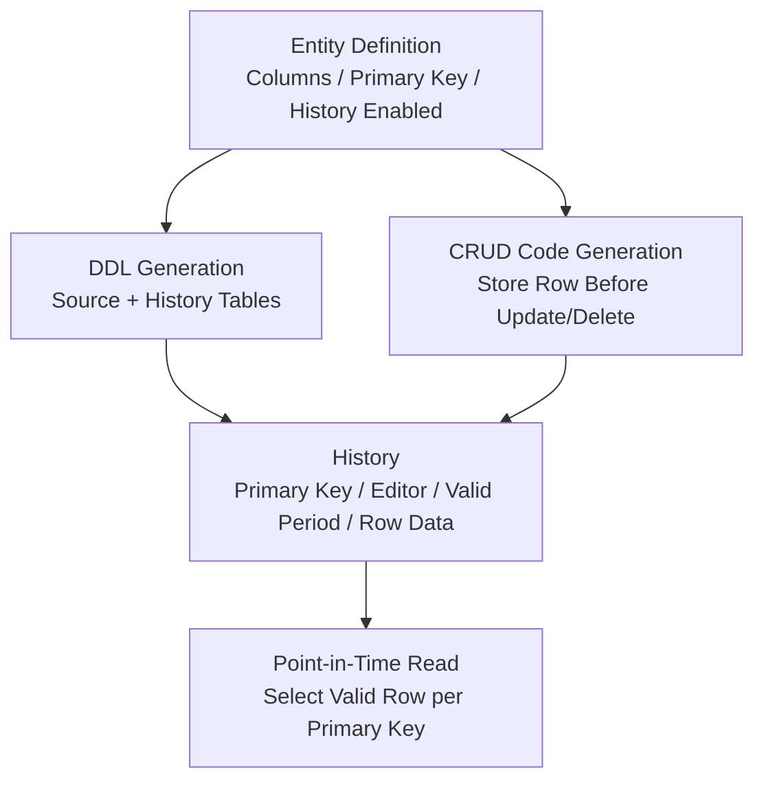

# TmaxCloud

- Period: Oct 2021 - Nov 2024

## Service Code Verification

**Problem and diagnosis:** A UI-defined service could only be checked against its real API response and database writes and reads after JAR creation and a separate deployment. With roughly 200–300 services and APIs to verify, one build, deploy, and verification cycle took about 20 minutes, and each invalid definition or request/response shape restarted the same delayed feedback loop.

**Constraints and decision:** Verification had to cover real JSON requests, responses, and database state rather than mocks. I placed those checks in a React, TypeScript, and WebSocket test UI that runs before deployment.

**Implementation:** I implemented WebSocket URL and connection validation, service-list loading, per-service JSON request templates, Monaco Editor request editing, API calls, response inspection, and database write/read checks.

**Validation and result:** I found invalid request/response shapes and missing definition-to-code links without a separate deployment, while still checking actual database writes and reads. At the time, this helped reduce the recurring design-to-verification cycle from about four weeks to about two.

## Data-Change History Storage and Point-in-Time Read Design

**Problem and diagnosis:** Generated CRUD applications kept only current values. Showing earlier values and the last editor after an update or deletion required storing the prior row, editor, and valid period under one consistent definition.

**Constraints and decision:** A Tibero database trigger or procedure could see the changed row but did not naturally receive the requesting user's identity. I chose to generate the history write in CRUD code, which already carried that identity, and made the history-table DDL and point-in-time read use the same entity columns and primary key.

**Implementation:** I encoded the source/history-table DDL and the SQL that stores a row before an update or deletion in FreeMarker templates. I defined the point-in-time read SQL to select the valid row for each primary key.

**Validation and result:** I checked that the source and history table DDL and CRUD write SQL reflected the same entity columns and primary key.

## Additional Work

### Entity Export/Import and Selected-Attribute Synchronization

Studio users can export an entity, import it into another generated application, and use the imported entity in service definitions. At import time, the feature copies data for selected attributes; when a connected service later changes data, it synchronizes changes to those attributes through a message broker.

I contributed to the DB schema and API for storing exported and imported entity information. I designed selected-attribute metadata and broker-mediated linkage between exported and imported entities. I implemented the export UI. The message-synchronization service and the redeployment migration strategy for later schema changes were separate areas of work.

### SQL Generation Library

I helped separate SQL generation into a library imported directly by the backend. I wrote JUnit tests for JSON-input SQL generation and added JaCoCo coverage configuration so the generation logic could be verified independently.

### Standardizing Exception Log Output

I standardized exception log output for messages, error codes, SQL states, and stack traces, and visually distinguished error logs from general terminal output.
