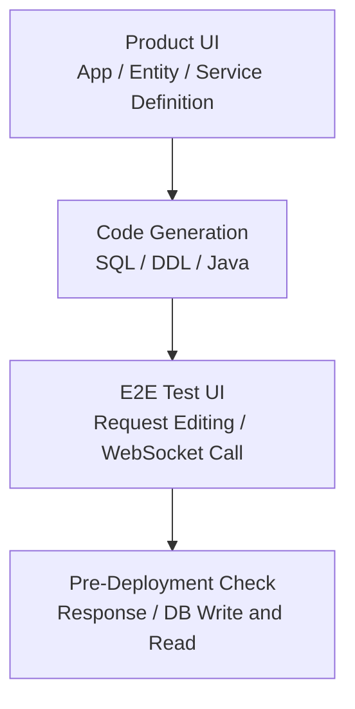
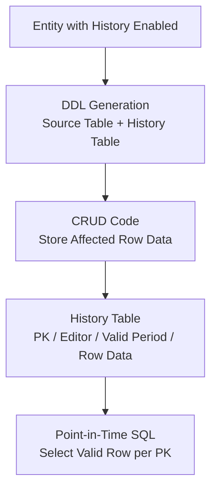

# TmaxCloud

- Period: Oct 2021 - Nov 2024

## Overview

On a Java/TypeScript no-code platform, I developed features for validating services built from UI definitions and managing the resulting SQL/DDL. My primary work covered pre-deployment API verification, data-change history storage, and point-in-time retrieval design; I also implemented specific parts of the SQL/DDL Generator and Entity Export/Import.

## Service Code Verification

**Problem:** A UI-defined service could only be checked against its real API response and DB effects after JAR creation and a separate deployment. Finding an invalid definition or request/response shape required repeating the build, deploy, and verify cycle.

**Decision:** I built a WebSocket-based E2E test UI that called the generated API before deployment and checked JSON request/response shapes and DB writes and reads.

**Implementation:** I validated the WebSocket URL and connection state, loaded the service list, and generated a JSON request template for each item. Users could edit a request in Monaco Editor, call the API, and inspect its response and DB effects.

**Validation and result:** I checked request/response shapes, DB writes and reads, and missing links between service definitions and generated code before deployment. This made errors previously found after deployment visible during design and verification.

## Data-Change History Storage and Point-in-Time Retrieval Design

**Problem:** Generated CRUD applications retained current values. Showing a table's state, last editor, and past values at a selected point after updates or deletes required a separate storage and query design.

**Decision:** I implemented the history table and CRUD write SQL against the entity's columns and primary key, then defined how point-in-time SQL should select valid rows from the same information. Instead of a DB trigger or procedure, the CRUD code—already carrying request-user context—explicitly stored the affected row data, keeping write and read rules in one code-generation path.

**Implementation:** Deploying an entity with history enabled created both its source and history tables. I connected Freemarker templates and code-generation logic so CRUD service calls stored the affected row data with its primary key, editor, and valid period.

**Validation and result:** I checked that the source and history table DDL and CRUD write SQL reflected the same entity columns and primary key. I then defined how to select, by primary key, the stored row data valid at a target time.

## Additional Work

### Entity Export/Import Data Copy

I contributed to the DB schema and API for storing exported and imported entities between generated applications. I handled selected-attribute metadata, the export UI, and the connection between exporting and importing entities, while message synchronization and migration strategy remained follow-up areas.

### SQL/DDL Generator

I helped separate SQL-generation responsibility into a library imported by the backend. JSON-input SQL tests and coverage checks made the generation logic independently verifiable.

### Exception Output Formatting

I organized exception messages, error codes, SQL state, and stack traces into a consistent format, and visually separated terminal errors from general logs.

## Technologies

Java, TypeScript, React, WebSocket, Monaco Editor, Freemarker, Tibero, SQL generation, JUnit
