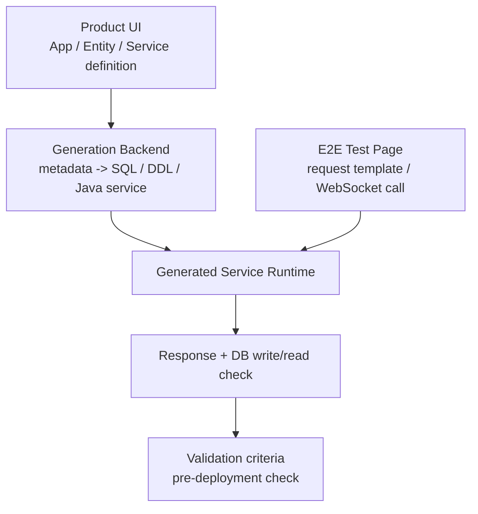
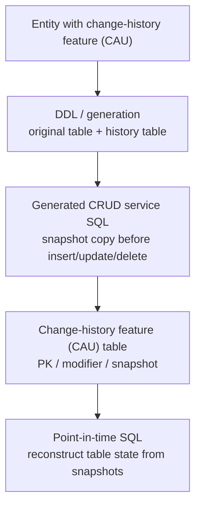

# TmaxCloud

- Role: Software Engineer
- Period: 2021.10 - 2024.11

## Overview

I implemented backend/platform features in a Java/TypeScript-based No-code platform, connecting app, entity, and service/API definitions from the UI to SQL/DDL, generated Java service code, DB verification, and change-history criteria.

The central work is generated-service E2E validation and change-history feature (CAU) table history. I keep the SQL/DDL Generator and error logger as supporting structural work around those two areas.

## Why This Is Representative Work

The core problem in the No-code platform was that design information defined through the UI had to remain consistent as it turned into executable code, SQL, DB state, and test request formats.

My scope was the backend/platform boundary that made generated service/API behavior verifiable before deployment and made generated CRUD services work with change-history tables.

Representative outcomes:

- Built a WebSocket-based generated-service E2E test page to verify request/response shape and DB write/read behavior before deployment.
- Designed and implemented the change-history feature (CAU) table and the insert/update/delete row-snapshot copy flow in generated CRUD service SQL.
- Defined select SQL criteria for reconstructing a point-in-time table snapshot from the needed snapshots.
- Separated SQL/DDL generation responsibility into a backend-importable library structure, and organized terminal error highlighting and exception formatting as developer diagnostics support.

## Representative Work Flows

The generated-service work moved request/response and DB-effect checks from post-deployment verification into a pre-deployment validation step.

The change-history feature (CAU) work kept row-snapshot copy and point-in-time select criteria inside the same generation boundary as generated CRUD service SQL.

## Generated-Service E2E Validation

**Problem Definition:** In the No-code platform, generated service/API behavior could previously be verified only after jar generation and a separate deployment flow.

As the number of services/APIs grew, finding incorrect service definitions or request/response shape issues required repeated build/deploy/verify cycles, increasing design and validation lead time.

**Solution:** I built a WebSocket-based generated-service E2E test page that moved verification before deployment. Users could select a service, generate and edit a JSON request, call the generated service, and check the response and DB write/read behavior.

**Rationale:** If validation happens only after jar generation and deployment, service-definition errors and request/response shape issues surface late. Generated services needed to be callable before deployment so the design-validation cycle could become shorter.

**Selection:** I scoped the work to generated-service/API request/response behavior, DB write/read effects, and consistency between service definitions and generated-service behavior, not to the entire No-code platform.

**Implementation:**

- Implemented WebSocket URL format validation and connection-state checks.
- Fetched service lists after a successful connection and displayed service test items in an Accordion UI.
- Generated JSON request templates per service and allowed edits in Monaco Editor.
- Sent generated-service requests through WebSocket and checked response and DB write/read behavior.

**Validation:**

- Request/response shape validation
- DB write/read verification
- Consistency between service definitions and generated-service behavior
- Pre-deployment detection of missing links between service definitions and generated-service behavior, or request/response shape issues
- Avoiding unnecessary connection attempts through WebSocket URL validation

**Result:** I moved generated-service request/response and DB write/read verification into the design and validation stage. Under the working conditions at the time, this contributed to reducing the repeated design-validation cycle from roughly 4 weeks to roughly 2 weeks.

**Limitation:** The 4-week to 2-week metric belongs to the generated-service validation scope. I do not generalize it into all No-code platform productivity or runtime performance.

## Change-History Feature (CAU) And Table Snapshot

**Problem Definition:** Generated CRUD applications primarily operate on current values. To reconstruct the table state at a specific point in time, the last modifier, or previous values of deleted records after insert/update/delete operations, the platform needed a separate change-history storage and query rule.

**Solution:** For entities with the change-history feature (CAU) enabled, I generated the original table and a change-history table together. Generated CRUD service SQL copied affected row snapshots into the history table before insert/update/delete operations, and point-in-time queries reconstructed table state by selecting the needed snapshots.

**Rationale:** Treating this as a simple audit log would not satisfy point-in-time reconstruction for generated applications. Snapshot copy on writes and select SQL criteria on reads needed to stay inside the same metadata and generation boundary.

**Selection:** DB triggers or procedures were possible alternatives, but they would split request/user context, snapshot copy queries, and point-in-time select formulas across separate artifacts. I chose to make the snapshot copy query explicit in generated CRUD service SQL.

**Implementation:**

- Implemented a DDL/generation flow that creates both the original table and a change-history table for entities with the change-history feature (CAU) enabled.
- Structured the change-history feature (CAU) table with the original PK, valid-through metadata, modifier metadata, and row-snapshot metadata.
- Connected generated CRUD service SQL so insert/update/delete operations copy affected row snapshots into the change-history table.
- Defined select SQL criteria to reconstruct a point-in-time table snapshot by selecting only the needed snapshots.

**Validation:** I checked whether the original table, change-history table, generated CRUD service SQL, and point-in-time select criteria stayed connected in one generation flow. The validation focus was keeping current-value CRUD behavior and historical snapshot reconstruction from splitting into separate responsibilities.

**Result:** The generated CRUD application could keep current-value behavior and historical snapshot reconstruction inside the same generated-service flow. The change-history feature (CAU) table, row-snapshot copy flow, and point-in-time select criteria remained in one generation boundary.

**Limitation:** This work is framed around change-history feature (CAU) table generation, row-snapshot copy in generated CRUD service SQL, and point-in-time select criteria. It does not extend to every audit-log policy or a DB-trigger-based audit system.

## Supporting Structure

### SQL/DDL Generator

I separated SQL/DDL generation responsibility into a backend-importable library structure so it would not remain mixed into the application backend flow. I also added JSON-input-based SQL generation tests and coverage checks to make the generation responsibility and test criteria explicit.

### Error Logger

During generated-service development, ordinary logs and error logs could make it difficult to locate exception context quickly. I organized exception messages, error codes, SQL state, and stack traces through an ErrorLogger and made terminal error logs visually distinct.

## Result

Generated-service E2E validation moved request/response and DB write/read verification from post-deployment checks into the design and validation stage. Under the working conditions at the time, this contributed to reducing the repeated design-validation cycle from roughly 4 weeks to roughly 2 weeks.

For the change-history feature (CAU), I organized the original table, change-history table, generated CRUD service row-snapshot copy flow, and point-in-time select SQL criteria within the same generation boundary. This kept current-value CRUD behavior and historical snapshot reconstruction under one generated-service validation flow.

## Skills

Java, TypeScript, React, Material UI, WebSocket, Monaco Editor, Freemarker, Tibero, SQL generation, JUnit
