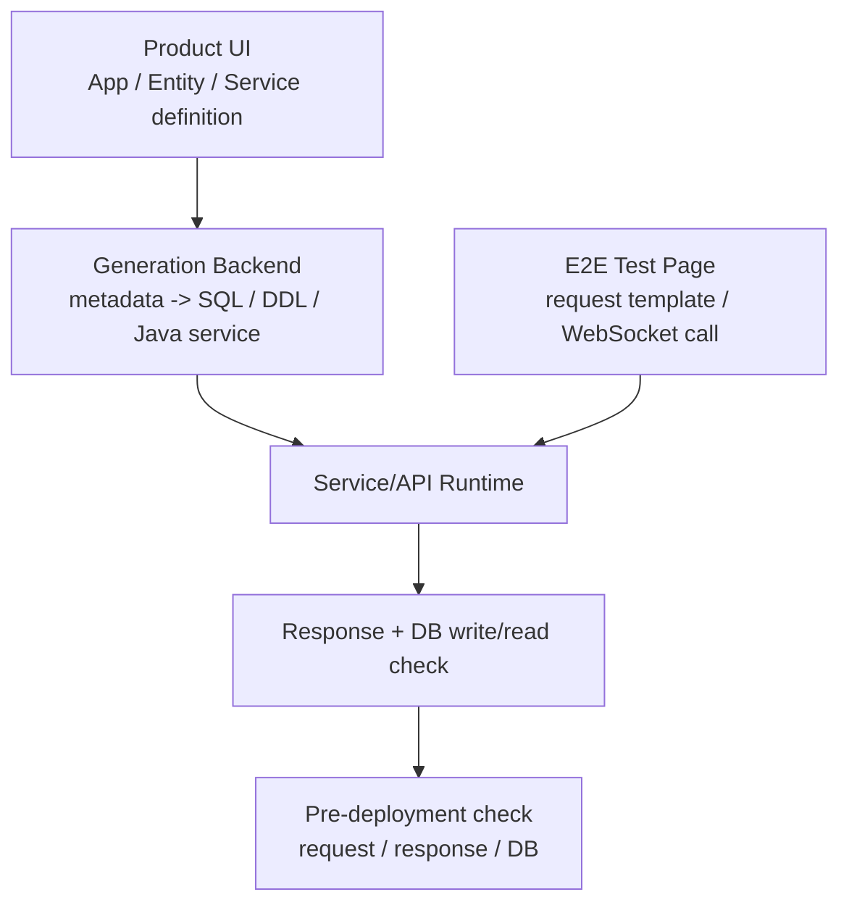
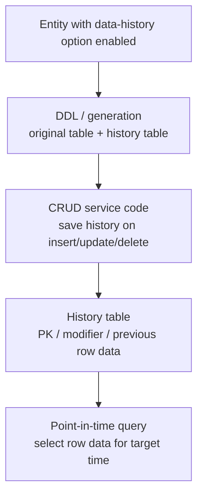

# TmaxCloud

- Role: Software Engineer
- Period: 2021.10 - 2024.11

## Overview

I implemented backend/platform features in a Java/TypeScript-based No-code platform so app, entity, and service/API definitions created in the UI could generate Java service code and SQL/DDL, then be checked through calls, responses, and DB write/read behavior before deployment.

The representative axes are service/API code-generation validation and data-change history storage/query. I also include additional work examples for entity export/import data copy, the SQL/DDL Generator, and the error logger.

## Why This Is Representative Work

The core problem in the No-code platform was making UI-defined service/API and entity designs become executable code and SQL, then making those generated artifacts callable and verifiable before deployment.

The representative work made UI-designed service/API definitions generate Java code and SQL, then let users call the service/API code with a JSON request and check the response plus DB write/read behavior before deployment. It also covers the data-history work that made CRUD insert/update/delete code save the row data needed for Studio to show table state at a target point in time. Additional work includes entity export/import data copy between platform-created applications, SQL/DDL generation, and error diagnostics.

Representative outcomes:

- Built a WebSocket-based E2E test page to verify request/response shape and DB write/read behavior before deployment.
- Designed and implemented source tables, history tables, and insert/update/delete service-code flows that save previous row data.
- Built point-in-time query logic that chooses valid row data per primary key when showing table state at a target time.
- In the entity export/import MVP, split cross-app entity data copy/sync requirements into exporting entity, intermediate connector app, and importing entity links, and owned the metadata schema plus Export client page.
- Separated SQL/DDL generation responsibility into a backend-importable library structure, and organized terminal error highlighting and exception formatting as a developer diagnostics case.

## Representative Work Flows

This work moved service/API request/response and DB-effect checks from post-deployment verification into a pre-deployment validation step.

The data-change history work created the source table and history table together when the option was enabled, then made insert/update/delete service code save previous row data into the history table. Studio could query that history table to show table state at a target point in time.

## Service/API Code-Generation Validation

**Problem Definition:** In the No-code platform, service/API behavior produced from UI definitions could previously be verified only after jar generation and a separate deployment flow.

As the number of services/APIs grew, finding incorrect service definitions or request/response shape issues required repeated build/deploy/verify cycles, increasing design and validation lead time.

**Solution:** I built a WebSocket-based E2E test page that moved verification before deployment. Users could select a service, generate and edit a JSON request, call the service/API code produced by the platform, and check the response and DB write/read behavior.

**Rationale:** If validation happens only after jar generation and deployment, service-definition errors and request/response shape issues surface late. UI-defined service/API behavior had to be callable before deployment, with response and DB write/read effects visible during validation, so the design-validation cycle could become shorter.

**Selection:** I validated whether UI-defined service/API behavior could be called through generated code, whether JSON request/response shapes matched, and whether the call produced the expected DB write/read behavior.

**Implementation:**

- Implemented WebSocket URL format validation and connection-state checks.
- Fetched service lists after a successful connection and displayed service test items in an Accordion UI.
- Generated JSON request templates per service and allowed edits in Monaco Editor.
- Sent service/API requests through WebSocket and checked response and DB write/read behavior.

**Validation:**

- Request/response shape validation
- DB write/read verification
- Whether UI service/API definitions were callable through generated code
- Pre-deployment detection of missing links between service definitions and generated code, or request/response shape issues
- Avoiding unnecessary connection attempts through WebSocket URL validation

**Result:** I moved service/API request/response and DB write/read verification into the design and validation stage. In that workflow, this contributed to reducing the repeated design-validation cycle from roughly 4 weeks to roughly 2 weeks.

## Data-Change History Storage And Query

**Problem Definition:** CRUD applications produced by the platform primarily operate on current values. To show table state at a specific point in time, the last modifier, or previous values of deleted records after insert/update/delete operations, the platform needed a separate change-history storage and query rule.

**Solution:** For entities with the data-history option enabled, I created the source table and history table together. Insert/update/delete service code saved previous row data into the history table, and point-in-time queries showed table state by choosing valid row data for each primary key at the target time.

**Rationale:** The requirement was not just to list change events, but to let CRUD applications show what a table looked like at a target point in time. That required write operations to save previous row data and query operations to choose which row data was valid for each primary key at the target time. If those rules came from different entity definitions, column, PK, and validity-period interpretation could become inconsistent, so I created the source table, history table, history-save SQL, and point-in-time query from the same entity definition.

**Selection:** DB triggers or procedures could save previous row data, but request/user context and point-in-time query generation would move into separate DB artifacts or session conventions. I chose to make the history-save query explicit in CRUD service code and to generate the history-table DDL and query SQL from the same generator input.

**Implementation:**

- Implemented a DDL/generation flow that creates both the source table and a history table for entities with the data-history option enabled.
- Structured the history table with the original PK, validity metadata, modifier metadata, and previous row data.
- Connected CRUD service SQL so insert/update/delete operations save affected previous row data into the history table through Freemarker templates and generation logic.
- Built point-in-time query logic that chooses valid row data per primary key to show table state.

**Validation:** I checked whether the columns, primary keys, and data-history option from the same entity definition were reflected in the source-table DDL, history-table DDL, CRUD service SQL, and point-in-time query SQL. I also reviewed whether the query SQL could select the previous row data saved by write operations at the target time.

**Result:** CRUD applications produced by the platform could save previous row data on insert/update/delete and show historical table state through point-in-time query SQL. The history table, history-save SQL, and point-in-time query SQL were generated from the same entity columns, primary keys, and data-history option.

## Additional Work Examples

### Entity Export/Import Data Copy

The entity export/import MVP supported initial entity-data copy between generated applications and connected that flow to change-event synchronization. I participated in the DB schema/API for exported/imported entity information and owned the metadata schema for copying selected attributes, the Export client page, and the connection structure between exporting entities, an intermediate connector app, and importing entities.

The import-cancel detail page, message-sync service template or runtime sync service, message ordering/retry, and migration strategy remained separate follow-up areas.

### SQL/DDL Generator

I separated SQL/DDL generation responsibility into a backend-importable library structure so it would not remain mixed into the application backend flow. I also added JSON-input-based SQL generation tests and coverage checks to make the generation responsibility and test flow explicit.

### Error Logger

During service/API code-generation development, ordinary logs and error logs could make it difficult to locate exception context quickly. I organized exception messages, error codes, SQL state, and stack traces through an ErrorLogger and made terminal error logs visually distinct.

## Result

Service/API code-generation validation moved request/response and DB write/read verification from post-deployment checks into the design and validation stage. In that workflow, this contributed to reducing the repeated design-validation cycle from roughly 4 weeks to roughly 2 weeks.

For data-change history, I created the source table, history table, CRUD service history-save SQL, and point-in-time query SQL from the same entity columns, primary keys, and data-history option. Write operations saved previous row data, and query operations selected the valid row data for the target time, allowing generated CRUD applications to support both current-value behavior and historical table-state lookup.

## Skills

Java, TypeScript, React, Material UI, WebSocket, Monaco Editor, Freemarker, Tibero, SQL generation, JUnit
