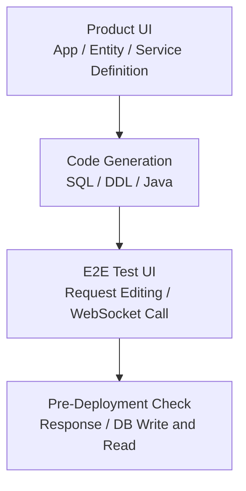
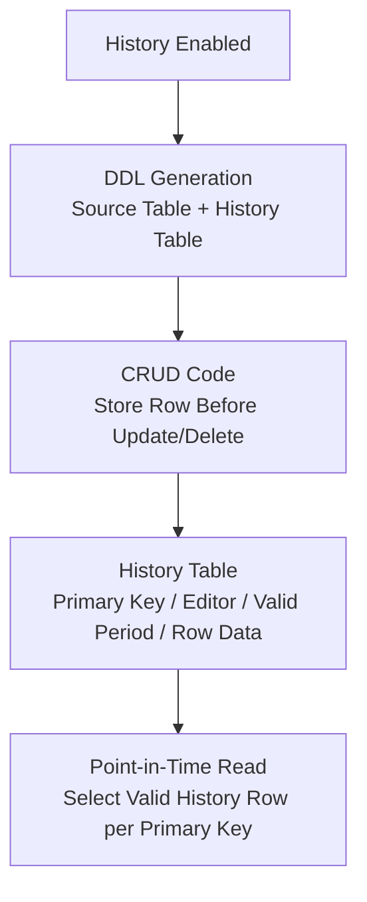

# TmaxCloud

- Period: Oct 2021 - Nov 2024

## Overview

On a Java/TypeScript no-code platform, I built pre-deployment verification for services generated from UI definitions and implemented data-change history storage. I defined how point-in-time reads should choose the valid history row for each primary key. I also added specific parts of the SQL/DDL Generator and Entity Export/Import.

## Service Code Verification

**Problem:** A UI-defined service could only be checked against its real API response and DB effects after JAR creation and a separate deployment. With roughly 200–300 services/APIs to verify, one build, deploy, and verify cycle took about 20 minutes, and finding an invalid definition or request/response shape required repeating it.

**Decision:** I built a WebSocket-based E2E test UI that called the generated API before deployment and checked JSON request/response shapes and DB writes and reads.

**Implementation:** I implemented WebSocket URL and connection validation, service-list loading, per-service JSON request templates, Monaco Editor request editing, API calls, response inspection, and database write/read checks.

**Validation and result:** I checked request/response shapes, DB writes and reads, and missing links between service definitions and generated code before deployment. This made errors previously found after deployment visible during design and verification.

## Data-Change History Storage and Point-in-Time Read Design

**Problem:** Generated CRUD applications kept only current values. Showing earlier values and the last editor after an update or delete required separate history storage and a way to query it.

**Decision:** I implemented the history table and CRUD write SQL against the entity's columns and primary key. For point-in-time reads, I defined how to choose the valid history row for each primary key. Instead of a DB trigger or procedure, I placed the write query in the CRUD code, which already carried request-user context, so it stored the row before an update or deletion together with the editor and valid period.

**Implementation:** Deploying an entity with history enabled created both its source and history tables. I connected FreeMarker templates and code-generation logic so CRUD services stored the row before an update or deletion with its primary key, editor, and valid period.

**Validation and result:** I checked that the source and history table DDL and CRUD write SQL reflected the same entity columns and primary key.

## Additional Work

### Entity Export/Import Data Copy

I contributed to the DB schema and API for storing exported and imported entities between generated applications. I designed the selected-attribute metadata and the connection between exporting and importing entities, and implemented the export UI. The MVP delivered initial data copying without message-synchronization implementation or a redeployment migration strategy for later export-schema changes.

### SQL/DDL Generator

I helped separate SQL-generation responsibility into a library imported by the backend. JSON-input SQL tests and coverage checks made the generation logic independently verifiable.

### Exception Output Formatting

I organized exception messages, error codes, SQL state, and stack traces into a consistent format, and visually separated terminal errors from general logs.

## Technologies

Java, TypeScript, React, WebSocket, Monaco Editor, FreeMarker, Tibero, SQL generation, JUnit
