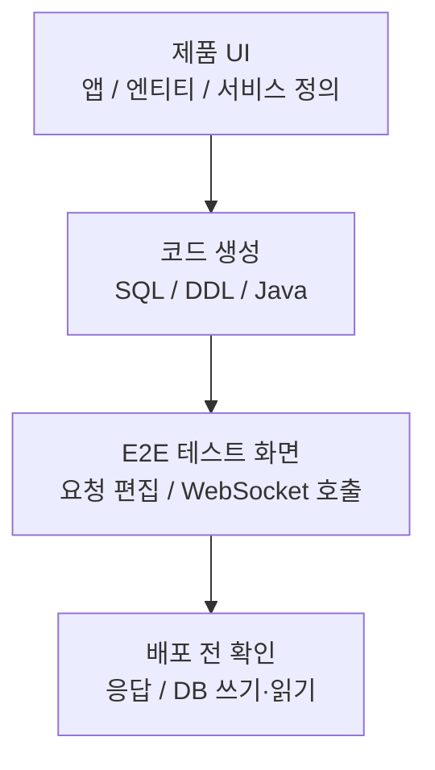
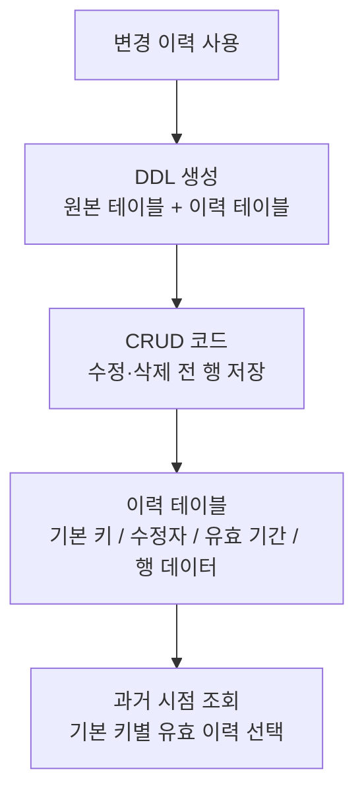

# 티맥스클라우드

- 기간: 2021.10 - 2024.11

## 개요

Java/TypeScript 기반 No-code 플랫폼에서 UI 정의로부터 생성된 서비스와 SQL/DDL을 검증·관리하는 기능을 개발했습니다. 생성된 서비스의 배포 전 검증과 데이터 변경 이력 저장을 구현하고, 과거 시점 조회에 사용할 행 선택 방식은 문서화했습니다. SQL/DDL Generator와 Entity Export/Import의 일부 기능도 추가했습니다.

## 서비스 코드 생성 검증

**문제:** UI로 정의한 서비스는 JAR 생성과 별도 배포를 마친 뒤에야 실제 API 응답과 DB 반영을 확인할 수 있었습니다. 생성된 서비스/API가 200~300개 규모로 늘어난 상황에서 한 차례 빌드·배포·검증에 약 20분이 걸렸고, 잘못된 서비스 정의나 요청·응답 형식을 찾을 때마다 이 과정을 반복해야 했습니다.

**판단:** 생성된 API를 WebSocket 기반 E2E 테스트 화면에서 호출해 JSON 요청·응답과 DB 쓰기·읽기를 배포 전에 확인하도록 했습니다.

**구현:** WebSocket URL과 연결 상태를 검사하고, 서비스 목록을 조회해 항목별 JSON 요청 양식을 만들었습니다. Monaco Editor에서 요청을 수정한 뒤 API를 호출하고 응답과 DB 반영을 확인하는 흐름을 구현했습니다.

**검증과 결과:** 요청·응답 형식, DB 쓰기·읽기, 서비스 정의와 생성 코드의 연결 누락을 배포 전에 확인했습니다. 배포 후에야 발견하던 오류를 설계·검증 단계에서 확인할 수 있게 했습니다.

## 데이터 변경 이력 저장과 과거 시점 조회 설계

**문제:** 생성된 CRUD 앱은 현재값만 남겼습니다. 수정하거나 삭제한 뒤 과거 시점의 값과 마지막 수정자를 보여주려면 변경 이력을 따로 저장하고 조회해야 했습니다.

**판단:** 이력 테이블과 CRUD 저장 SQL은 엔티티의 열과 기본 키를 따르도록 구현했습니다. 과거 시점 조회는 저장된 이력에서 기본 키별로 유효한 행을 고르도록 정의했습니다. DB 트리거나 프로시저 대신 요청 사용자 정보를 이미 가진 CRUD 코드에 저장 쿼리를 넣어 수정·삭제 전 행, 수정자, 유효 기간을 함께 남겼습니다.

**구현:** 변경 이력 옵션이 켜진 엔티티를 배포할 때 원본 테이블과 이력 테이블을 함께 만들었습니다. CRUD 서비스가 수정·삭제 전 행과 기본 키, 수정자, 유효 기간을 저장하도록 FreeMarker 템플릿과 코드 생성 로직을 연결했습니다.

**검증과 결과:** 원본·이력 테이블 DDL과 CRUD 저장 SQL에 같은 엔티티 열과 기본 키가 반영되는지 확인했습니다.

## 추가 작업

### Entity Export/Import Data Copy

서로 다른 생성 앱 사이에서 엔티티 데이터를 초기 복사하기 위해 exported/imported entity 정보를 저장하는 DB schema와 API에 참여했습니다. 선택 속성 metadata와 내보내는 엔티티·가져오는 엔티티의 연결 구조를 설계하고 Export 화면을 구현했습니다. 이 MVP는 초기 데이터 복사를 제공했고, 메시지 동기화 서비스 구현과 export schema 변경 후 재배포 migration 전략은 포함하지 않았습니다.

### SQL/DDL Generator

SQL 생성 책임을 backend에서 import할 수 있는 library로 분리하는 작업에 참여했습니다. JSON 입력 기반 SQL 생성 테스트와 coverage 확인을 붙여 생성 로직을 독립적으로 검증할 수 있게 했습니다.

### 예외 출력 정리

예외 message, error code, SQL state, stack trace를 한 형식으로 정리하고 terminal의 오류 log를 일반 log와 시각적으로 구분했습니다.

## 기술

Java, TypeScript, React, WebSocket, Monaco Editor, FreeMarker, Tibero, SQL generation, JUnit
