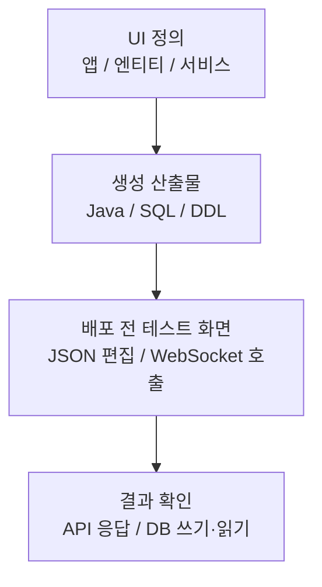
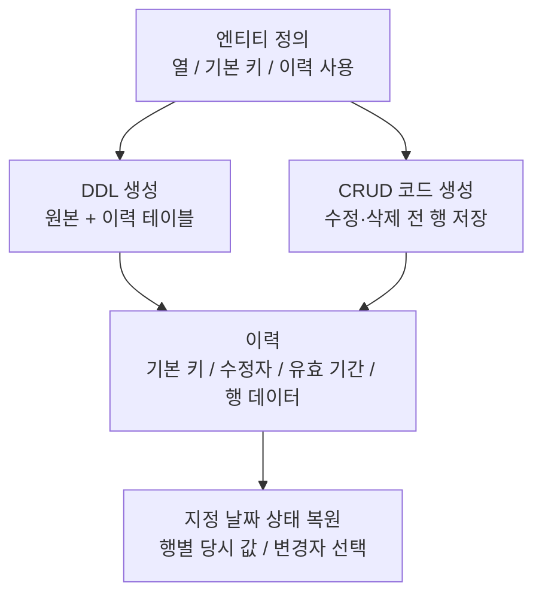

# 티맥스클라우드

- 기간: 2021.10 - 2024.11

## 코드 생성 플랫폼의 배포 전 API 테스트 기능

**문제와 진단:** 사용자가 UI에서 엔티티와 서비스 로직을 정의하면 Java API·SQL과 JAR가 생성됐습니다. 생성된 API의 응답과 DB 쓰기·읽기는 별도 배포와 컨테이너 기동 뒤에야 확인할 수 있었습니다. 서비스와 API가 200~300개 규모로 늘어난 상황에서 한 차례 빌드·배포·검증에 약 20분이 걸렸고, 잘못된 정의나 요청·응답 형식을 찾을 때마다 같은 피드백 지연이 반복됐습니다.

**제약과 선택:** 검증은 mock이 아니라 실제 JSON 요청·응답과 DB 상태를 포함해야 했습니다. 이 경계를 React·TypeScript·WebSocket 기반 테스트 화면에 배치해 배포 전에 확인하도록 선택했습니다.

**구현:** 서비스 목록에서 대상을 고르고 Monaco Editor에서 JSON 요청을 편집해 생성된 API를 호출하는 React·TypeScript 테스트 화면을 구현했습니다. 화면의 호출은 WebSocket으로 처리하고, 이를 지원하는 Java REST API와 DB 스키마를 만들어 응답 확인과 실제 DB 쓰기·읽기를 한 흐름으로 연결했습니다.

**검증과 결과:** 잘못된 요청·응답 형식과 서비스 정의·생성 코드의 연결 누락을 별도 배포 없이 찾고, 실제 DB 쓰기·읽기까지 확인했습니다. 오류를 찾을 때마다 한 차례 약 20분의 빌드·배포·확인을 반복하지 않아도 됐습니다.

## 데이터 변경 이력 저장과 지정 날짜 상태 복원

**문제와 진단:** 생성된 CRUD 앱은 현재값만 남겼습니다. 수정·삭제 뒤 과거 값과 마지막 수정자를 보여주려면 변경 전 행, 수정자, 유효 기간을 같은 기준으로 저장하고 조회해야 했습니다.

**제약과 선택:** Tibero DB 트리거나 프로시저는 변경 행을 볼 수 있지만 요청 사용자 정보까지 자연스럽게 전달받지 못했습니다. 요청 사용자 정보를 이미 가진 CRUD 코드에 저장 SQL을 생성하고, 이력 테이블 DDL과 과거 시점 조회가 같은 엔티티 열·기본 키 정의를 따르도록 선택했습니다.

**구현:** FreeMarker 템플릿에 원본·이력 테이블 DDL과 수정·삭제 전 행을 저장하는 SQL을 반영했습니다. 원본·이력 데이터를 조합해 지정한 날짜 기준으로 각 행의 당시 값을 복원하고 마지막 변경자를 반환하는 조회 SQL도 작성했습니다.

**검증과 결과:** 예시 데이터에서 수정·삭제 전 값과 변경자·삭제 정보가 이력 테이블에 쌓이는지 확인했습니다. 조회 날짜를 입력한 SQL이 기본 키별 유효 이력 행을 골라 당시 테이블 상태와 마지막 변경자를 반환하는 결과도 확인했습니다.

## 추가 작업

### 엔티티 내보내기·가져오기와 선택 속성 동기화

Studio에서 엔티티를 내보내 다른 생성 앱으로 가져오고, 가져온 엔티티를 서비스 정의에 사용합니다. 가져오기 시점에는 선택한 속성 데이터를 복사하고, 이후 연결된 서비스에서 데이터 변경이 발생하면 해당 속성의 변경을 메시지 브로커를 통해 동기화합니다.

내보낸 엔티티와 가져온 엔티티 정보를 저장하는 DB 스키마와 API 개발에 참여했습니다. 선택 속성 메타데이터와 메시지 브로커를 거치는 내보내기·가져오기 엔티티 연결 구조를 설계하고, 내보내기 화면을 구현했습니다. 메시지 동기화 서비스 구현과 스키마 변경 후 재배포 마이그레이션 전략은 별도 작업 영역이었습니다.

### SQL 생성 로직의 라이브러리 분리

SQL 생성 책임을 백엔드가 직접 불러 사용하는 라이브러리로 분리하는 작업에 참여했습니다. JUnit으로 JSON 입력 기반 SQL 생성 테스트를 작성하고 JaCoCo 커버리지 설정을 추가해 생성 로직을 독립적으로 검증할 수 있게 했습니다.

### 예외 로그 출력 형식 통일

예외 메시지, 오류 코드, SQL 상태 코드와 스택 트레이스를 한 형식으로 출력하고, 터미널에서 오류 로그를 일반 로그와 시각적으로 구분하도록 구현했습니다.
