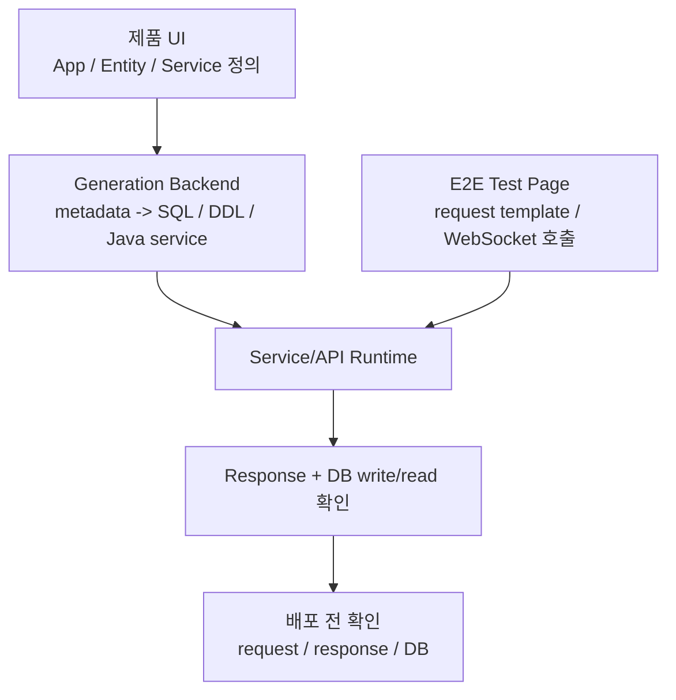
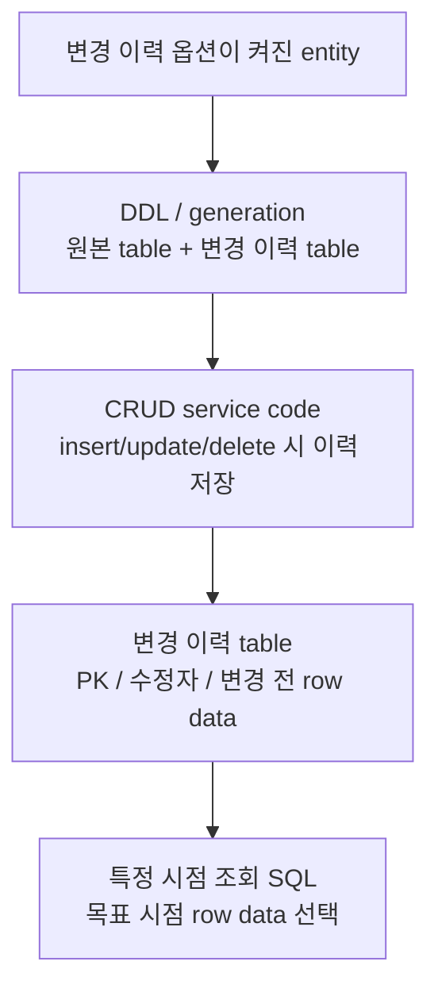

# 티맥스클라우드

- 역할: Software Engineer
- 기간: 2021.10 - 2024.11

## 개요

Java/TypeScript 기반 No-code 플랫폼에서 사용자가 UI로 정의한 app, entity, service/API가 Java service code와 SQL/DDL로 생성되고, 호출 결과와 DB write/read 반영까지 배포 전 확인되도록 하는 backend/platform 기능을 구현했습니다.

대표 축은 service/API 코드 생성 검증과 데이터 변경 이력 저장·조회입니다. 그 외 확인된 작업 사례로 entity export/import data copy, SQL/DDL Generator, error logger를 별도로 정리합니다.

## 대표 작업으로 보는 이유

No-code platform의 핵심 문제는 사용자가 화면에서 정의한 service/API와 entity가 실제 실행 가능한 코드와 SQL로 생성되고, 그 산출물이 배포 전에 호출·검증될 수 있어야 한다는 점이었습니다.

대표로 앞세우는 작업은 화면에서 설계한 service/API를 Java 코드와 SQL로 생성하고, JSON request로 호출해 response와 DB write/read 반영을 배포 전에 확인할 수 있게 만든 것입니다. 배포된 CRUD 앱의 insert/update/delete 동작이 변경 이력 table에 필요한 row data를 남기고, Studio가 특정 시점의 table 상태를 다시 보여줄 수 있도록 한 작업도 함께 다룹니다. 그 외에도 생성된 앱 사이의 entity export/import data copy, SQL/DDL generation, error diagnostics 작업을 맡았습니다.

대표 결과는 아래와 같습니다.

- WebSocket 기반 E2E test page로 배포 전 request/response 형식과 DB write/read 반영을 확인할 수 있게 했습니다.
- 변경 이력 옵션이 켜진 entity의 원본 table, 변경 이력 table, insert/update/delete 서비스 코드의 이력 저장 흐름을 설계·구현했습니다.
- 특정 시점 조회 SQL이 목표 시점에 유효한 row data를 골라 table 상태를 보여주도록 만들었습니다.
- Entity export/import MVP에서 앱 간 entity data copy/sync 요구를 export entity, Broker App, import entity 연결로 나누고, metadata schema와 Export client page를 담당했습니다.
- SQL/DDL 생성 책임은 backend에서 import 가능한 library 구조로 분리하고, terminal error highlighting과 예외 정보 formatting은 개발 진단 사례로 정리했습니다.

## 대표 작업 흐름

이 작업은 jar 생성과 별도 배포 후에야 확인하던 service/API request/response와 DB 반영 문제를 배포 전 검증 단계로 당기는 작업이었습니다.

변경 이력 작업은 옵션이 켜진 entity를 배포할 때 원본 table과 변경 이력 table을 함께 만들고, insert/update/delete 서비스 코드가 변경 전 row data를 이력 table에 저장하도록 한 작업입니다. Studio는 이 이력 table을 조회해 특정 시점의 table 상태를 보여줄 수 있습니다.

## Service/API 코드 생성 검증

**문제 정의:** No-code platform에서 화면으로 정의한 service/API는 jar 생성과 별도 배포 흐름을 거친 뒤에야 실제 request/response와 DB 반영을 확인할 수 있었습니다.

service/API 수가 늘어나면 잘못된 service definition이나 request/response 형식 문제를 찾기 위해 build/deploy/verify cycle을 반복해야 했고, 이 반복은 설계와 검증 리드타임을 늘렸습니다.

**해결 방법:** WebSocket 기반 E2E test page로 배포 전 검증 흐름을 만들었습니다. 사용자가 service를 선택하고 JSON request를 생성·수정한 뒤 코드로 생성된 service/API를 호출해 response와 DB write/read 반영을 확인할 수 있게 했습니다.

**근거:** 문제를 jar 생성 이후의 배포 단계에서만 확인하면 service definition 오류와 request/response 형식 오류가 늦게 드러납니다. 화면에서 정의한 service/API를 배포 전에 호출하고 response와 DB write/read 반영을 확인할 수 있어야 설계와 검증 cycle이 짧아집니다.

**선택:** 검증 대상은 화면에서 정의한 service/API가 생성 코드로 호출되는지, JSON request/response 형식이 맞는지, 호출 결과가 DB write/read에 반영되는지였습니다.

**구현:**

- WebSocket URL 형식 검증과 연결 상태 확인 흐름을 구현했습니다.
- 연결 성공 후 service 목록을 조회하고, service별 테스트 항목을 Accordion UI로 표시했습니다.
- Service별 JSON request template을 생성하고 Monaco Editor에서 수정할 수 있게 했습니다.
- Service/API request를 WebSocket으로 전송하고 response와 DB write/read 반영 여부를 확인하는 테스트 흐름을 만들었습니다.

**검증:**

- request/response 형식 확인
- DB write/read 반영 확인
- 화면 service/API 정의가 생성 코드로 호출되는지 확인
- service 정의와 생성 코드 연결 누락 또는 request/response 형식 오류를 배포 전 검증 단계에서 확인
- 잘못된 WebSocket URL 입력을 사전에 막아 불필요한 연결 시도와 오류 감소

**결과:** 배포 후에야 확인하던 service/API request/response와 DB write/read 반영을 설계·검증 단계에서 확인하는 흐름으로 옮겼습니다. 당시 반복되던 설계-검증 cycle을 약 4주에서 2주 수준으로 줄이는 데 기여했습니다.

## 데이터 변경 이력 저장과 조회

**문제 정의:** 코드로 생성된 CRUD 앱은 기본적으로 현재값 중심으로 동작합니다. insert/update/delete 이후 특정 시점의 table 상태, 마지막 수정자, 삭제된 record의 과거 값을 다시 보여주려면 별도 변경 이력 저장 구조와 조회 로직이 필요했습니다.

**해결 방법:** 변경 이력 옵션이 켜진 entity에 대해 원본 table과 변경 이력 table을 함께 만들고, insert/update/delete 서비스 코드가 변경 전 row data를 변경 이력 table에 저장하도록 구성했습니다. 특정 시점 조회 SQL은 목표 시점에 각 PK별로 유효한 row data를 골라 table 상태를 보여주도록 정리했습니다.

**근거:** 요구는 변경 사실을 나열하는 감사 로그가 아니라, 생성된 CRUD 앱이 특정 시점의 table 상태를 다시 보여주는 것이었습니다. 그래서 쓰기 동작에서는 변경 전 row data를 저장해야 했고, 조회 동작에서는 목표 시점에 각 PK별로 어떤 row data가 유효한지 선택해야 했습니다. 이 두 흐름이 서로 다른 entity 정의 정보에서 만들어지면 column, PK, 유효 기간 해석이 어긋날 수 있어, 원본 table, 변경 이력 table, 이력 저장 SQL, 특정 시점 조회 SQL을 같은 entity 정의 정보에서 만들도록 묶었습니다.

**선택:** DB trigger/procedure도 변경 전 row data 저장에는 사용할 수 있었지만, request/user context 전달과 특정 시점 조회 SQL 생성을 별도 DB artifact나 session 규약으로 관리해야 했습니다. 그래서 CRUD service code 안에 이력 저장 query를 명시하고, 변경 이력 table DDL과 조회 SQL을 같은 generator input에서 만들었습니다.

**구현:**

- 변경 이력 옵션이 켜진 entity에 대해 원본 table과 변경 이력 table이 함께 생성되도록 DDL/generation 흐름을 구현했습니다.
- 변경 이력 table에 원본 PK, 유효 기간, 수정자, 변경 전 row data를 포함하도록 구성했습니다.
- CRUD service code의 insert/update/delete SQL이 영향받는 변경 전 row data를 변경 이력 table에 저장하도록 Freemarker template과 generation logic을 연동했습니다.
- 특정 시점 조회 SQL이 각 PK별 유효 row data를 골라 table 상태를 보여주도록 만들었습니다.

**검증:** 같은 entity 정의의 column, PK, 변경 이력 옵션이 원본 table DDL, 변경 이력 table DDL, CRUD service SQL, 특정 시점 조회 SQL에 반영되는지 확인했습니다. 쓰기 동작이 저장한 변경 전 row data를 조회 SQL이 목표 시점에 다시 선택할 수 있는지 검토했습니다.

**결과:** 생성된 CRUD 앱이 현재값 처리만 하는 구조에서 벗어나, insert/update/delete 때 변경 전 row data를 남기고 특정 시점 조회 SQL로 과거 table 상태를 보여줄 수 있게 했습니다. 변경 이력 table, 이력 저장 SQL, 특정 시점 조회 SQL은 같은 entity 정의의 column, PK, 이력 옵션에서 생성되도록 정리했습니다.

## 추가 작업 사례

### Entity Export/Import Data Copy

Entity export/import MVP는 서로 다른 생성 앱 사이에서 entity data를 초기 복사하고 변경 이벤트 동기화 흐름과 연결하기 위한 작업이었습니다. 저는 exported/imported entity 정보를 저장하는 DB schema/API에 참여하고, 선택한 속성만 복사하기 위한 metadata schema와 `selected_attr_ids`, Export client page, `export entity -> Broker App -> import entity` 연결 구조를 맡았습니다.

Import 취소 상세 목록 page, `syncservice.ftl` 또는 message sync service, message ordering/retry, migration strategy는 후속 연계 영역으로 분리했습니다.

### SQL/DDL Generator

SQL/DDL 생성 책임이 application backend 흐름과 섞일 수 있는 구조를 backend에서 import 가능한 library 형태로 분리했습니다. JSON input 기반 SQL 생성 테스트와 coverage 확인 흐름을 붙여, SQL 생성 책임과 테스트 흐름을 명확히 했습니다.

### Error Logger

Service/API 코드 생성 개발 과정에서 일반 log와 error log가 섞여 문제 위치와 예외 정보를 빠르게 보기 어려운 문제가 있었습니다. ErrorLogger로 exception message, error code, SQL state, stack trace를 정리하고 terminal에서 error log가 빨간색으로 보이도록 출력 형식을 정리했습니다.

## 결과

Service/API 코드 생성 검증은 배포 후 확인하던 request/response와 DB write/read 반영을 설계·검증 단계로 옮겼고, 당시 반복되던 설계-검증 cycle을 약 4주에서 2주 수준으로 줄이는 데 기여했습니다.

데이터 변경 이력 작업은 원본 table, 변경 이력 table, CRUD service code의 이력 저장 SQL, 특정 시점 조회 SQL을 같은 entity 정의의 column, PK, 이력 옵션에서 만들도록 한 작업입니다. 쓰기 동작이 저장한 변경 전 row data를 조회 SQL이 목표 시점에 다시 선택할 수 있어, 생성된 CRUD 앱이 현재값 처리와 과거 table 상태 조회를 함께 지원할 수 있습니다.

## 기술

Java, TypeScript, React, Material UI, WebSocket, Monaco Editor, Freemarker, Tibero, SQL generation, JUnit
