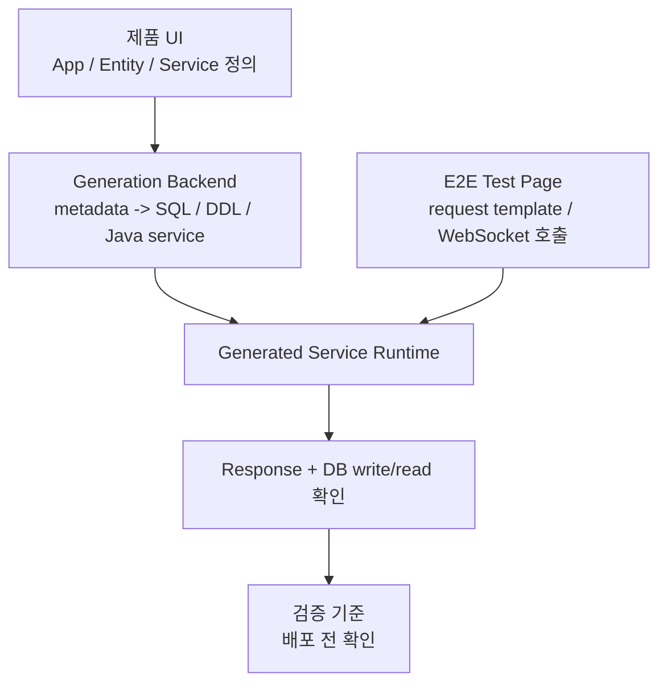
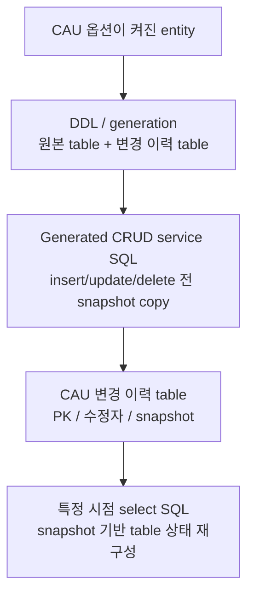

# 티맥스클라우드

- 역할: Software Engineer
- 기간: 2021.10 - 2024.11

## 개요

Java/TypeScript 기반 No-code 플랫폼에서 사용자가 UI로 정의한 app, entity, service/API 정보를 SQL/DDL, generated Java service code, DB 반영 검증, 변경 이력 기준으로 연결하는 backend/platform 기능을 구현했습니다.

이 페이지는 이력서의 티맥스클라우드 항목을 보완합니다. 중심은 generated service E2E validation과 CAU table history이며, SQL/DDL Generator와 error logger는 보조 구조로 둡니다.

## 대표 작업으로 보는 이유

No-code platform의 핵심 문제는 사용자가 화면에서 정의한 설계 정보가 실제 실행 코드, SQL, DB 상태, 테스트 요청 형식까지 일관되게 이어져야 한다는 점이었습니다.

제가 맡은 범위는 생성된 service/API를 배포 전 검증할 수 있게 하고, 생성된 CRUD service가 변경 이력 table과 함께 동작하도록 만드는 backend/platform 경계였습니다.

대표 결과는 아래와 같습니다.

- WebSocket 기반 generated service E2E test page로 배포 전 request/response 형식과 DB write/read 반영을 확인할 수 있게 했습니다.
- CAU 변경 이력 table과 generated CRUD service code SQL의 insert/update/delete row snapshot copy 흐름을 설계·구현했습니다.
- 특정 시점의 table snapshot을 재구성하기 위해 필요한 snapshot만 고르는 select SQL 기준을 정리했습니다.
- SQL/DDL 생성 책임은 backend에서 import 가능한 library 구조로 분리하고, terminal error highlighting과 예외 정보 formatting은 개발 진단 보조 구조로 정리했습니다.

## 대표 작업 흐름

Generated service는 jar 생성과 별도 배포 후에야 확인하던 request/response와 DB 반영 문제를 배포 전 검증 단계로 당기는 작업이었습니다.

CAU 변경 이력은 generated CRUD service SQL 안에서 row snapshot copy와 특정 시점 select SQL 기준을 같은 generation boundary에 둔 작업입니다.

## Generated Service E2E Validation

### 생성 서비스 검증 문제

No-code platform에서 생성된 service/API는 jar 생성과 별도 배포 흐름을 거친 뒤에야 실제 request/response와 DB 반영을 확인할 수 있었습니다.

service/API 수가 늘어나면 잘못된 service definition이나 request/response 형식 문제를 찾기 위해 build/deploy/verify cycle을 반복해야 했고, 이 반복은 설계와 검증 리드타임을 늘렸습니다.

### 구현 범위

- WebSocket URL 형식 검증과 연결 상태 확인 흐름을 구현했습니다.
- 연결 성공 후 service 목록을 조회하고, service별 테스트 항목을 Accordion UI로 표시했습니다.
- Service별 JSON request template을 생성하고 Monaco Editor에서 수정할 수 있게 했습니다.
- Generated service request를 WebSocket으로 전송하고 response와 DB write/read 반영 여부를 확인하는 테스트 흐름을 만들었습니다.

### 검증 기준

- request/response 형식 확인
- DB write/read 반영 확인
- service definition과 generated service 동작 일치 여부 확인
- service 정의와 generated service 연결 누락 또는 request/response 형식 오류를 배포 전 검증 단계에서 확인
- 잘못된 WebSocket URL 입력을 사전에 막아 불필요한 연결 시도와 오류 감소

## CAU 변경 이력과 Table Snapshot

### 변경 이력 재구성 문제

생성된 CRUD 앱은 기본적으로 현재값 중심으로 동작합니다. insert/update/delete 이후 특정 시점의 table 상태, 마지막 수정자, 삭제된 record의 과거 값을 재구성하려면 별도 변경 이력 저장 구조와 조회 기준이 필요했습니다.

### 설계와 구현

- CAU 옵션이 켜진 entity에 대해 원본 table과 변경 이력 table이 함께 생성되도록 DDL/generation 흐름을 구현했습니다.
- CAU table에 원본 PK, 유효 기간, 수정자, row snapshot metadata를 포함하도록 구성했습니다.
- generated CRUD service code의 insert/update/delete SQL이 영향받는 row snapshot을 변경 이력 table에 copy하도록 generation logic을 연동했습니다.
- select SQL로 필요한 snapshot만 골라 특정 시점의 table snapshot을 재구성하는 기준을 정리했습니다.

### 선택 이유

DB trigger/procedure도 가능한 대안이었지만, 이 기능은 단순 audit log가 아니라 No-code platform이 생성한 entity를 특정 시점 table snapshot으로 재구성하기 위한 generation feature였습니다.

request/user context, snapshot copy query, 특정 시점 select SQL 공식이 같은 generation boundary 안에서 연결되어야 했기 때문에 generated CRUD service SQL 안에 snapshot copy query를 명시하는 방향을 선택했습니다.

## 보조 구조

### SQL/DDL Generator

SQL/DDL 생성 책임이 application backend 흐름과 섞일 수 있는 구조를 backend에서 import 가능한 library 형태로 분리했습니다. JSON input 기반 SQL 생성 테스트와 coverage 확인 흐름을 붙여, SQL 생성 책임과 테스트 기준을 명확히 했습니다.

### Error Logger

Generated service 개발 과정에서 일반 log와 error log가 섞여 문제 위치와 예외 정보를 빠르게 보기 어려운 문제가 있었습니다. ErrorLogger로 exception message, error code, SQL state, stack trace를 정리하고 terminal에서 error log가 빨간색으로 보이도록 출력 형식을 정리했습니다.

## 결과

배포 후에야 확인하던 generated service의 request/response와 DB write/read 반영을 설계·검증 단계에서 확인하는 흐름으로 옮겼습니다. 잘못된 service definition, request/response 형식, DB 반영 누락을 build/deploy 이후가 아니라 배포 전 검증 단계에서 발견할 수 있게 한 작업입니다.

당시 작업 기준 반복되던 설계-검증 cycle을 약 4주에서 2주 수준으로 줄이는 데 기여한 것으로 기록되어 있습니다. 이 지표는 generated service 검증을 배포 전 단계로 옮긴 작업 범위의 결과입니다.

CAU 변경 이력은 원본 table, 변경 이력 table, generated CRUD service code의 row snapshot copy 흐름, 특정 시점 select SQL 기준이 같은 generation boundary 안에서 함께 관리되도록 정리했습니다. 이 기준 덕분에 생성된 CRUD 앱의 현재값 처리와 과거 snapshot 재구성 책임이 흩어지지 않고 같은 생성 흐름 안에서 검증됩니다.

## 기술

Java, TypeScript, React, Material UI, WebSocket, Monaco Editor, Freemarker, Tibero, SQL generation, JUnit
