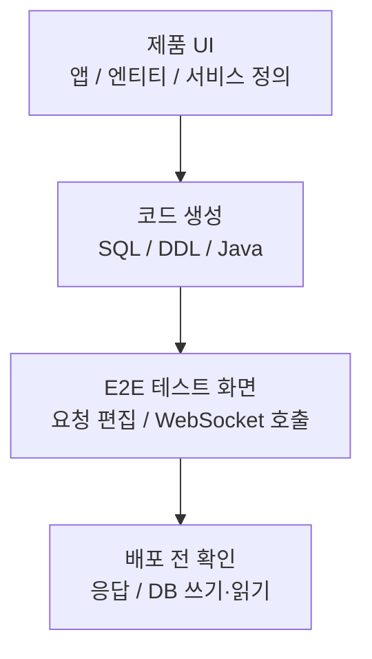
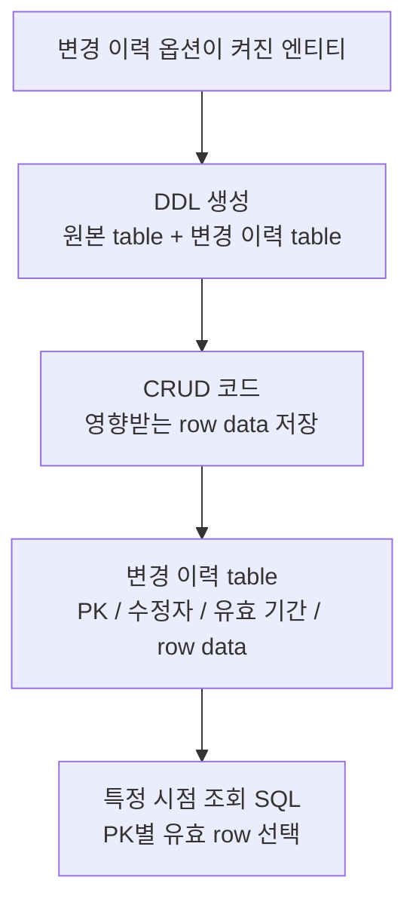

# 티맥스클라우드

- 기간: 2021.10 - 2024.11

## 개요

Java/TypeScript 기반 No-code 플랫폼에서 UI 정의로부터 생성된 서비스와 SQL/DDL을 검증·관리하는 기능을 개발했습니다. 대표 작업은 생성된 서비스의 배포 전 검증, 데이터 변경 이력 저장과 시점 조회 기준 설계이며, SQL/DDL Generator와 Entity Export/Import 등 일부 생성 기능도 구현했습니다.

## 서비스 코드 생성 검증

**문제:** UI로 정의한 서비스는 JAR 생성과 별도 배포를 마친 뒤에야 실제 API 응답과 DB 반영을 확인할 수 있었습니다. 잘못된 서비스 정의나 요청·응답 형식을 찾을 때마다 빌드·배포·검증을 반복해야 했습니다.

**판단:** 생성된 API를 WebSocket 기반 E2E 테스트 화면에서 호출해 JSON 요청·응답과 DB 쓰기·읽기를 배포 전에 확인하도록 했습니다.

**구현:** WebSocket URL과 연결 상태를 검사하고, 서비스 목록을 조회해 항목별 JSON 요청 양식을 만들었습니다. Monaco Editor에서 요청을 수정한 뒤 API를 호출하고 응답과 DB 반영을 확인하는 흐름을 구현했습니다.

**검증과 결과:** 요청·응답 형식, DB 쓰기·읽기, 서비스 정의와 생성 코드의 연결 누락을 배포 전에 확인했습니다. 배포 후에야 발견하던 오류를 설계·검증 단계에서 확인할 수 있게 했습니다.

## 데이터 변경 이력 저장과 시점 조회 설계

**문제:** 생성된 CRUD 앱은 현재값만 남기기 때문에 수정·삭제 뒤 특정 시점의 table 상태, 마지막 수정자, 과거 값을 다시 보여주려면 별도 저장과 조회 구조가 필요했습니다.

**판단:** 변경 이력 table과 CRUD 코드의 저장 SQL이 엔티티의 column과 PK를 따르도록 구현하고, 특정 시점 조회 SQL이 같은 정보를 기준으로 유효한 row를 고르도록 재구성 기준을 정리했습니다. DB trigger/procedure 대신 요청 사용자 정보를 이미 가진 CRUD 코드에 저장 query를 명시해 쓰기와 조회 기준을 한 생성 흐름에서 관리했습니다.

**구현:** 변경 이력 옵션이 켜진 엔티티를 배포할 때 원본 table과 변경 이력 table을 함께 만들었습니다. CRUD service 호출 시 영향받는 row data와 PK, 수정자, 유효 기간을 저장하도록 Freemarker template과 코드 생성 로직을 연동했습니다.

**검증과 결과:** 원본·변경 이력 table DDL과 CRUD 저장 SQL에 같은 엔티티 column·PK가 반영되는지 확인했습니다. 이어 저장된 row data에서 목표 시점에 유효한 값을 PK별로 고르는 조회 기준을 정리했습니다.

## 추가 작업

### Entity Export/Import Data Copy

서로 다른 생성 앱 사이에서 엔티티 데이터를 초기 복사하기 위해 exported/imported entity 정보를 저장하는 DB schema와 API에 참여했습니다. 선택 속성 metadata, Export 화면, 내보내는 엔티티와 가져오는 엔티티의 연결 구조를 맡았고 메시지 동기화 서비스와 migration strategy는 후속 영역으로 분리했습니다.

### SQL/DDL Generator

SQL 생성 책임을 backend에서 import할 수 있는 library로 분리하는 작업에 참여했습니다. JSON 입력 기반 SQL 생성 테스트와 coverage 확인을 붙여 생성 로직을 독립적으로 검증할 수 있게 했습니다.

### 예외 출력 정리

예외 message, error code, SQL state, stack trace를 한 형식으로 정리하고 terminal의 오류 log를 일반 log와 시각적으로 구분했습니다.

## 기술

Java, TypeScript, React, WebSocket, Monaco Editor, Freemarker, Tibero, SQL generation, JUnit
