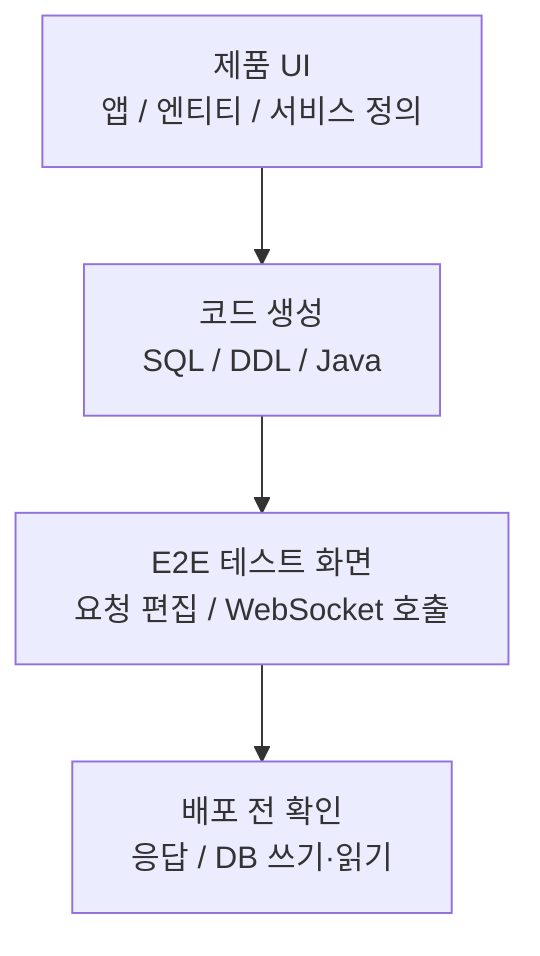
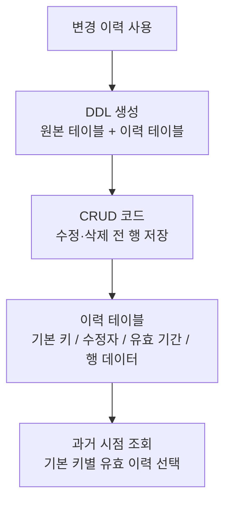

# 티맥스클라우드

- 기간: 2021.10 - 2024.11

## 개요

Java/TypeScript 기반 노코드 플랫폼에서 UI 정의로 생성된 Java 서비스 코드와 SQL·DDL을 배포 전에 검증하는 기능을 개발했습니다. 생성된 CRUD 앱의 수정·삭제 전 데이터를 저장하는 변경 이력 기능을 구현하고, 기본 키별 과거 시점 조회 기준을 정의했습니다. 엔티티 내보내기·가져오기 기능은 Studio에서 엔티티를 내보내 다른 생성 앱으로 가져와 서비스 정의에 사용하고, 가져오기 시점에는 선택 속성 데이터를 복사한 뒤 이후 해당 속성의 변경을 메시지 브로커를 통해 동기화합니다. 저는 내보낸·가져온 엔티티 정보를 저장하는 DB 스키마·API 개발에 참여하고, 선택 속성 메타데이터와 메시지 브로커를 거치는 엔티티 연결 구조를 설계했으며, 내보내기 화면을 구현했습니다. SQL 생성 로직의 라이브러리 분리에도 참여했습니다.

## 서비스 코드 생성 검증

**문제:** UI로 정의한 서비스는 JAR 생성과 별도 배포를 마친 뒤에야 실제 API 응답과 DB 쓰기·읽기를 확인할 수 있었습니다. 생성된 서비스/API가 200~300개 규모로 늘어난 상황에서 한 차례 빌드·배포·검증에 약 20분이 걸렸고, 잘못된 서비스 정의나 요청·응답 형식을 찾을 때마다 이 과정을 반복해야 했습니다.

**판단:** 생성된 API를 React·WebSocket 기반 E2E 테스트 화면에서 호출해 JSON 요청·응답과 DB 쓰기·읽기를 배포 전에 확인하도록 했습니다.

**구현:** WebSocket URL과 연결 상태 검사, 서비스 목록 조회, 항목별 JSON 요청 양식 생성, Monaco Editor 요청 편집, API 호출, 응답·DB 쓰기·읽기 확인 기능을 구현했습니다.

**검증과 결과:** 요청·응답 형식, DB 쓰기·읽기, 서비스 정의와 생성 코드의 연결 누락을 배포 전에 확인하도록 했습니다. 이 기능은 당시 반복되던 설계·검증 주기를 약 4주에서 2주 수준으로 줄이는 데 기여했습니다.

## 데이터 변경 이력 저장과 과거 시점 조회 설계

**문제:** 생성된 CRUD 앱은 현재값만 남겼습니다. 수정하거나 삭제한 뒤 과거 시점의 값과 마지막 수정자를 보여주려면 변경 이력을 따로 저장하고 조회해야 했습니다.

**판단:** 이력 테이블과 CRUD 저장 SQL은 엔티티의 열과 기본 키를 따르도록 구현했습니다. 과거 시점 조회는 저장된 이력에서 기본 키별로 유효한 행을 고르도록 정의했습니다. Tibero DB 트리거나 프로시저 대신 요청 사용자 정보를 이미 가진 CRUD 코드에 저장 쿼리를 넣어 수정·삭제 전 행, 수정자, 유효 기간을 함께 남겼습니다.

**구현:** 변경 이력 옵션이 켜진 엔티티를 배포할 때 원본 테이블과 이력 테이블을 함께 만들었습니다. CRUD 서비스가 수정·삭제 전 행과 기본 키, 수정자, 유효 기간을 저장하도록 FreeMarker 템플릿과 코드 생성 로직을 연결했습니다.

**검증과 결과:** 원본·이력 테이블 DDL과 CRUD 저장 SQL에 같은 엔티티 열과 기본 키가 반영되는지 확인했습니다.

## 추가 작업

### 엔티티 내보내기·가져오기와 선택 속성 동기화

Studio에서 엔티티를 내보내 다른 생성 앱으로 가져오고, 가져온 엔티티를 서비스 정의에 사용합니다. 가져오기 시점에는 선택한 속성 데이터를 복사하고, 이후 연결된 서비스에서 데이터 변경이 발생하면 해당 속성의 변경을 메시지 브로커를 통해 동기화합니다. 저는 내보낸 엔티티와 가져온 엔티티 정보를 저장하는 DB 스키마와 API 개발에 참여하고, 선택 속성 메타데이터와 메시지 브로커를 거치는 내보내기·가져오기 엔티티 연결 구조를 설계했으며, 내보내기 화면을 구현했습니다. 메시지 동기화 서비스 구현과 스키마 변경 후 재배포 마이그레이션 전략은 별도 작업 영역이었습니다.

### SQL 생성 로직의 라이브러리 분리

SQL 생성 책임을 백엔드가 직접 불러 사용하는 라이브러리로 분리하는 작업에 참여했습니다. JUnit으로 JSON 입력 기반 SQL 생성 테스트를 작성하고 JaCoCo 커버리지 설정을 추가해 생성 로직을 독립적으로 검증할 수 있게 했습니다.

### 예외 로그 출력 형식 통일

예외 메시지, 오류 코드, SQL 상태 코드와 스택 트레이스를 한 형식으로 출력하고, 터미널에서 오류 로그를 일반 로그와 시각적으로 구분하도록 구현했습니다.

## 기술

Java, TypeScript, React, WebSocket, Monaco Editor, FreeMarker, Tibero, SQL·DDL 생성, JUnit, JaCoCo
