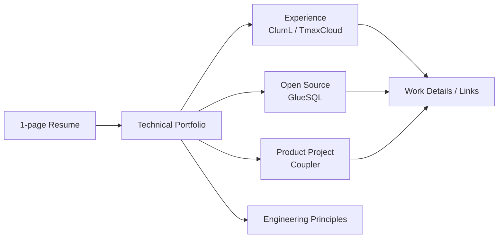

# Kim Minsik Technical Portfolio

PLATFORM SOFTWARE ENGINEER

## Summary

I am a Platform Software Engineer who connects service design information and domain rules to SQL/DDL, service code, test criteria, and review criteria so platform features and change safety move together.

At ClumL, I work on report/detection display issues, Rust service compatibility, and issue/spec-based validation criteria for a security event analysis product suite. At TmaxCloud, I implemented generated-service E2E validation and CAU change-history criteria in a Java/TypeScript-based No-code platform. In GlueSQL, I have worked on Rust-based SQL engine parser/AST work, SQL functions, storage, test suites, mentoring, and code review. In Coupler, I organize app, API, admin web, DB, deployment, and signup/review flow criteria for a React Native product.

This portfolio documents representative work through problem context, role scope, design choices, validation criteria, and related links.

## Structure

## Representative Work

- [Display consistency and change safety in a security analysis product](experience/cluml.md): separate causes and change scope for detection list/detail views, time ranges, port/packet display, and chart/report behavior, then check completion criteria and review evidence.
- [Generated-service validation and change-history criteria](experience/tmaxcloud.md): organized a generated-service E2E test page, CAU change-history table, and generated CRUD service row-snapshot copy flow.
- [Rust SQL engine open-source contribution](opensource/gluesql.md): worked on SQL functions, parser/AST, aggregate functions, storage, and test suites through GitHub PRs and reviews.
- [State contracts and review criteria for a personal product](projects/coupler.md): organized signup response contracts, member review policies, and code review criteria for a React Native app, API, and admin web as implementation and documentation standards.

## Engineering Perspective

I value code that is consistent, extensible, cohesive, loosely coupled, and clear in its separation of responsibilities.

As some repetitive implementation work becomes less of a bottleneck, I consider problem definition, domain policies, responsibility boundaries, test criteria, and review criteria more important. Good engineering documents should become executable guidance that helps teammates and AI agents implement and review from the same perspective.

I describe this in more detail in [Principles](engineering-principles.md).

## Technical Focus Areas

- Platform: connecting metadata and schema information to SQL/DDL, generated service code, DB verification, change history, and test criteria
- Rust/SQL: SQL engine internals, parser/AST, storage, Rust open-source contribution, and code review
- Product quality: display consistency in security event analysis products, Rust service compatibility checks, React Native product operation, TypeScript migration, and signup/review flow cleanup
- Review system: requirements-based work definition, completion criteria, test coverage, change-safety review, and verification criteria for AI-assisted development

## Skills

- Languages: Rust, Java, TypeScript, SQL
- Backend/Data: SQL/DDL Generator, GraphQL, WebSocket, PostgreSQL, MySQL, Tibero
- Frontend: React, React Native, Material UI, React Flow
- Infra/Tools: Kubernetes, Terraform, GitHub Actions, AWS

## Links

- [Email](mailto:meenseek5929@naver.com)
- [GitHub](https://github.com/zmrdltl)

## Navigation

- [Work](experience/index.md)
- [ClumL](experience/cluml.md)
- [TmaxCloud](experience/tmaxcloud.md)
- [Principles](engineering-principles.md)
- [GlueSQL](opensource/gluesql.md)
- [Coupler](projects/coupler.md)
- [Activities](activities/index.md)
