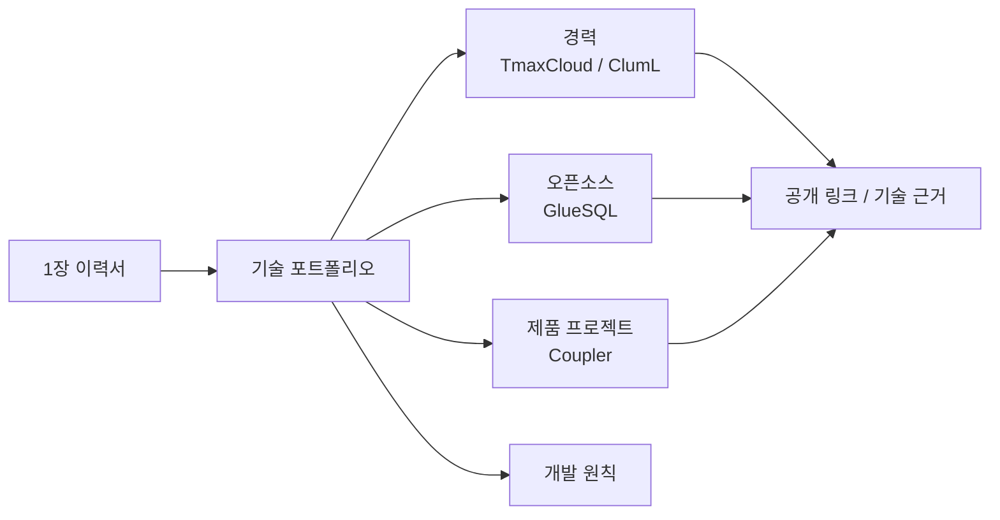

# 김민식 기술 포트폴리오

PLATFORM SOFTWARE ENGINEER

## 요약

서비스 설계 정보와 도메인 규칙을 SQL/DDL, 서비스 코드, 테스트·리뷰 기준으로 연결해 플랫폼 기능과 변경 안전성을 함께 다루는 Platform Software Engineer입니다.

티맥스클라우드에서는 Java/TypeScript 기반 No-code 플랫폼에서 설계 metadata를 code/DDL generation, 데이터 이식성, 변경 이력, 검증 도구로 연결했습니다. GlueSQL에서는 Rust 기반 SQL engine의 parser/AST, SQL function, storage, test suite, 멘토링과 코드 리뷰를 이어왔습니다. ClumL에서는 보안 이벤트 분석 제품군의 탐지 화면·리포트 표시 일관성, Rust 서비스 compatibility 확인, 요구사항·완료 기준 기반 작업 정의, PR review를 수행하고 있습니다.

이 사이트는 제출용 이력서를 대체하지 않습니다. 이력서에 담기 어려운 기술 맥락, 역할 범위, 결과, 공개 링크를 정리하는 기술 포트폴리오입니다.

## 구조

## 대표 작업

- [설계 정보 기반 서비스 생성 플랫폼](experience/tmaxcloud.md): metadata, entity, service definition을 SQL/DDL, Java service code, request/response contract, generated service E2E test page로 연결했습니다.
- [Rust SQL engine 오픈소스 기여](opensource/gluesql.md): SQL function, parser/AST, aggregate function, storage, test suite를 공개 PR과 review로 검증 가능한 범위에서 다뤘습니다.
- [보안 분석 제품의 표시 일관성과 변경 안전성](experience/cluml.md): 탐지 목록/상세, time range, port/packet, chart/report가 같은 이벤트 맥락을 유지하도록 수정하고 요구사항·완료 기준과 review 기준으로 변경 범위를 확인하고 있습니다.
- [개인 제품의 상태 계약과 리뷰 기준](projects/coupler.md): React Native app, API, 관리자 웹의 회원가입 응답 계약, 회원 심사 정책, 코드 리뷰 기준을 공개 문서로 남겼습니다.

## 개발 관점

유지보수를 위한 일관성, 확장성, 응집도와 결합도, 책임 분리가 분명한 코드 작성을 중요하게 봅니다.

반복 구현의 일부 허들이 낮아질수록 문제 정의, 도메인 정책, 책임 범위, 테스트 기준, 리뷰 기준을 흔들리지 않게 남기는 일이 더 중요해진다고 봅니다. 좋은 개발 문서는 동료와 AI agent가 같은 관점으로 구현과 리뷰를 이어갈 수 있게 만드는 실행 가능한 기준이어야 한다고 생각합니다.

자세한 기준은 [원칙](engineering-principles.md)에 정리했습니다.

## 주요 기술 영역

- Platform: 메타데이터와 스키마를 SQL/DDL, Java service code, 데이터 동기화, 변경 이력, 테스트 도구로 연결
- Rust/SQL: SQL engine internals, parser/AST, storage, Rust 오픈소스 기여, 코드 리뷰
- Product quality: 보안 이벤트 분석 제품군의 표시 일관성, Rust 서비스 compatibility 확인, React Native 제품 운영, TypeScript 전환, 회원가입/심사 흐름 정리
- Review system: 요구사항 기반 작업 정의, 완료 기준, test coverage, change-safety review, AI-assisted development 검증 기준

## 기술

- Languages: Rust, Java, TypeScript, SQL, Python
- Backend: WebSocket, Node.js, Express, Freemarker
- Database: MySQL, Tibero, schema migration, SQL generation
- Frontend: React, React Native, Material UI, React Flow
- Infra/Tools: Kubernetes, Terraform, GitHub Actions, AWS

## 링크

- [Email](mailto:meenseek5929@naver.com)
- [GitHub](https://github.com/zmrdltl)

## 둘러보기

- [경력](experience/index.md)
- [ClumL](experience/cluml.md)
- [티맥스클라우드](experience/tmaxcloud.md)
- [원칙](engineering-principles.md)
- [GlueSQL](opensource/gluesql.md)
- [프로젝트](projects/index.md)
- [Coupler](projects/coupler.md)
- [활동](activities/index.md)
