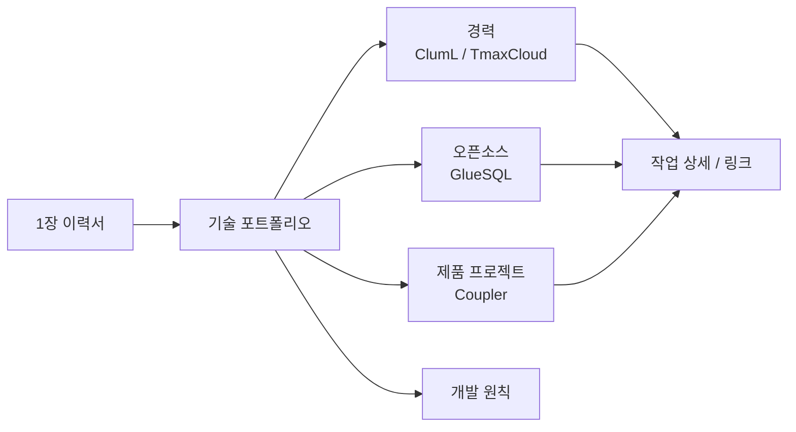

# 김민식 기술 포트폴리오

PLATFORM SOFTWARE ENGINEER

## 요약

서비스 설계 정보와 도메인 규칙을 SQL/DDL, 서비스 코드, 테스트·리뷰 기준으로 연결해 플랫폼 기능과 변경 안전성을 함께 다루는 Platform Software Engineer입니다.

ClumL에서는 보안 이벤트 분석 제품군의 리포트·탐지 화면 문제, Rust 서비스 compatibility, issue/spec 기반 검증 기준을 다룹니다. 티맥스클라우드에서는 Java/TypeScript 기반 No-code 플랫폼에서 generated service E2E 검증과 CAU 변경 이력 기준을 구현했습니다. GlueSQL에서는 Rust 기반 SQL engine의 parser/AST, SQL function, storage, test suite, 멘토링과 코드 리뷰를 이어왔고, Coupler에서는 React Native 제품의 앱·API·관리자 웹·DB·배포 기준과 가입·심사 플로우를 정리하고 있습니다.

기술 포트폴리오에는 대표 작업의 문제 맥락, 역할 범위, 설계 선택, 검증 기준, 관련 링크를 정리했습니다.

## 구조

## 대표 작업

- [보안 분석 제품의 표시 일관성과 변경 안전성](experience/cluml.md): 탐지 목록/상세, time range, port/packet, chart/report가 같은 이벤트 맥락을 유지해야 하는 문제에서 원인과 수정 범위를 분리하고, 요구사항·완료 기준과 review 기준으로 변경 범위를 확인하고 있습니다.
- [생성 서비스 검증과 변경 이력 기준](experience/tmaxcloud.md): generated service E2E test page, CAU 변경 이력 table, generated CRUD service code의 row snapshot copy 흐름을 정리했습니다.
- [Rust SQL engine 오픈소스 기여](opensource/gluesql.md): SQL function, parser/AST, aggregate function, storage, test suite를 GitHub PR과 review 중심으로 다뤘습니다.
- [개인 제품의 상태 계약과 리뷰 기준](projects/coupler.md): React Native app, API, 관리자 웹의 회원가입 응답 계약, 회원 심사 정책, 코드 리뷰 기준을 문서와 구현 기준으로 정리했습니다.

## 개발 관점

유지보수를 위한 일관성, 확장성, 응집도와 결합도, 책임 분리가 분명한 코드 작성을 중요하게 봅니다.

반복 구현의 일부 허들이 낮아질수록 문제 정의, 도메인 정책, 책임 범위, 테스트 기준, 리뷰 기준을 흔들리지 않게 남기는 일이 더 중요해진다고 봅니다. 좋은 개발 문서는 동료와 AI agent가 같은 관점으로 구현과 리뷰를 이어갈 수 있게 만드는 실행 가능한 기준이어야 한다고 생각합니다.

자세한 기준은 [원칙](engineering-principles.md)에 정리했습니다.

## 주요 기술 영역

- Platform: 메타데이터와 스키마를 SQL/DDL, generated service code, DB 반영 검증, 변경 이력, 테스트 기준으로 연결
- Rust/SQL: SQL engine internals, parser/AST, storage, Rust 오픈소스 기여, 코드 리뷰
- Product quality: 보안 이벤트 분석 제품군의 표시 일관성, Rust 서비스 compatibility 확인, React Native 제품 운영, TypeScript 전환, 회원가입/심사 흐름 정리
- Review system: 요구사항 기반 작업 정의, 완료 기준, test coverage, change-safety review, AI-assisted development 검증 기준

## 기술

- Languages: Rust, Java, TypeScript, SQL
- Backend/Data: SQL/DDL Generator, GraphQL, WebSocket, PostgreSQL, MySQL, Tibero
- Frontend: React, React Native, Material UI, React Flow
- Infra/Tools: Kubernetes, Terraform, GitHub Actions, AWS

## 링크

- [Email](mailto:meenseek5929@naver.com)
- [GitHub](https://github.com/zmrdltl)

## 둘러보기

- [경력](experience/index.md)
- [ClumL](experience/cluml.md)
- [티맥스클라우드](experience/tmaxcloud.md)
- [원칙](engineering-principles.md)
- [GlueSQL](opensource/gluesql.md)
- [프로젝트](projects/index.md)
- [Coupler](projects/coupler.md)
- [활동](activities/index.md)
