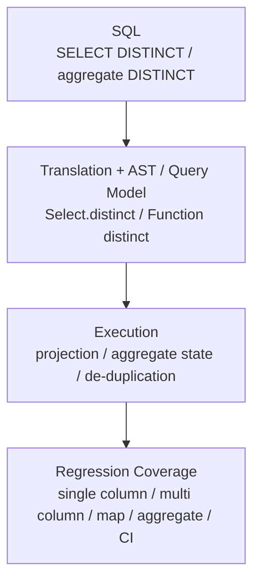

# GlueSQL

- Type: Open-source contribution
- Period: 2021.06 - Present

## Overview

GlueSQL is a Rust-based SQL database engine. My contribution scope includes SQL engine features, parser/AST work, aggregate/data functions, numeric type handling, Parquet storage, test suites, mentoring, and code review.

I authored [Merged 45+ PRs](https://github.com/gluesql/gluesql/pulls?q=is%3Apr+author%3Azmrdltl+is%3Amerged) in `gluesql/gluesql`, continuing work visible through GitHub PRs, reviews, and docs.

In 2025, I continued as a GlueSQL reviewer with merged PRs covering DISTINCT operations, a Rust toolchain bump, deterministic ordering cleanup, and Parquet-storage clippy work.

This page presents open-source work across SQL engine parser, AST, execution path, storage, and test suites through GitHub PR and review flow.

Adding a SQL engine feature does not end at syntax support. The parser must accept the syntax, the AST and plan/execution path must preserve the same meaning, and storage and test suites must lock edge conditions. My GlueSQL contribution leaves that flow in PR and review records.

## DISTINCT Processing And Validation Flow

This diagram shows how `DISTINCT` support was carried from SQL syntax through translation, AST/query representation, execution, aggregate state, and regression coverage.

## Representative Work

- Implemented and validated `SELECT DISTINCT` and aggregate `DISTINCT` across SQL translation, AST/query representation, executor de-duplication, aggregate state, AST builder, and test-suite paths.
- Extended SQL engine query and storage surfaces through AST Builder aggregate helpers, aggregate-expression argument paths, Parquet storage, and CLI surface work.
- Reviewed and mentored contributor PRs around error handling, edge cases, test coverage, and code organization.

## Verifiable Evidence

- Authored 45+ merged PRs in `gluesql/gluesql`
- SQL parser, AST/query representation, execution path, storage, and test-suite work are visible through actual PR and review records
- Contributor mentoring and review history continued across OSSCA 2021 mentee, 2022 lead mentee, and 2023 mentor roles

## CLI Application

GlueSQL can be used as an embedded SQL engine, and its CLI can be used to inspect SQL execution flow during development.

## Extended Contribution

Beyond `DISTINCT`, I contributed to AST Builder APIs, aggregate/data functions, Parquet storage, CLI surfaces, numeric type handling, and test-suite improvements. This work supports the same technical signal: changing a SQL engine requires parser, AST, execution, storage, and regression coverage to stay aligned.

Contributor PR review and mentoring are treated as supporting technical evidence, not as a separate activity catalog. In review, I focused on error handling, edge cases, test coverage, and code organization.

Awards and program history are summarized on the [Activities](../activities/index.md) page. This page keeps the technical scope of code contribution and review.

## Links

- [GlueSQL repository](https://github.com/gluesql/gluesql)
- [GlueSQL PR search authored by `zmrdltl`](https://github.com/gluesql/gluesql/pulls?q=is%3Apr+author%3Azmrdltl)
- [GlueSQL 2023 official docs](https://gluesql.org/docs/0.14/)
- [DataFusion SQL Parser logical XOR PR](https://github.com/apache/datafusion-sqlparser-rs/pull/357)
- [BigDecimal `get_scale` PR](https://github.com/akubera/bigdecimal-rs/pull/116)
- [Parquet Storage PR #1269](https://github.com/gluesql/gluesql/pull/1269)

## Articles

- [Breaking the Boundary between SQL and NoSQL Databases](https://gluesql.org/blog/breaking-the-boundary-between-sql-and-nosql)
- [Revolutionizing Databases by Unifying Query Interfaces](https://gluesql.org/blog/revolutionizing-databases-by-unifying-query-interfaces)

## Skills

Rust, SQL engine internals, parser/AST design, aggregate functions, numeric data types, storage, Parquet, test suites, code review, mentoring
