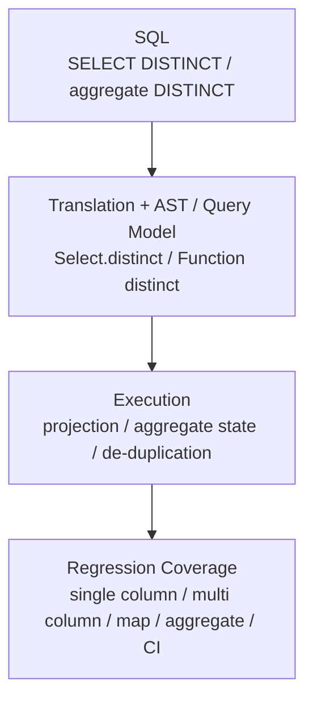

# GlueSQL

- Type: Open-source contribution
- Period: 2021.06 - Present

## Overview

GlueSQL is a Rust-based SQL database engine. My contribution scope includes SQL engine features, parser/AST work, aggregate/data functions, numeric type handling, Parquet storage, regression tests, mentoring, and code review.

In `gluesql/gluesql`, I authored [50 merged PRs under GitHub `is:merged` search](https://github.com/gluesql/gluesql/pulls?q=is%3Apr+author%3Azmrdltl+is%3Amerged). In 2025, I continued merged work around DISTINCT operations, a Rust toolchain bump, deterministic ordering cleanup, and Parquet-storage clippy work; I currently contribute to maintenance as a GlueSQL reviewer.

This open-source work spans SQL engine parser, AST, execution logic, storage, and regression tests through GitHub PR and review flow.

Adding a SQL engine feature does not end at syntax support. The parser must accept the syntax, the AST and execution logic must preserve the same meaning, and storage and regression tests must lock edge conditions. My GlueSQL work connects those layers instead of treating syntax support as an isolated change.

## Representative Work

- Implemented `SELECT DISTINCT` and aggregate `DISTINCT` across SQL translation, AST representation, executor de-duplication, aggregate handling, AST builder, and regression tests. The primary PR implementing both paths is [DISTINCT operations](https://github.com/gluesql/gluesql/pull/1710).
- Extended the SQL engine query interface through AST Builder aggregate helpers, `COUNT` argument handling, and aggregate-expression argument paths. Related PRs include [aggregate helper](https://github.com/gluesql/gluesql/pull/635), [`COUNT` argument handling](https://github.com/gluesql/gluesql/pull/656), and [aggregate expression argument evaluation](https://github.com/gluesql/gluesql/pull/749).
- Connected Parquet storage to GlueSQL storage traits and SQL execution paths, adding docs, tests, CLI prompts, and CLI examples with it. Related PRs include [Parquet storage read/write](https://github.com/gluesql/gluesql/pull/1269) and [Parquet storage clippy refactor](https://github.com/gluesql/gluesql/pull/1806).
- Reviewed and mentored contributor PRs around error handling, edge cases, test coverage, and code organization.

## DISTINCT Processing And Validation Flow

This diagram shows how `DISTINCT` support was carried from SQL syntax through translation, AST/query representation, execution, aggregate state, and regression coverage.

## Review, Mentoring, And Awards

As a GlueSQL reviewer and OSSCA mentor, I checked contributor PRs around error handling, edge cases, test coverage, and code organization. In mentoring, I covered Rust project commands, test writing, GlueSQL SQL execution flow, storage structure, AST builder structure, and function implementation direction.

| Date | Program | Award | Organizer |
| --- | --- | --- | --- |
| 2023.11 | Open Source Contribution Academy | NIPA President's Award (Encouragement) | OSSCA |
| 2022.12 | Open Source Contribution Academy | NIPA President's Award (Top Excellence) | OSSCA |
| 2021.11 | Open Source Contribution Academy | NIPA President's Award (Top Excellence) | OSSCA |

OSSCA public materials are available in the [award proof folder](https://drive.google.com/drive/folders/1llwXz9RquWtRVH0ZQh2FZOLelAzmuBfO?usp=sharing) and the [certificate/activity proof folder](https://drive.google.com/drive/folders/1xQb6YpfgiYz59uKkaK0rvNL82mQ_6Nqn).

## Links

- [GlueSQL repository](https://github.com/gluesql/gluesql)
- [Merged GlueSQL PR search authored by `zmrdltl`](https://github.com/gluesql/gluesql/pulls?q=is%3Apr+author%3Azmrdltl+is%3Amerged)
- [GlueSQL 2023 official docs](https://gluesql.org/docs/0.14/)
- [DISTINCT operations PR](https://github.com/gluesql/gluesql/pull/1710)
- [Parquet storage read/write PR](https://github.com/gluesql/gluesql/pull/1269)
- [Parquet storage clippy refactor PR](https://github.com/gluesql/gluesql/pull/1806)
- [DataFusion SQL Parser logical XOR PR](https://github.com/apache/datafusion-sqlparser-rs/pull/357)
- [BigDecimal `get_scale` PR](https://github.com/akubera/bigdecimal-rs/pull/116)

## Articles

- [Breaking the Boundary between SQL and NoSQL Databases](https://gluesql.org/blog/breaking-the-boundary-between-sql-and-nosql)
- [Revolutionizing Databases by Unifying Query Interfaces](https://gluesql.org/blog/revolutionizing-databases-by-unifying-query-interfaces)

## Skills

Rust, SQL engine internals, parser/AST design, aggregate functions, numeric data types, storage, Parquet, regression tests, code review, mentoring
