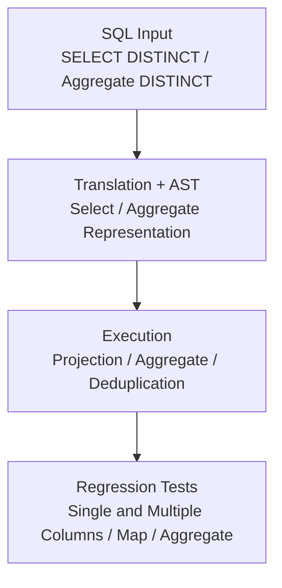

# GlueSQL

- Type: Open-source contribution
- Period: Jun 2021 - Present

## Overview

I have implemented SQL features, AST/query interfaces, storage, and regression tests for GlueSQL, a Rust SQL database engine. I authored [50 merged pull requests in `gluesql/gluesql`](https://github.com/gluesql/gluesql/pulls?q=is%3Apr+author%3Azmrdltl+is%3Amerged) and currently contribute to maintenance as a reviewer.

## DISTINCT Implementation

I fixed a path where `SELECT DISTINCT` could behave like a regular `SELECT` by carrying its meaning from SQL translation through execution.

**Decision:** `SELECT DISTINCT` removes duplicate result rows after projection, while aggregates such as `COUNT(DISTINCT ...)` track unique values in aggregate state. Unsupported `DISTINCT ON` syntax returns an explicit error instead of appearing to work.

**Implementation:** I propagated parser output into the internal AST and query model, then connected executor deduplication, aggregate handling, and AST builder APIs. I also strengthened value equality, hashing, and map-key ordering so duplicate decisions remained deterministic.

**Validation and result:** Regression tests covered single and multiple columns, maps, schemaless rows, and aggregate `DISTINCT`, including `COUNT`. The feature and tests preserve the same meaning across SQL input, internal representation, and execution output.

## Additional Implementation

### AST Query Interface

I implemented AST Builder aggregate helpers and `COUNT` argument handling, then updated executor and test paths so aggregate functions could evaluate expression arguments rather than only simple columns.

### Parquet Storage and CLI

I connected Parquet storage to GlueSQL's storage traits and SQL execution, adding file read/write, schema and value conversion, documentation, tests, and a CLI usage path. I later updated the related code to meet `clippy::pedantic` checks.

## Review, Mentoring, and Awards

As a GlueSQL reviewer and OSSCA mentor, I reviewed contributor pull requests for error handling, edge cases, test coverage, and code organization. I also guided contributors through Rust project workflows, GlueSQL internals, storage, AST Builder, and function implementation.

| Year | Program | Award |
| --- | --- | --- |
| 2023 | Open Source Contribution Academy | NIPA President's Encouragement Award |
| 2022 | Open Source Contribution Academy | NIPA President's Top Excellence Award |
| 2021 | Open Source Contribution Academy | NIPA President's Top Excellence Award |

- [Award evidence](https://drive.google.com/drive/folders/1llwXz9RquWtRVH0ZQh2FZOLelAzmuBfO?usp=sharing)
- [Completion and activity evidence](https://drive.google.com/drive/folders/1xQb6YpfgiYz59uKkaK0rvNL82mQ_6Nqn)

## Related Links

- [GlueSQL repository](https://github.com/gluesql/gluesql)
- Representative implementations: [DISTINCT operations](https://github.com/gluesql/gluesql/pull/1710), [Parquet storage read/write](https://github.com/gluesql/gluesql/pull/1269)
- External ecosystem contributions: [DataFusion SQL Parser logical XOR](https://github.com/apache/datafusion-sqlparser-rs/pull/357), [BigDecimal `get_scale`](https://github.com/akubera/bigdecimal-rs/pull/116)
- Technical articles: [Breaking the Boundary between SQL and NoSQL Databases](https://gluesql.org/blog/breaking-the-boundary-between-sql-and-nosql), [Revolutionizing Databases by Unifying Query Interfaces](https://gluesql.org/blog/revolutionizing-databases-by-unifying-query-interfaces)

## Technologies

Rust, SQL engine internals, parser/AST design, aggregate functions, storage, Parquet, regression tests, code review, mentoring
