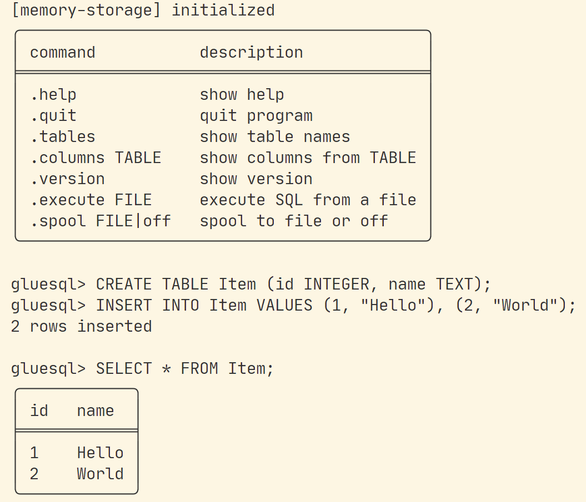

# GlueSQL

- Type: Open-source contribution
- Period: 2021.08 - Present

## Overview

GlueSQL is a Rust-based SQL database engine. My contribution scope includes SQL engine features, parser/AST work, aggregate/data functions, numeric type handling, Parquet storage, test suites, mentoring, and code review.

I authored [50+ PRs](https://github.com/gluesql/gluesql/pulls?q=is%3Apr+author%3Azmrdltl) in `gluesql/gluesql`, and this portfolio uses only the scope that can be supported by public GitHub PRs, reviews, and docs.

## CLI Application

GlueSQL can be used as an embedded SQL engine, and its CLI can be used to inspect SQL execution flow during development.

## 2021: SQL function and parser contribution

In 2021, I joined GlueSQL as an OSSCA mentee and contributed from small SQL functions to parser integration while learning the structure of a Rust-based SQL engine.

- Added the `REVERSE` SQL function and wrote integration tests.
- Wrote tests around `PartialEq` and `PartialOrd` behavior and fixed related bugs.
- Merged a [logical XOR parser PR](https://github.com/apache/datafusion-sqlparser-rs/pull/357) into the upstream parser, `sqlparser-rs`, to support logical XOR in GlueSQL.
- Implemented logical XOR behavior for GlueSQL Boolean values.
- Refactored aggregation function intermediate state into a private enum to reduce ambiguous value meaning.
- Added unary plus/minus unit tests.

The core technical signal from this period is that I worked across SQL syntax, parser behavior, execution paths, and integration tests through actual PRs.

## 2022: AST Builder, aggregate function, numeric type

In 2022, I participated as an OSSCA lead mentee and focused on aggregate/data functions and AST Builder API improvements.

Representative work:

- [#635](https://github.com/gluesql/gluesql/pull/635): Added AST Builder aggregate functions
- [#656](https://github.com/gluesql/gluesql/pull/656): Implemented COUNT aggregate function
- [#675](https://github.com/gluesql/gluesql/pull/675): Added `sqrt` function to enum Value
- [#684](https://github.com/gluesql/gluesql/pull/684): Added STDEV aggregate function
- [#698](https://github.com/gluesql/gluesql/pull/698): Improved aggregate function structure
- [#723](https://github.com/gluesql/gluesql/pull/723): Improved FunctionNode structure
- [#749](https://github.com/gluesql/gluesql/pull/749): Extended aggregate functions to support Expr
- [#782](https://github.com/gluesql/gluesql/pull/782): Refactored the test suite
- [#828](https://github.com/gluesql/gluesql/pull/828): Added unsigned integer `u8` data type

Technically, this work involved AggregateNode, CountArgExprNode, Expr conversion, numeric type casting, sqrt, variance, and standard deviation. Extending aggregate expression support also required working through async evaluate, storage I/O, and lifetime issues.

For numeric type handling, I also merged a [`get_scale` PR](https://github.com/akubera/bigdecimal-rs/pull/116) into `bigdecimal-rs`.

## 2023: mentoring, review, Parquet storage

In 2023, I participated as an OSSCA mentor and contributed through contributor mentoring, PR review, issue guidance, and Parquet storage implementation.

- Held 1:1 mentoring coffee chats with 17 contributors over 4 weeks.
- Explained Rust project commands, test writing, and GlueSQL execution flow.
- Explained GlueSQL's SQL execution flow as `parse -> translate -> plan -> execute`.
- Reviewed SQL function PRs including `REPLACEMENT`, `SORT`, `GREATEST`, `SLICE`, and `COALESCE`.
- Guided implementation directions for `EXPLAIN`, `KEYS`, `SPLICE`, `LEAST`, `TAKE`, and `ADD_MONTH`.
- Explained storage structure, memory storage transactions, AST builder, alias select nodes, and type-based comparison/scoring.

Representative public evidence:

- [Parquet Storage PR #1269](https://github.com/gluesql/gluesql/pull/1269)
- [REPLACEMENT function review #1266](https://github.com/gluesql/gluesql/pull/1266)
- [SORT function review #1300](https://github.com/gluesql/gluesql/pull/1300)
- [GREATEST function review #1312](https://github.com/gluesql/gluesql/pull/1312)
- [SLICE function review #1340](https://github.com/gluesql/gluesql/pull/1340)
- [COALESCE function review/support #1333](https://github.com/gluesql/gluesql/pull/1333)
- [GlueSQL Parquet storage docs](https://gluesql.org/docs/0.16.0/storages/supported-storages/parquet-storage)

## Maintenance contribution

I later continued maintenance PRs around Rust toolchain updates, clippy, deterministic ordering, and `DISTINCT` operation. I classify this work as project compatibility, lint, deterministic behavior, and regression-safety contribution rather than as one isolated feature.

## Activities and awards

I participated in OSSCA as a mentee in 2021, lead mentee in 2022, and mentor in 2023. Awards are summarized on the [Activities](../activities/index.md) page, while this page focuses on the technical scope of code contribution, review, and mentoring.

## Public evidence

- [GlueSQL repository](https://github.com/gluesql/gluesql)
- [GlueSQL PR search authored by `zmrdltl`](https://github.com/gluesql/gluesql/pulls?q=is%3Apr+author%3Azmrdltl)
- [GlueSQL 2023 official docs](https://gluesql.org/docs/0.14/)
- [DataFusion SQL Parser logical XOR PR](https://github.com/apache/datafusion-sqlparser-rs/pull/357)
- [BigDecimal `get_scale` PR](https://github.com/akubera/bigdecimal-rs/pull/116)
- [Parquet Storage PR #1269](https://github.com/gluesql/gluesql/pull/1269)

## Articles

- [Breaking the Boundary between SQL and NoSQL Databases](https://gluesql.org/blog/breaking-the-boundary-between-sql-and-nosql)
- [Revolutionizing Databases by Unifying Query Interfaces](https://gluesql.org/blog/revolutionizing-databases-by-unifying-query-interfaces)

## Skills

Rust, SQL engine internals, parser/AST design, aggregate functions, numeric data types, storage, Parquet, test suites, code review, mentoring
