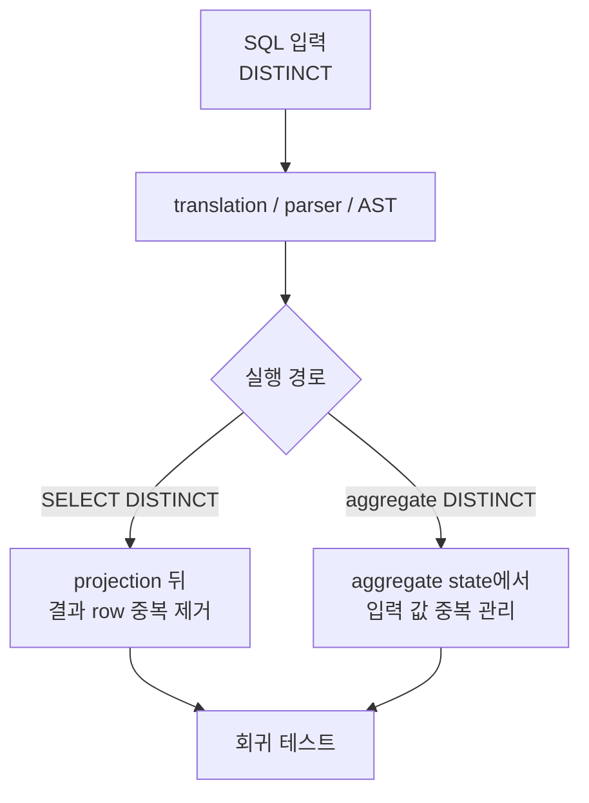

# GlueSQL

- 유형: 오픈소스 기여
- 기간: 2021.06 - 현재

## DISTINCT 실행 의미 구현

**문제와 진단:** `SELECT DISTINCT` 구문 정보가 GlueSQL의 Rust SQL 엔진 실행기(executor)까지 전달되지 않아 일반 `SELECT`와 같은 결과를 만들었습니다. 중복의 의미는 projection과 aggregate에서 서로 다른 상태를 기준으로 했습니다.

**제약과 선택:** `DISTINCT`가 아닌 기존 실행 결과는 바꾸지 않으면서, 최종 값이 만들어지는 두 상태 경계에서만 중복을 제거해야 했습니다. 지원하지 않는 `DISTINCT ON`은 명시적 오류로 처리했습니다.

**구현:** parser/AST 결과를 query model에 전달하고, SQL executor의 row 중복 제거와 aggregate 처리, AST Builder API까지 연결했습니다. 값의 equality/hash와 map key order도 중복 판정이 흔들리지 않도록 보강했습니다.

**검증과 결과:** 단일·복수 column, map과 schemaless row, `COUNT`를 포함한 aggregate `DISTINCT`를 회귀 테스트로 확인했습니다. SQL 입력, 내부 표현, 실행 결과가 같은 의미를 유지하도록 기능과 테스트를 함께 반영했습니다.

## AST Query Interface·Parquet Storage·CLI 구현

### AST Query Interface

AST Builder aggregate helper와 `COUNT` argument 처리를 구현하고, aggregate 함수가 단순 column뿐 아니라 expression argument를 평가하도록 executor와 테스트를 수정했습니다.

### Parquet Storage와 CLI

Parquet storage를 GlueSQL storage trait와 SQL 실행 경로에 연결하고 file read/write, schema·value 변환, 문서, 테스트, CLI 사용 흐름을 추가했습니다. 이후 `clippy::pedantic` 기준에 맞춰 관련 코드를 정리했습니다.

## 리뷰·멘토링·수상

[`gluesql/gluesql` 병합 PR 50건](https://github.com/gluesql/gluesql/pulls?q=is%3Apr+author%3Azmrdltl+is%3Amerged)을 작성했습니다. 현재 GlueSQL 리뷰어와 OSSCA 멘토로 코드 리뷰와 유지보수에 참여하며, 기여자 PR의 오류 처리, edge case, 테스트 커버리지, 코드 구조를 검토했습니다. Rust 프로젝트 기본 흐름, GlueSQL 구조, storage와 AST Builder, 함수 구현 방향을 안내했습니다.

| 연도 | 대회/프로그램 | 수상 |
| --- | --- | --- |
| 2023 | 오픈소스 컨트리뷰션 아카데미 | 정보통신산업진흥원장상(장려상) |
| 2022 | 오픈소스 컨트리뷰션 아카데미 | 정보통신산업진흥원장상(최우수상) |
| 2021 | 오픈소스 컨트리뷰션 아카데미 | 정보통신산업진흥원장상(최우수상) |

- 공개 수상 발표 자료: [2023 장려상](https://drive.google.com/file/d/1oK3BYXVzaAQec83pAjl00_FUHt9ZZN0b/view?usp=sharing)

## 관련 링크

- [GlueSQL repository](https://github.com/gluesql/gluesql)
- 대표 구현: [DISTINCT operations](https://github.com/gluesql/gluesql/pull/1710), [Parquet storage read/write](https://github.com/gluesql/gluesql/pull/1269)
- 대표 리뷰: [REPLACE 함수](https://github.com/gluesql/gluesql/pull/1266), [GREATEST 함수](https://github.com/gluesql/gluesql/pull/1312), [SLICE 함수](https://github.com/gluesql/gluesql/pull/1340)
- 외부 생태계 기여: [DataFusion SQL Parser logical XOR](https://github.com/apache/datafusion-sqlparser-rs/pull/357), [BigDecimal `get_scale`](https://github.com/akubera/bigdecimal-rs/pull/116)
- GlueSQL 프로젝트 기술 글: [Breaking the Boundary between SQL and NoSQL Databases](https://gluesql.org/blog/breaking-the-boundary-between-sql-and-nosql), [Revolutionizing Databases by Unifying Query Interfaces](https://gluesql.org/blog/revolutionizing-databases-by-unifying-query-interfaces)
