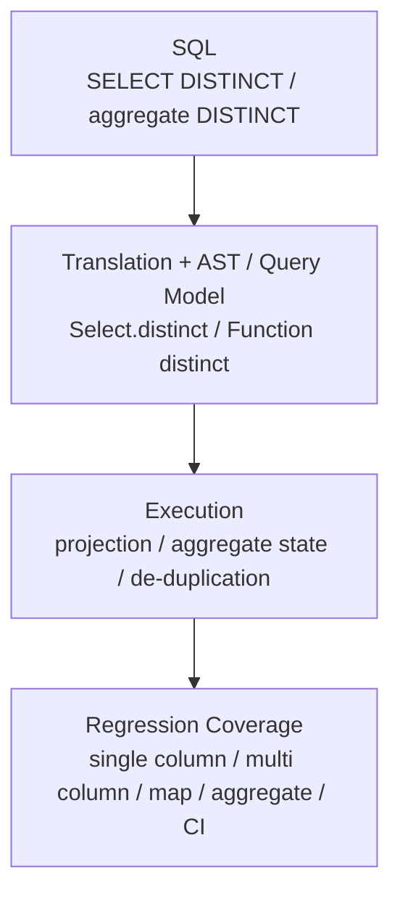

# GlueSQL

- 유형: 오픈소스 기여
- 기간: 2021.06 - Present

## 개요

GlueSQL은 Rust 기반 SQL database engine입니다. 기여 범위는 SQL engine 기능, parser/AST, aggregate/data function, numeric type 처리, Parquet storage, 회귀 테스트, 멘토링, 코드 리뷰를 포함합니다.

`gluesql/gluesql`에서는 [GitHub `is:merged` 검색 기준 병합 PR 44건](https://github.com/gluesql/gluesql/pulls?q=is%3Apr+author%3Azmrdltl+is%3Amerged)을 작성했습니다. 2025년에는 GlueSQL reviewer로 활동하면서 DISTINCT operations, Rust toolchain, deterministic ordering, Parquet storage clippy 정리 PR을 이어갔습니다.

GlueSQL 작업은 SQL engine의 parser, AST, 실행 로직, storage, 회귀 테스트를 GitHub PR과 review 흐름으로 보여주는 오픈소스 기여입니다.

SQL engine 기능은 문법만 추가한다고 끝나지 않습니다. parser가 구문을 받아들이고, AST와 실행 로직이 같은 의미를 유지하며, storage와 회귀 테스트가 예외 조건을 고정해야 합니다. GlueSQL 기여는 syntax 추가를 고립된 변경으로 보지 않고 이 계층들을 함께 맞춘 작업입니다.

## 대표 작업

- `SELECT DISTINCT`와 aggregate `DISTINCT`를 SQL translation, AST 표현, executor 중복 제거, aggregate 처리, AST builder, 회귀 테스트까지 연결해 구현했습니다. 주요 PR은 [SELECT DISTINCT](https://github.com/gluesql/gluesql/pull/835)와 [aggregate DISTINCT](https://github.com/gluesql/gluesql/pull/1710)입니다.
- AST Builder aggregate helper, `COUNT` argument handling, aggregate expression argument path를 구현해 SQL engine의 query interface를 확장했습니다. 관련 PR은 [aggregate helper](https://github.com/gluesql/gluesql/pull/635), [`COUNT` argument handling](https://github.com/gluesql/gluesql/pull/656), [aggregate expression argument evaluation](https://github.com/gluesql/gluesql/pull/749)입니다.
- Parquet storage를 GlueSQL storage trait와 SQL 실행 경로에 연결하고 docs, tests, CLI prompt/example까지 함께 추가했습니다. 관련 PR은 [Parquet storage read/write](https://github.com/gluesql/gluesql/pull/1269)와 [Parquet storage clippy refactor](https://github.com/gluesql/gluesql/pull/1806)입니다.
- Contributor PR에서는 error handling, edge case, test coverage, code organization 관점으로 review와 mentoring을 수행했습니다.

## DISTINCT 처리와 검증 흐름

이 그림은 `DISTINCT` support를 문법, translation, AST 표현, executor, aggregate 처리, 회귀 테스트까지 이어서 검증한 흐름입니다.

## 리뷰·멘토링·수상

GlueSQL reviewer와 OSSCA mentor로 contributor PR의 error handling, edge case, test coverage, code organization을 검토했습니다. mentoring에서는 Rust project 기본 명령어, test 작성, GlueSQL SQL 실행 흐름, storage 구조, AST builder, function 구현 방향을 안내했습니다.

| 날짜 | 대회/프로그램 | 수상 | 주최기관 |
| --- | --- | --- | --- |
| 2023.11 | 오픈소스 컨트리뷰션 아카데미 | 정보통신산업진흥원장상 장려상 | OSSCA |
| 2022.12 | 오픈소스 컨트리뷰션 아카데미 | 정보통신산업진흥원장상 최우수상 | OSSCA |
| 2021.11 | 오픈소스 컨트리뷰션 아카데미 | 정보통신산업진흥원장상 최우수상 | OSSCA |

OSSCA 관련 공개 자료는 [수상 증빙 폴더](https://drive.google.com/drive/folders/1Kp0WQnuLxfCKPfvxvYLO27yjkDyE2Wda?usp=sharing)와 [수료·활동 증빙 폴더](https://drive.google.com/drive/folders/1xQb6YpfgiYz59uKkaK0rvNL82mQ_6Nqn)에서 확인할 수 있습니다.

## 링크

- [GlueSQL repository](https://github.com/gluesql/gluesql)
- [`zmrdltl`이 작성한 GlueSQL merged PR 검색](https://github.com/gluesql/gluesql/pulls?q=is%3Apr+author%3Azmrdltl+is%3Amerged)
- [GlueSQL 2023년 공식 문서](https://gluesql.org/docs/0.14/)
- [SELECT DISTINCT PR](https://github.com/gluesql/gluesql/pull/835)
- [aggregate DISTINCT PR](https://github.com/gluesql/gluesql/pull/1710)
- [Parquet storage read/write PR](https://github.com/gluesql/gluesql/pull/1269)
- [Parquet storage clippy refactor PR](https://github.com/gluesql/gluesql/pull/1806)
- [DataFusion SQL Parser logical XOR PR](https://github.com/apache/datafusion-sqlparser-rs/pull/357)
- [BigDecimal `get_scale` PR](https://github.com/akubera/bigdecimal-rs/pull/116)

## Articles

- [Breaking the Boundary between SQL and NoSQL Databases](https://gluesql.org/blog/breaking-the-boundary-between-sql-and-nosql)
- [Revolutionizing Databases by Unifying Query Interfaces](https://gluesql.org/blog/revolutionizing-databases-by-unifying-query-interfaces)

## 기술

Rust, SQL engine internals, parser/AST design, aggregate functions, numeric data types, storage, Parquet, regression tests, code review, mentoring
