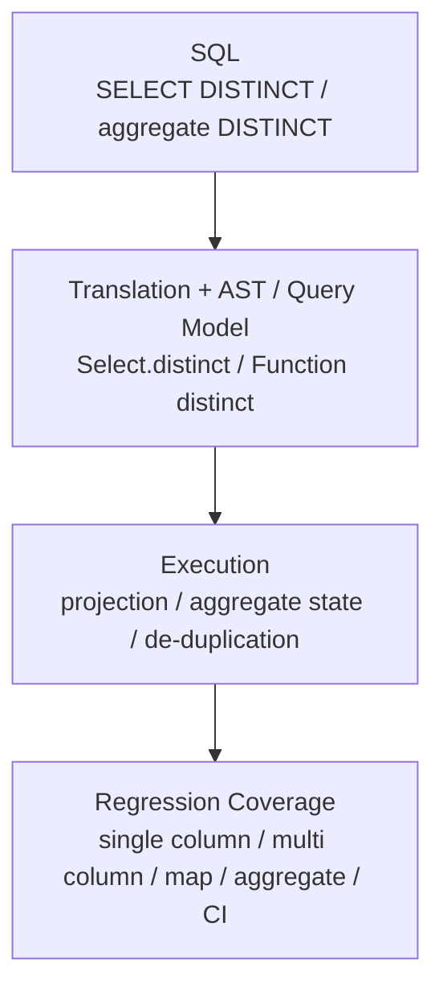

# GlueSQL

- 유형: 오픈소스 기여
- 기간: 2021.06 - Present

## 개요

GlueSQL은 Rust 기반 SQL database engine입니다. 기여 범위는 SQL engine 기능, parser/AST, aggregate/data function, numeric type 처리, Parquet storage, test suite, 멘토링, 코드 리뷰를 포함합니다.

`gluesql/gluesql`에서 [Merged 45+](https://github.com/gluesql/gluesql/pulls?q=is%3Apr+author%3Azmrdltl+is%3Amerged)을 작성했고, GitHub PR, review, docs로 확인할 수 있는 기여를 이어왔습니다.

2025년에는 GlueSQL reviewer로 활동하면서 DISTINCT operations, Rust toolchain, deterministic ordering, Parquet storage clippy 정리 PR이 merge되며 유지보수 기여를 이어갔습니다.

이 페이지는 SQL engine의 parser, AST, execution path, storage, test suite를 실제 GitHub PR과 review 흐름으로 보여주는 오픈소스 작업입니다.

SQL engine 기능은 문법만 추가한다고 끝나지 않습니다. parser가 구문을 받아들이고, AST와 plan/execution path가 같은 의미를 유지하며, storage와 test suite가 예외 조건을 고정해야 합니다. GlueSQL 기여는 이 흐름을 PR과 review 기록으로 남긴 작업입니다.

## DISTINCT 처리와 검증 흐름

이 그림은 `DISTINCT` support를 문법, translation, AST/query representation, executor, aggregate state, test suite까지 이어서 검증한 경로입니다.

## 대표 작업

- `SELECT DISTINCT`와 aggregate `DISTINCT`를 SQL translation, AST/query representation, executor de-duplication, aggregate state, AST builder, test-suite 경로로 구현·검증했습니다.
- AST Builder aggregate helper, aggregate expression argument path, Parquet storage와 CLI surface처럼 SQL engine의 query interface와 storage surface를 확장했습니다.
- Contributor PR에서는 error handling, edge case, test coverage, code organization 관점으로 review와 mentoring을 수행했습니다.

## 검증 가능한 근거

- `gluesql/gluesql`에서 authored merged PR 45개 이상
- SQL parser, AST/query representation, execution path, storage, test suite를 실제 PR과 review 기록으로 확인 가능
- OSSCA 2021 멘티, 2022 리드 멘티, 2023 멘토로 이어진 contributor mentoring과 review 기록

## CLI Application

GlueSQL은 embedded SQL engine으로 사용할 수 있고, 개발 과정에서 CLI로 SQL 실행 흐름을 확인할 수 있습니다.

## 확장 기여

`DISTINCT` 외에도 AST Builder, aggregate/data function, Parquet storage, CLI surface, numeric type 처리, test suite 개선에 기여했습니다. 이 범위는 SQL parser와 AST, execution path, storage, regression test가 함께 움직이는 구조를 이해하고 수정한 근거로 둡니다.

Contributor PR review와 mentoring은 별도 활동 이력이 아니라 기술 기여의 보조 신호로만 설명합니다. review에서는 error handling, edge case, test coverage, code organization 관점으로 구현 방향을 검토했습니다.

수상과 프로그램 이력은 [활동](../activities/index.md)에 따로 두고, 이 페이지에서는 code contribution과 review의 기술 범위만 남깁니다.

## 링크

- [GlueSQL repository](https://github.com/gluesql/gluesql)
- [`zmrdltl`이 작성한 GlueSQL PR 검색](https://github.com/gluesql/gluesql/pulls?q=is%3Apr+author%3Azmrdltl)
- [GlueSQL 2023년 공식 문서](https://gluesql.org/docs/0.14/)
- [DataFusion SQL Parser logical XOR PR](https://github.com/apache/datafusion-sqlparser-rs/pull/357)
- [BigDecimal `get_scale` PR](https://github.com/akubera/bigdecimal-rs/pull/116)
- [Parquet Storage PR #1269](https://github.com/gluesql/gluesql/pull/1269)

## Articles

- [Breaking the Boundary between SQL and NoSQL Databases](https://gluesql.org/blog/breaking-the-boundary-between-sql-and-nosql)
- [Revolutionizing Databases by Unifying Query Interfaces](https://gluesql.org/blog/revolutionizing-databases-by-unifying-query-interfaces)

## 기술

Rust, SQL engine internals, parser/AST design, aggregate functions, numeric data types, storage, Parquet, test suites, code review, mentoring
