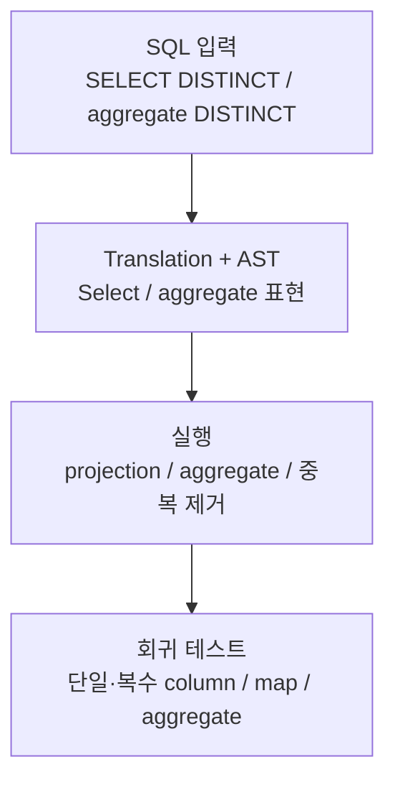

# GlueSQL

- 유형: 오픈소스 기여
- 기간: 2021.06 - 현재

## 개요

Rust 기반 SQL 엔진 GlueSQL에서 SQL 기능, AST/쿼리 인터페이스, 스토리지 연동을 구현하고 회귀 테스트를 추가했습니다. [`gluesql/gluesql` 병합 PR 50건](https://github.com/gluesql/gluesql/pulls?q=is%3Apr+author%3Azmrdltl+is%3Amerged)을 작성했으며, 현재 리뷰어로 유지보수에 기여하고 있습니다.

## DISTINCT 구현

`SELECT DISTINCT`가 일반 `SELECT`처럼 동작하던 문제를 SQL translation부터 실행 결과까지 연결해 수정했습니다.

**판단:** `SELECT DISTINCT`는 projection 뒤 결과 row의 중복을 제거하고, `COUNT(DISTINCT ...)` 같은 aggregate는 aggregate state에서 중복 값을 관리하도록 두 경로를 나눴습니다. 지원하지 않는 `DISTINCT ON`은 정상 동작처럼 처리하지 않고 명시적인 오류를 반환하게 했습니다.

**구현:** parser 결과를 내부 AST와 query model에 전달하고, executor 중복 제거, aggregate 처리, AST builder API까지 연결했습니다. 값의 equality/hash와 map key order도 중복 판정이 흔들리지 않도록 보강했습니다.

**검증과 결과:** 단일·복수 column, map과 schemaless row, `COUNT`를 포함한 aggregate `DISTINCT`를 회귀 테스트로 확인했습니다. SQL 입력, 내부 표현, 실행 결과가 같은 의미를 유지하도록 기능과 테스트를 함께 반영했습니다.

## 추가 구현

### AST Query Interface

AST Builder aggregate helper와 `COUNT` argument 처리를 구현하고, aggregate 함수가 단순 column뿐 아니라 expression argument를 평가하도록 executor와 테스트를 수정했습니다.

### Parquet Storage와 CLI

Parquet storage를 GlueSQL storage trait와 SQL 실행 경로에 연결하고 file read/write, schema·value 변환, 문서, 테스트, CLI 사용 흐름을 추가했습니다. 이후 `clippy::pedantic` 기준에 맞춰 관련 코드를 정리했습니다.

## 리뷰·멘토링·수상

GlueSQL 리뷰어와 OSSCA 멘토로 기여자 PR의 오류 처리, edge case, 테스트 커버리지, 코드 구조를 검토했습니다. Rust 프로젝트 기본 흐름, GlueSQL 구조, storage와 AST builder, 함수 구현 방향을 안내했습니다.

| 연도 | 대회/프로그램 | 수상 |
| --- | --- | --- |
| 2023 | 오픈소스 컨트리뷰션 아카데미 | 정보통신산업진흥원장상(장려상) |
| 2022 | 오픈소스 컨트리뷰션 아카데미 | 정보통신산업진흥원장상(최우수상) |
| 2021 | 오픈소스 컨트리뷰션 아카데미 | 정보통신산업진흥원장상(최우수상) |

- [수상 증빙](https://drive.google.com/drive/folders/1llwXz9RquWtRVH0ZQh2FZOLelAzmuBfO?usp=sharing)

## 관련 링크

- [GlueSQL repository](https://github.com/gluesql/gluesql)
- 대표 구현: [DISTINCT operations](https://github.com/gluesql/gluesql/pull/1710), [Parquet storage read/write](https://github.com/gluesql/gluesql/pull/1269)
- 대표 리뷰: [REPLACE 함수](https://github.com/gluesql/gluesql/pull/1266), [GREATEST 함수](https://github.com/gluesql/gluesql/pull/1312), [SLICE 함수](https://github.com/gluesql/gluesql/pull/1340)
- 외부 생태계 기여: [DataFusion SQL Parser logical XOR](https://github.com/apache/datafusion-sqlparser-rs/pull/357), [BigDecimal `get_scale`](https://github.com/akubera/bigdecimal-rs/pull/116)
- GlueSQL 프로젝트 기술 글: [Breaking the Boundary between SQL and NoSQL Databases](https://gluesql.org/blog/breaking-the-boundary-between-sql-and-nosql), [Revolutionizing Databases by Unifying Query Interfaces](https://gluesql.org/blog/revolutionizing-databases-by-unifying-query-interfaces)

## 기술

Rust, SQL engine internals, parser/AST design, aggregate functions, storage, Parquet, regression tests, code review, mentoring
