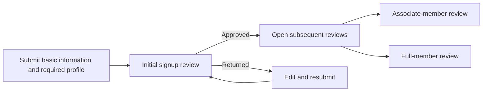
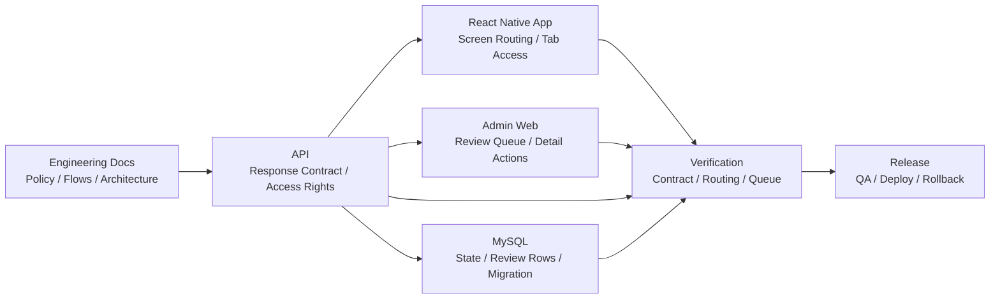

# Coupler

- Contribution period: Jul 2025 - Present
- Type: Mobile dating app
- Classification: Independent project, initially outsourced maintenance
- Phases: Maintenance, Jul-Nov 2025 · Engineering Lead, Nov 2025-Present

## Overview

I now lead development and operations across the React Native mobile app, API, admin web, and database. While moving the existing codebase to version 2.0.0, I redesigned the signup-review flow and product engineering criteria.

## Role and Responsibilities

- Translate product decisions into the app, API, admin web, DB schema, and migrations.
- Own QA, code review, merges, releases, deployment, and rollback.
- Maintain public engineering documents for policy, flows, architecture, and release criteria.

## Problem

The previous signup application asked for about 30 fields at once, creating a large burden before the first review request. If the server response, app screens, and admin queue inferred review state independently, submission, resubmission, approval, and rejection behavior could diverge.

## Signup and Review Flow

The initial application now focuses on basic information and the required profile. After initial signup-review approval, associate and full-member reviews can be submitted in parallel or completed by moving between tabs.

## App / API / Admin Responsibility Boundaries

The API response contract supplies routing and access rights. The app and admin web apply it to the user flow and review queue, while DB state, migrations, regression tests, and release checks are reviewed within the same change.

## Implementation and Validation

- The [signup response contract](https://github.com/coupler-developer/docs/blob/main/content/policy/signup-response-contract.md) separates successful API responses from screen-routing state so clients do not infer server state.
- The [member review policy](https://github.com/coupler-developer/docs/blob/main/content/policy/member-review-policy.md) defines submission and resubmission, separates signup from profile-edit reviews, and standardizes admin queue classification.
- I migrated the admin web to TypeScript and added automated type checks and a guard against JavaScript reintroduction.
- API contract, mobile routing, and admin queue regression tests, together with the [code review policy](https://github.com/coupler-developer/docs/blob/main/content/policy/code-review-policy.md), are part of release checks.

## Observed Result

The Meta SDK CompleteRegistration event, recorded upon reaching the first signup review, was observed at about 10 before the redesign and about 100 from Jun 14 to Jul 11, 2026, after it.

## Related Links

- [Google Play](https://play.google.com/store/apps/details?id=com.ritzy.fourhundred&pli=1)
- [App Store](https://apps.apple.com/kr/app/id1645569179)
- [Engineering documentation](https://github.com/coupler-developer/docs)

## Technologies

React Native, TypeScript, Express, MySQL
