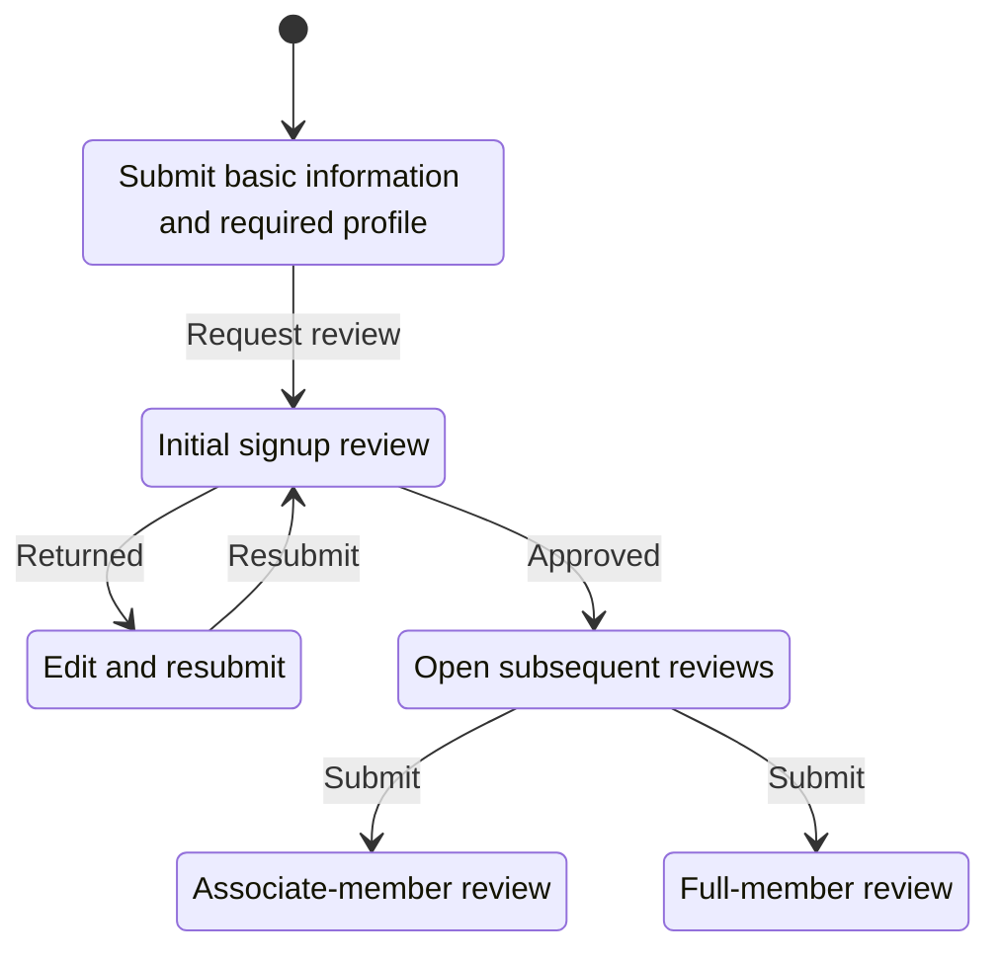
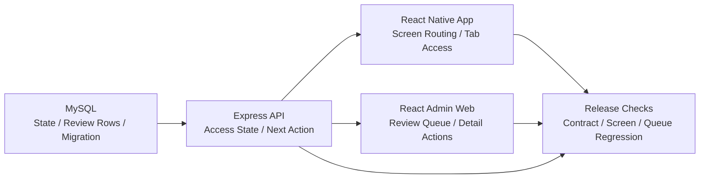

# Coupler

- Contribution period: Jul 2024 - Present
- Type: Mobile dating app
- Classification: Independent project, started as contracted maintenance

## Role and Responsibilities

I now lead development and operations across the React Native mobile app, Express API, React admin web, and MySQL database.

- Translate product decisions into the app, API, admin web, database schema, and migrations.
- Own QA, code review, merges, releases, deployment, and rollback.
- Keep policy, flows, architecture, database-change verification procedures, and deployment and rollback rules in the [public engineering documentation](https://coupler-developer.github.io/docs/) and tie them to release criteria.

## Using One Server Response for Signup and Review State

**Problem and diagnosis:** The previous signup application asked for about 30 fields at once, creating a large burden before the first review request. The larger consistency risk was that app screens, API result codes, and the admin review queue could independently infer submission, resubmission, approval, rejection, and the next screen, producing different flows.

**Constraints and decision:** The change had to span the existing React Native app, Express API, React admin web, MySQL data, and migrations. Instead of matching client-specific conditionals, I made the API the single source that returns access state and the next action, while the app and admin web interpret only valid server states. Missing or invalid state does not open a screen by inference.

**Implementation:** While moving the existing codebase to version 2.0.0, I reduced the initial application to basic information and the required profile, implemented state transitions that allow associate- and full-member reviews to proceed independently after approval, and reworked the database structure. The [signup response contract](https://coupler-developer.github.io/docs/policy/signup-response-contract/) separates successful responses from screen-routing state, while the [member review policy](https://coupler-developer.github.io/docs/policy/member-review-policy/) aligns submission and resubmission, signup versus settings-change reviews, and admin queue classification.

**Validation and result:** I kept API response-contract, mobile-routing, and admin review-queue regression tests in the same release checklist. I also migrated the admin web from JavaScript to TypeScript and added GitHub Actions CI checks for type errors and JavaScript reintroduction. Changes go through the [code review policy](https://coupler-developer.github.io/docs/policy/code-review-policy/), QA, and deployment and rollback procedures.

## Observed Result

Meta SDK event recorded upon reaching the initial signup review stage: observed about 10 times before the redesign and about 100 times after.

This value counts events recorded when the initial signup review stage was reached.

## Related Links

- [Google Play](https://play.google.com/store/apps/details?id=com.ritzy.fourhundred&pli=1)
- [App Store](https://apps.apple.com/kr/app/id1645569179)
- [Engineering documentation](https://coupler-developer.github.io/docs/)
