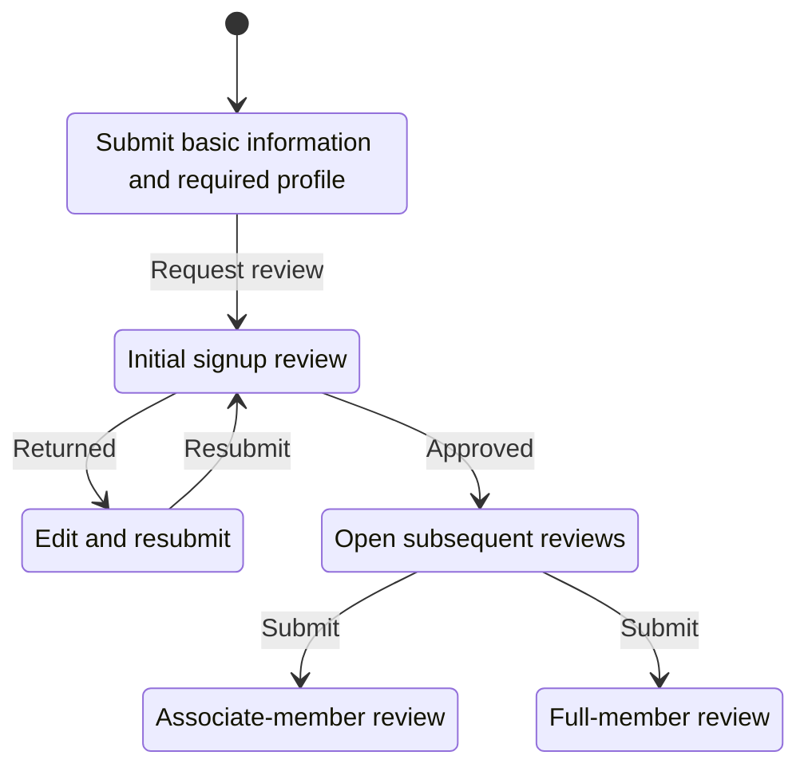
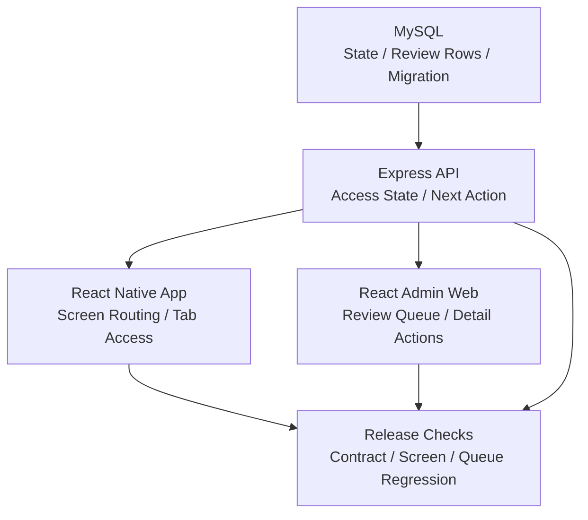
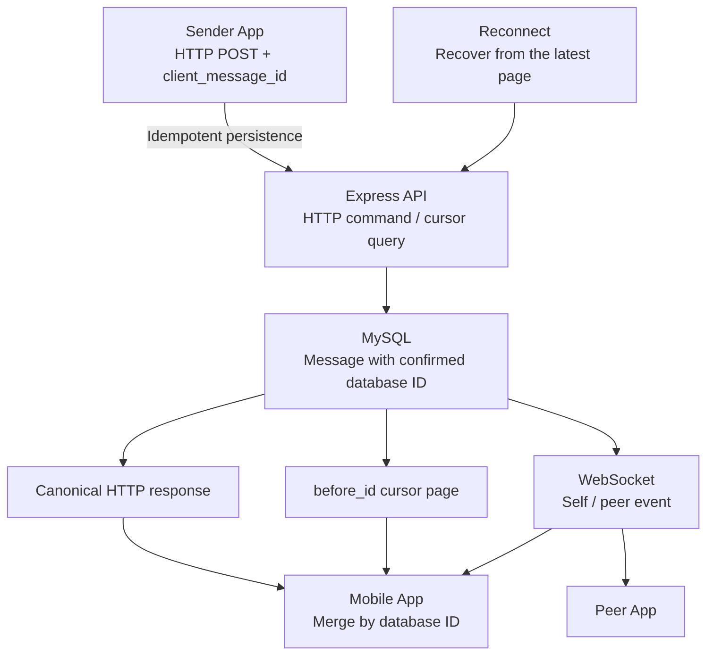

# Coupler

- Contribution period: Jul 2024 - Present
- Type: Mobile dating app
- Classification: Independent project, started as contracted maintenance

## Role and Responsibilities

I now lead development and operations across the React Native mobile app, Express API, React admin web, and MySQL database.

- Translate product decisions into the app, API, admin web, database schema, and migrations.
- Own QA, code review, merges, releases, deployment, and rollback.
- Keep policy, flows, architecture, database-change verification procedures, and deployment and rollback rules in the [public engineering documentation](https://coupler-developer.github.io/docs/) and tie them to release criteria.

## Using One Server Response for Signup and Review State

**Problem and diagnosis:** The previous signup application asked for about 30 fields at once, creating a large burden before the first review request. The larger consistency risk was that app screens, API result codes, and the admin review queue could independently infer submission, resubmission, approval, rejection, and the next screen, producing different flows.

**Constraints and decision:** The change had to span the existing React Native app, Express API, React admin web, MySQL data, and migrations. Instead of matching client-specific conditionals, I made the API the single source that returns access state and the next action, while the app and admin web interpret only valid server states. Missing or invalid state does not open a screen by inference.

**Implementation:** While moving the existing codebase to version 2.0.0, I reduced the initial application to basic information and the required profile, implemented state transitions that allow associate- and full-member reviews to proceed independently after approval, and reworked the database structure. The [signup response contract](https://coupler-developer.github.io/docs/policy/signup-response-contract/) separates successful responses from screen-routing state, while the [member review policy](https://coupler-developer.github.io/docs/policy/member-review-policy/) aligns submission and resubmission, signup versus settings-change reviews, and admin queue classification.

**Validation and result:** I kept API response-contract, mobile-routing, and admin review-queue regression tests in the same release checklist. Changes go through the [code review policy](https://coupler-developer.github.io/docs/policy/code-review-policy/), QA, and deployment and rollback procedures.

## Meta SDK Events Observed Before and After the Signup Review Redesign

Observed Meta SDK event count upon reaching the initial signup review stage: about 10 before the redesign and about 100 after.

This value counts events recorded when the initial signup review stage was reached.

## Additional Work

### Recovering Missing Messages in Real-Time Chat for One-to-One Conversations

**Problem and diagnosis:** On mobile networks, a response can be lost after a message is persisted, an HTTP response can overlap with the sender's WebSocket event, and peer messages can be missed while the connection is down. Treating every retry as a new command would duplicate messages and notifications, while trusting WebSocket delivery alone could leave the screen inconsistent with the database.

**Constraints and decision:** I made message sending an HTTP command that persists to the database first and assigned WebSocket the separate responsibility of distributing server-confirmed real-time state. A client-generated `client_message_id` is stored as a sender-scoped unique key for safe retries, while the database-assigned message ID is the ordering, cursor, and deduplication key.

**Implementation and validation:** When the same sender retries the same payload with the same `client_message_id`, the API returns the original message without publishing another WebSocket event or notification. Reusing the key with a different payload is rejected as a conflict. The mobile app merges the HTTP response and sender/peer WebSocket events by the database message ID. After reconnect or screen focus, it walks backward from the latest HTTP page with a `before_id` cursor until it reaches the previous synchronization boundary, merging any missing messages. Regression tests cover persistence, duplicate requests, payload conflicts, cursor pages, and mobile reconnect merging.

**Scaling consideration:** WebSocket fan-out currently uses the connection set of a single API process. To prepare for an event broker and an outbox when moving to multiple instances, the screen-recovery source remains the HTTP API and database.

### Migrating the Admin Web to TypeScript and Preventing JavaScript Reintroduction in CI

**Problem and diagnosis:** Because the admin screens, stores, and locale resources were written in JavaScript and JSX, expected value shapes and response contracts were not visible in types. Loose casts, missing locale keys, and runtime rendering errors therefore had to be addressed together during the migration.

**Constraints and decision:** I migrated the existing admin application incrementally to TypeScript and TSX, then made `allowJs: false` and type checking ongoing constraints rather than treating file conversion as a one-time task.

**Implementation and validation:** I converted the admin web's JavaScript and JSX code to TypeScript and TSX. GitHub Actions CI runs type checks and fails the migration guard if JavaScript or JSX returns under `src` or loose double casts are reintroduced.

## Related Links

- [Google Play](https://play.google.com/store/apps/details?id=com.ritzy.fourhundred&pli=1)
- [App Store](https://apps.apple.com/kr/app/id1645569179)
- [Engineering documentation](https://coupler-developer.github.io/docs/)
