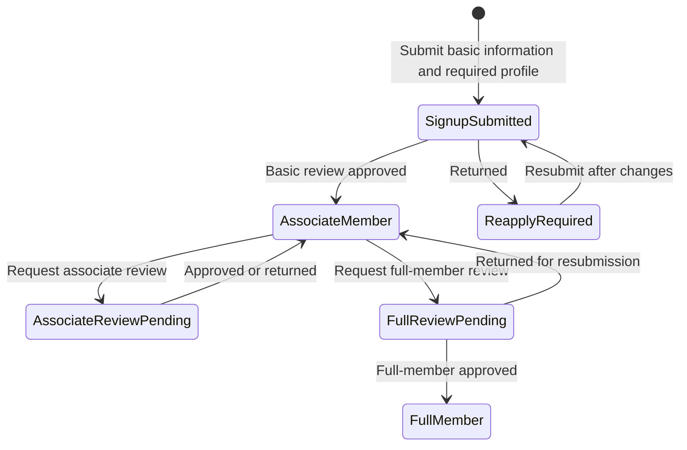
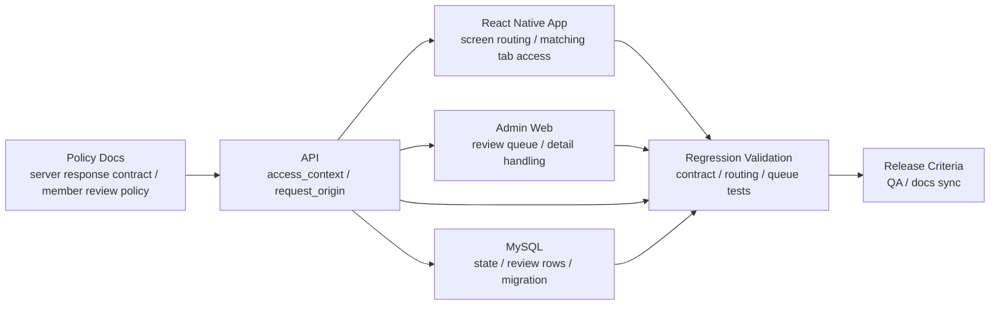

# Coupler

2024.07 - Present

## Overview

Coupler is product development work spanning a React Native app, API, admin web, and policy docs.
I now lead development for a product that began as outsourced maintenance work. From 1.0.0 operation through the 2.0.0 transition, I aligned screen flows, server responses, and admin review criteria around shared state contracts and review criteria.

## Role and Scope

- Development lead / Software Engineer
- Defined development and release criteria across the mobile app, API, admin web, and policy docs.
- Expanded the work from maintenance-centered ownership into development leadership across the mobile app, API, admin web, database structure, and policy docs.
- Broke customer and market response plus operating signals into requirement-sized units, then kept only product changes that passed state-contract, typecheck, migration-guard, and regression-validation criteria.

## Problem and Constraints

While moving the React Native product from its 1.0.0 initial implementation through the 2.0.0 transition, I needed the mobile app, API, and admin web to follow the same state model and release criteria.

The previous signup flow required users to enter roughly 30 fields at once, and the review stages and screen-branching rules were becoming a maintenance and product-operations burden.

## Signup And Review State Flow

The core change was splitting a roughly 30-field signup flow into staged review flows, then making app screens, API responses, and admin review queues follow the same state criteria.

## App / API / Admin Boundary

My role in this structure was to connect product criteria to the server response contract, app routing, admin review queues, database state, regression tests, and release criteria.

## Design and Implementation

- Set maintainability criteria by migrating the admin web to TypeScript and adding typecheck CI/migration guards.
- Unified screen branching by separating signup and review flows around usage flows and the [server response contract](https://github.com/coupler-developer/docs/blob/main/content/policy/signup-response-contract.md).
- Reworked the database structure and state flow so the roughly 30-field signup process could be split into general-member, associate-member, and full-member stages, with associate/full review submissions available in parallel or through tab navigation.
- Aligned submission/resubmission UX and review-list criteria so Admin/Mobile/API use the same [member review policy](https://github.com/coupler-developer/docs/blob/main/content/policy/member-review-policy.md).
- Broke customer and market response plus operating signals into requirement-sized units, then iterated app/API/admin web/database changes quickly.
- Reviewed AI-assisted development output against state contracts, typechecks, migration guards, regression validation, and policy-doc sync before keeping operational changes.
- Recorded testing, documentation-sync, and regression-safety criteria in the [code review policy](https://github.com/coupler-developer/docs/blob/main/content/policy/code-review-policy.md).

## Validation and Criteria

- Established the admin web TypeScript migration criteria through typecheck CI and migration guards.
- Reduced client-side guesswork and duplicate review-queue risk through the signup response contract and member review policy.

## Result

Within the 2.0.0 transition scope, I clarified development criteria across the mobile app, API, and admin web, and changed the roughly 30-field signup flow into staged review flows. The signup response contract, member review policy, and code review criteria are captured in policy docs.

Meta SDK postback event count showed review-request-related events increasing from roughly 40 to roughly 1.1k over one month.

While operating the product, I turned customer and market response into product changes while keeping the mobile app, API, admin web, database, and policy docs aligned around the same state model and release criteria.

## Links

- [Google Play](https://play.google.com/store/apps/details?id=com.ritzy.fourhundred&pli=1)
- [App Store](https://apps.apple.com/kr/app/id1645569179)
- [Development docs](https://github.com/coupler-developer/docs)

## Artifacts

- [Signup response contract](https://github.com/coupler-developer/docs/blob/main/content/policy/signup-response-contract.md)
- [Member review policy](https://github.com/coupler-developer/docs/blob/main/content/policy/member-review-policy.md)
- [Code review policy](https://github.com/coupler-developer/docs/blob/main/content/policy/code-review-policy.md)

## Skills

React Native, TypeScript, Express, MySQL
