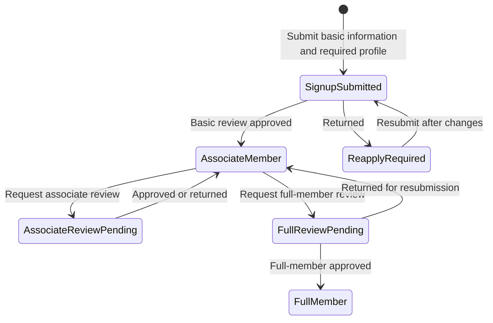
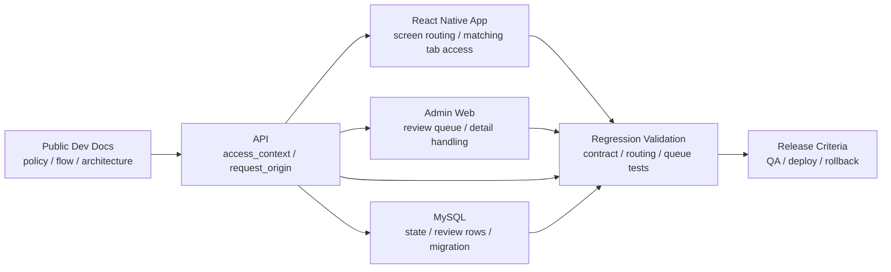

# Coupler

2024.07 - Present

- Engagement: Contract project

## Overview

Coupler is a contract project where I lead development for a React Native mobile dating app.
From 1.0.0 operation through the 2.0.0 transition, I changed a roughly 30-field signup request into staged review flows and rebuilt app screen flows, API responses, admin review queues, and database state around a shared signup/review state contract.

## Role and Scope

- Development lead / Software Engineer
- Lead development across the mobile app, API, admin web, database structure, and public development docs.
- Documented policy, flow, architecture, release, deployment, and rollback criteria.
- Keep product changes behind state-contract, typecheck, migration-guard, and regression-validation checks.

## Problem and Constraints

While moving the React Native product from its 1.0.0 initial implementation through the 2.0.0 transition, I needed the mobile app, API, and admin web to follow a shared signup/review state contract.

The previous signup flow required users to enter roughly 30 fields at once, creating a high input burden before they could reach review submission. Review stages and screen-branching rules also had to use the same state values across the server response contract, member review policy, app screens, and admin review queue.

## Representative Workflow

The core change was reducing a roughly 30-field signup flow into staged review flows centered on basic information and required profile material, then making app screens, API responses, and admin review queues use the same review states.

## App / API / Admin Boundary

My role in this structure was to translate product requirements into policy/flow/architecture docs, server response contracts, app routing, admin review queues, database state, regression tests, and release/deployment/rollback checks.

## Design and Implementation

- Fixed the maintainability path by migrating the admin web to TypeScript and adding typecheck CI/migration guards.
- Unified screen branching by separating signup and review flows around usage flows and the [server response contract](https://github.com/coupler-developer/docs/blob/main/content/policy/signup-response-contract.md).
- Reworked the database structure and state flow so the roughly 30-field signup process could be split into general-member, associate-member, and full-member stages, with associate/full review submissions available in parallel or through tab navigation.
- Aligned submission/resubmission UX and review-list behavior so Admin/Mobile/API use the same [member review policy](https://github.com/coupler-developer/docs/blob/main/content/policy/member-review-policy.md).
- Recorded testing, documentation-sync, and regression-safety checks in the [code review policy](https://github.com/coupler-developer/docs/blob/main/content/policy/code-review-policy.md).

## Validation

- Used typecheck CI and migration guards to keep the admin web TypeScript migration from slipping back.
- Reduced client-side guesswork and duplicate review-queue risk through the signup response contract and member review policy.

## Result

During the 2.0.0 transition, I clarified policy, flow, architecture, and release/deployment/rollback criteria across the mobile app, API, admin web, and database, and changed the roughly 30-field signup flow into staged review flows centered on basic information and required profile material. The signup response contract, member review policy, and code review checks are captured in public development docs.

The Meta SDK CompleteRegistration event, recorded when a person reached the first signup review, was observed at roughly 10 events before the signup/review-flow redesign and roughly 100 afterward.

While operating the product, I turned customer and market response into product changes while keeping the mobile app, API, admin web, database, and public development docs aligned around a shared signup/review state contract and release/deployment/rollback flow.

## Links

- [Google Play](https://play.google.com/store/apps/details?id=com.ritzy.fourhundred&pli=1)
- [App Store](https://apps.apple.com/kr/app/id1645569179)
- [Development docs](https://github.com/coupler-developer/docs)

## Artifacts

- [Public development docs](https://github.com/coupler-developer/docs)
- [Architecture docs](https://github.com/coupler-developer/docs/tree/main/content/architecture)
- [Flow docs](https://github.com/coupler-developer/docs/tree/main/content/flows)
- [Release docs](https://github.com/coupler-developer/docs/tree/main/content/releases)
- [Signup response contract](https://github.com/coupler-developer/docs/blob/main/content/policy/signup-response-contract.md)
- [Member review policy](https://github.com/coupler-developer/docs/blob/main/content/policy/member-review-policy.md)
- [Code review policy](https://github.com/coupler-developer/docs/blob/main/content/policy/code-review-policy.md)

## Skills

React Native, TypeScript, Express, MySQL
