# Coupler

- Contribution period: Jul 2024 - Present
- Type: Mobile dating app
- Classification: Independent project, started as contracted maintenance

## Role and Responsibilities

I now lead development and operations across the React Native mobile app, Express API, React admin web, and MySQL database.

- Translate product decisions into the app, API, admin web, database schema, and migrations.
- Own QA, code review, merges, releases, deployment, and rollback.
- Keep policy, flows, architecture, database-change verification procedures, and deployment and rollback rules in the [public engineering documentation](https://coupler-developer.github.io/docs/) and tie them to release criteria.

## Centralizing Signup and Review State During a Signup-Flow Redesign

**Problem and diagnosis:** Redesigning the previous signup application's roughly 30 input fields into stages also changed which screen should follow submission, resubmission, approval, or rejection. The app, API result codes, and admin review queue each inferred those states independently, so changing the signup flow alone risked making the three paths diverge. I therefore unified the signup and review state before adding more screen-specific conditions.

**Constraints and decision:** The change had to span the existing React Native app, Express API, React admin web, MySQL data, and migrations. The initial submission needed to reduce input burden while retaining the basic information and required profile materials for the first review; after approval, associate and full-member reviews needed to proceed independently. Instead of matching client-specific conditionals, I made the API the single source for access state and screen-routing state, while the app and admin web interpret only valid server states. Missing or invalid state does not open a screen by inference.

Scroll horizontally to inspect the full flow.
{ .diagram-scroll-hint }

{ .editorial-diagram-scroll role="group" tabindex="0" aria-label="Coupler signup and member-review state diagram" }

**Implementation:** While moving the existing codebase to version 2.0.0, I reduced the initial application to basic information and the required profile, implemented state transitions that allow associate- and full-member reviews to proceed independently after approval, and reworked the database structure. The [signup response contract](https://coupler-developer.github.io/docs/policy/signup-response-contract/) separates successful responses from screen-routing state, while the [member review policy](https://coupler-developer.github.io/docs/policy/member-review-policy/) aligns submission and resubmission, signup versus settings-change reviews, and admin queue classification.

**Validation and result:** I regression-tested the API response contract, mobile routing, and admin review queue to verify that server-side review state was reflected consistently in the app and admin queue. Missing or invalid state does not open a screen by inference. The change also went through the [code review policy](https://coupler-developer.github.io/docs/policy/code-review-policy/), QA, and deployment and rollback procedures.

## Connecting N-to-N Group Meetings as One Operational Lifecycle

**Problem and diagnosis:** A group meeting involving several members and an operator is more than a scheduling screen. Recruitment, application, event confirmation, participant approval, chat access, completion, and review eligibility change at different times. If each screen and API inferred those states independently, a canceled application could reappear, chat could open before event confirmation, or writing could remain available after the meeting ended.

**Constraints and decision:** I had to add the feature within the existing app, API, admin web, and database while aligning operator management of events and participants with member application, reapplication, leaving, chat, and reviews. I separated the event and application lifecycles under server-owned state, initialized group chat only when the event was confirmed for the first time, and derived chat availability and completion from server time.

### Event lifecycle

Scroll horizontally to inspect the full lifecycle.
{ .diagram-scroll-hint }

{ .editorial-diagram-scroll role="group" tabindex="0" aria-label="Group meeting event lifecycle diagram" }

### Participant application lifecycle

Scroll horizontally to inspect the full lifecycle.
{ .diagram-scroll-hint }

{ .editorial-diagram-scroll role="group" tabindex="0" aria-label="Group meeting participant application lifecycle diagram" }

**Implementation:** I implemented meeting, application, participant, chat, and review state in the API and database, then connected admin workflows for creation, publication, approval and cancellation, participants, reviews, and reports. A teammate built parts of the initial mobile list, detail, and chat UI; I connected application state, real-time message merging, read state, notification markers, reapplication, reporting, and reviews to that collaborative mobile flow. Group messages are persisted through REST and received as server-confirmed events over WebSocket.

**Validation and result:** Event publication, confirmation, reopening, and completion, along with application, approval, leaving, reapplication, and review transitions, are release criteria together with API, admin-web, and mobile regressions. I have not yet run an operational smoke test spanning FCM, real-time connections, and the scheduler. I documented the regression-tested chat opening, read-only transition, and full lifecycle in the [group meeting system documentation](https://coupler-developer.github.io/docs/architecture/group-meeting-system/) and released them as v2.3.0.

## Additional Work

### Three Real-Time Chat Surfaces and One-to-One Gap Recovery

I connected real-time messages and unread-count updates across curator chat, one-to-one matching chat, and N-to-N group chat. All three keep the database and HTTP reads as the durable source while WebSocket distributes confirmed state to connected clients. The idempotent retry and cursor-recovery design below applies specifically to one-to-one matching chat.

**Problem and diagnosis:** On mobile networks, a response can be lost after a message is persisted, an HTTP response can overlap with the sender's WebSocket event, and peer messages can be missed while the connection is down. Treating every retry as a new command would duplicate messages and notifications, while trusting WebSocket delivery alone could leave the screen inconsistent with the database.

**Constraints and decision:** I made message sending an HTTP command that persists to the database first and assigned WebSocket the separate responsibility of distributing server-confirmed real-time state. A client-generated `client_message_id` is stored as a sender-scoped unique key for safe retries, while the database-assigned message ID is the ordering, cursor, and deduplication key.

Scroll horizontally to inspect the full flow.
{ .diagram-scroll-hint }

{ .editorial-diagram-scroll role="group" tabindex="0" aria-label="Coupler one-to-one chat persistence, real-time delivery, and reconnect recovery diagram" }

**Implementation and validation:** When the same sender retries the same payload with the same `client_message_id`, the API returns the original message without publishing another WebSocket event or notification. Reusing the key with a different payload is rejected as a conflict. The mobile app merges the HTTP response and sender/peer WebSocket events by the database message ID. After reconnect or screen focus, it walks backward from the latest HTTP page with a `before_id` cursor until it reaches the previous synchronization boundary, merging any missing messages. Regression tests cover persistence, duplicate requests, payload conflicts, cursor pages, and mobile reconnect merging.

**Scaling consideration:** WebSocket fan-out currently uses the connection set of a single API process. To prepare for an event broker and an outbox when moving to multiple instances, the screen-recovery source remains the HTTP API and database.

### An Interruptible Database Migration Runner and Recovery Criteria

**Problem and decision:** An operational database change had to prevent three unsafe states together: a schema change without an execution record, a partially applied sequence, and an older API continuing to write against the new schema. I fixed the changes and their order before execution, then blocked existing writes and checked in-flight work, backup, and preconditions before mutation.

**Implementation and validation:** I implemented an interruptible tool that records each change step, its completion condition, and its execution history. If interrupted, it keeps writes blocked and resumes or recovers only after confirming the original plan. In development, I found a state where the schema change and completion condition had succeeded but one execution record was missing; the tool repaired only that record. The v2.3.0 production changes predated this tool; I closed that state by rechecking the live schema, existing execution records, and completion conditions. These rules are maintained in the [database migration policy](https://coupler-developer.github.io/docs/policy/db-migration-gate-policy/).

### Migrating the Admin Web to TypeScript and Preventing JavaScript Reintroduction in CI

**Problem and diagnosis:** Because the admin screens, stores, and locale resources were written in JavaScript and JSX, expected value shapes and response contracts were not visible in types. Loose casts, missing locale keys, and runtime rendering errors therefore had to be addressed together during the migration.

**Constraints and decision:** I migrated the existing admin application incrementally to TypeScript and TSX, then made `allowJs: false` and type checking ongoing constraints rather than treating file conversion as a one-time task.

**Implementation and validation:** I converted the admin web's JavaScript and JSX code to TypeScript and TSX. GitHub Actions CI runs type checks and fails the migration guard if JavaScript or JSX returns under `src` or loose double casts are reintroduced.

## Related Links

- [Google Play](https://play.google.com/store/apps/details?id=com.ritzy.fourhundred&pli=1)
- [App Store](https://apps.apple.com/kr/app/id1645569179)
- [Engineering documentation](https://coupler-developer.github.io/docs/)
