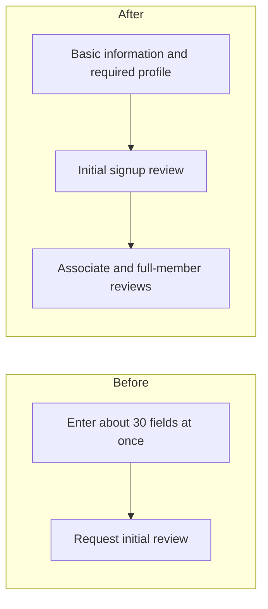
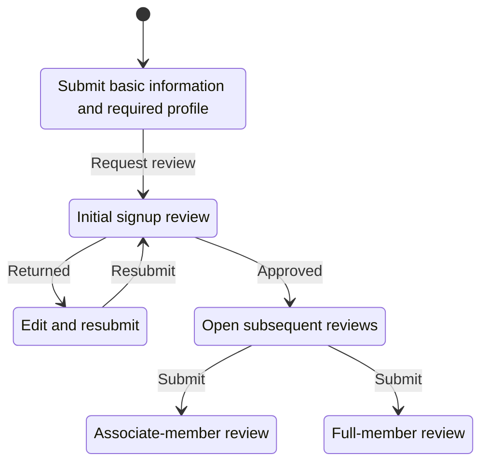
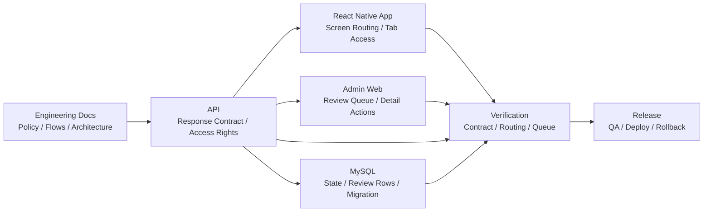

# Coupler

- Contribution period: Jul 2024 - Present
- Type: Mobile dating app
- Classification: Independent project, started as contracted maintenance

## Overview

I now lead development and operations across the React Native mobile app, Express API, React admin web, and MySQL database. While moving the existing codebase to version 2.0.0, I implemented signup and review state transitions and reworked the database structure so the app, API, and admin web use the same review states.

## Role and Responsibilities

- Translate product decisions into the app, API, admin web, DB schema, and migrations.
- Own QA, code review, merges, releases, deployment, and rollback.
- Keep policy, flows, architecture, DB-change verification procedures, and deployment and rollback rules in the [public engineering documentation](https://coupler-developer.github.io/docs/) and tie them to release criteria.

## Signup Flow Redesign

The previous signup application asked for about 30 fields at once, creating a large burden before the first review request. If the server response, app screens, and admin queue inferred review state independently, submission, resubmission, approval, and rejection behavior could diverge.

I reduced the initial application to basic information and the required profile, then separated subsequent reviews so they could proceed independently after approval.

## Signup and Review State Transitions

The app opens submission, resubmission, and subsequent-review tabs from review state supplied by the server.

## Responsibilities across App, API, and Admin

The API response contract supplies routing and access rights. The app and admin web apply it to the user flow and review queue, while DB state, migrations, regression tests, and release checks are reviewed within the same change.

## Implementing the Signup and Review Flow and Verifying the Release

- The [signup response contract](https://coupler-developer.github.io/docs/policy/signup-response-contract/) separates successful API responses from screen-routing state so clients do not infer server state.
- The [member review policy](https://coupler-developer.github.io/docs/policy/member-review-policy/) defines submission and resubmission, separates signup reviews from reviews triggered by settings changes, and standardizes admin queue classification.
- I migrated the admin web from JavaScript to TypeScript and added GitHub Actions CI checks for type errors and JavaScript reintroduction.
- API contract, mobile routing, and admin queue regression tests, together with the [code review policy](https://coupler-developer.github.io/docs/policy/code-review-policy/), are part of release checks.

## Observed Result

Meta SDK event recorded upon reaching the initial signup review stage: observed about 10 times before the redesign and about 100 times after.

## Related Links

- [Google Play](https://play.google.com/store/apps/details?id=com.ritzy.fourhundred&pli=1)
- [App Store](https://apps.apple.com/kr/app/id1645569179)
- [Engineering documentation](https://coupler-developer.github.io/docs/)

## Technologies

React Native, React, TypeScript, Express, MySQL, API response design, signup/review state management, database migrations, GitHub Actions
