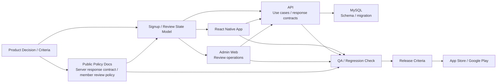

# Coupler

2024.07 - Present

## Overview

Coupler is a personal product development project spanning a React Native app, API, admin web, and public docs.
I now lead development for a product that began as outsourced maintenance work. From 1.0.0 operation through the 2.0.0 transition, I clarified TypeScript migration criteria, signup/review flow criteria, and development/review criteria through AX, an AI Transformation approach applied to the development process.

I keep this page separate from the representative regular-work platform cases. It is a product-ownership case where I operated a personal product and aligned the mobile app, API, and admin web around the same state contracts and review policies.

## Role and Scope

- Development lead / Software Engineer
- Defined development and release criteria across the mobile app, API, admin web, and public docs.
- Expanded the work from maintenance-centered ownership into development leadership across the mobile app, API, admin web, database structure, and public docs.
- Applied AX as a development workflow for cycling through problem decomposition, implementation, review, regression testing, validation, and documentation criteria.

## Problem and Constraints

While moving the React Native product from its 1.0.0 initial implementation through the 2.0.0 transition, I needed the mobile app, API, and admin web to follow the same state model and release criteria.

The previous signup flow required users to enter roughly 30 fields at once, and the review stages and screen-branching rules were becoming a maintenance and product-operations burden.

## Representative Structure

My role in this structure was to connect product criteria to public policy docs, the app, API, admin web, database structure, QA, and release criteria. In the public portfolio, I use public docs and product components instead of private repository names or operational access details.

## Design and Implementation

- Set maintainability criteria by migrating the admin web to TypeScript and adding typecheck CI/migration guards.
- Unified screen branching by separating signup and review flows around use cases and the [server response contract](https://github.com/coupler-developer/docs/blob/main/content/policy/signup-response-contract.md).
- Reworked the database structure and state flow so the roughly 30-field signup process could be split into general-member, associate-member, and full-member stages, with associate/full review submissions available in parallel or through tab navigation.
- Aligned submission/resubmission UX and review-list criteria so Admin/Mobile/API use the same [member review policy](https://github.com/coupler-developer/docs/blob/main/content/policy/member-review-policy.md).
- Used AX to split requirements into smaller units, then iterate app/API/admin web/database changes through implementation, review, regression validation, and documentation sync.
- Recorded testing, documentation-sync, and regression-safety criteria in the [code review policy](https://github.com/coupler-developer/docs/blob/main/content/policy/code-review-policy.md).

## Validation and Criteria

- Established the admin web TypeScript migration criteria through typecheck CI and migration guards.
- Reduced client-side guesswork and duplicate review-queue risk through the signup response contract and member review policy.

## Result

Within the 2.0.0 transition scope, I clarified development criteria across the mobile app, API, and admin web, and changed the roughly 30-field signup flow into staged review flows. The signup response contract, member review policy, and code review criteria are captured in public docs.

Within the public scope, this page focuses on state contracts, review policies, TypeScript migration criteria, AX, and review criteria produced while operating the product and tied back to code standards.

## Links

- [Google Play](https://play.google.com/store/apps/details?id=com.ritzy.fourhundred&pli=1)
- [App Store](https://apps.apple.com/app/id1645569179)
- [Public development docs](https://github.com/coupler-developer/docs)

## Skills

React Native, TypeScript, Express, MySQL
