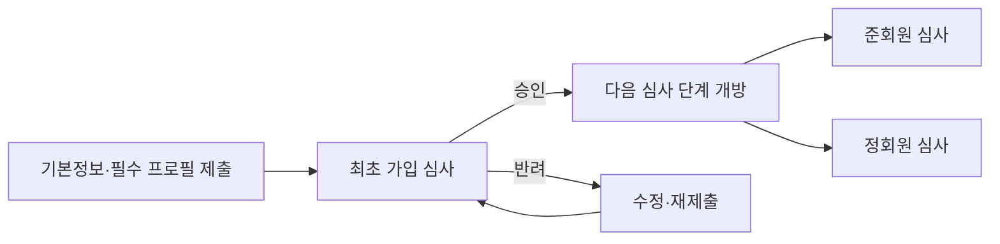
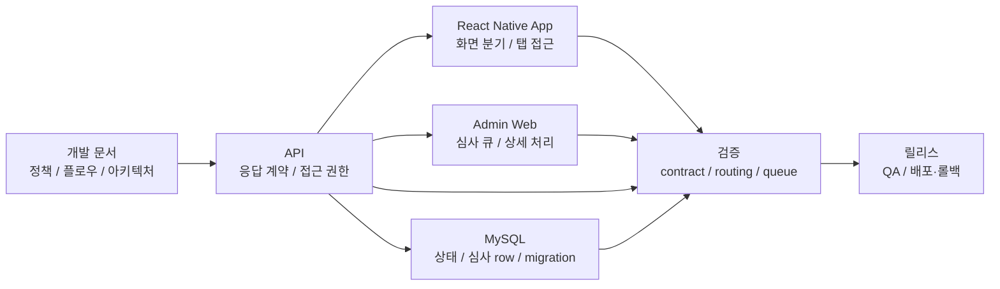

# Coupler

- 참여 기간: 2024.07 - 현재
- 유형: 모바일 소개팅 앱
- 구분: 개인 프로젝트(외주 유지보수로 시작)

## 개요

현재 React Native 모바일 앱, API, 관리자 웹, DB의 개발과 운영을 총괄하고 있습니다. 기존 코드베이스를 2.0.0으로 전환하면서 가입·심사 상태 전이 로직을 구현하고 DB 구조를 재구성해 앱·API·관리자 웹이 같은 심사 상태를 사용하도록 했습니다.

## 역할과 책임

- 기획 결정을 앱, API, 관리자 웹, DB schema와 migration에 반영합니다.
- QA, 코드 리뷰, merge, 릴리스, 배포·롤백을 책임집니다.
- 정책·플로우·아키텍처, DB 변경 검증 절차, 배포·롤백 기준을 [공개 개발 문서](https://coupler-developer.github.io/docs/)로 정리하고 릴리스 기준에 연결합니다.

## 문제

기존 가입 신청은 약 30개 항목을 한 번에 입력해야 해 최초 심사 요청까지의 부담이 컸습니다. 심사 상태도 서버 응답, 앱 화면, 관리자 심사 큐가 각자 추론하면 제출·재제출·승인·반려 흐름이 어긋날 수 있었습니다.

## 가입·심사 흐름

최초 신청은 기본정보와 필수 프로필 중심으로 줄이고, 최초 가입 심사 승인 뒤 준회원·정회원 심사를 병렬로 제출하거나 탭을 이동하며 진행하도록 상태 전이를 나눴습니다.

## App / API / Admin 책임 경계

API 응답 계약이 화면 분기와 접근 권한을 제공하고, 앱과 관리자 웹은 이를 각각 사용자 흐름과 심사 큐에 적용합니다. DB 상태와 migration, 회귀 테스트, 릴리스 확인 항목은 같은 변경 단위에서 점검합니다.

## 구현과 검증

- [회원가입 응답 계약](https://coupler-developer.github.io/docs/policy/signup-response-contract/)을 기준으로 성공 응답과 화면 분기 상태를 분리하고, 앱이 서버 상태를 추측하지 않도록 했습니다.
- [회원 심사 정책](https://coupler-developer.github.io/docs/policy/member-review-policy/)으로 제출·재제출, 가입 심사와 설정 수정 심사, 관리자 대기 큐의 분류 기준을 통일했습니다.
- 관리자 웹의 JavaScript 코드를 TypeScript로 마이그레이션하고, CI에 typecheck와 JavaScript 재유입 방지 검사를 추가했습니다.
- API contract, mobile routing, 관리자 심사 큐의 회귀 테스트와 [코드 리뷰 정책](https://coupler-developer.github.io/docs/policy/code-review-policy/)을 릴리스 확인 항목으로 사용했습니다.
- LLM을 문제 분해와 구현 보조에 사용했지만, 요구사항 정의, 제품·기술 판단, 코드 리뷰, 테스트 기준, merge와 릴리스 결정은 개발총괄로 직접 책임졌습니다.

## 관측 결과

Meta SDK 최초 가입 심사 도달 이벤트: 개편 전 약 10건, 개편 후 약 100건 관측

## 관련 링크

- [Google Play](https://play.google.com/store/apps/details?id=com.ritzy.fourhundred&pli=1)
- [App Store](https://apps.apple.com/kr/app/id1645569179)
- [개발 문서](https://coupler-developer.github.io/docs/)

## 기술

React Native, TypeScript, Express, MySQL
