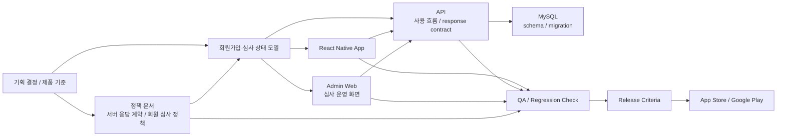

# Coupler

2024.07 - Present

## 개요

React Native 앱, API, 관리자 웹, 정책 문서로 구성된 개인 제품 개발 프로젝트입니다.
외주 유지보수로 시작한 제품을 현재 개발총괄로 맡고 있습니다. 1.0.0 운영 이후 2.0.0 전환 과정에서 화면 흐름, 서버 응답, 관리자 심사 기준이 같은 상태 계약과 리뷰 기준을 따르도록 정리했습니다.

정규 경력의 대표 플랫폼 작업과 분리해, 개인 제품을 운영하며 모바일 앱, API, 관리자 웹이 같은 상태 계약과 심사 정책을 따르도록 정리한 제품 오너십 작업으로 둡니다.

## 역할과 범위

- 개발총괄 / Software Engineer
- 모바일 앱, API, 관리자 웹, 정책 문서의 개발 기준과 릴리스 기준을 정리했습니다.
- 유지보수 중심으로 시작한 제품을 현재는 모바일 앱, API, 관리자 웹, DB 구조, 정책 문서까지 함께 다루는 범위로 총괄하고 있습니다.
- 고객·시장 반응과 운영 지표를 기준으로 기획을 조정하고, AI-assisted development를 제품 변경을 빠르게 만들고 검증하는 개발 운영 방식으로 적용하고 있습니다.

## 문제와 제약

React Native 제품을 1.0.0 초기 구현 이후 2.0.0까지 전환하면서 모바일 앱, API, 관리자 웹이 같은 상태 모델과 릴리스 기준으로 움직이도록 정리해야 했습니다.

기존 가입 신청은 약 30개 항목을 한 번에 입력해야 하는 구조였고, 심사 단계와 화면 분기 기준이 제품 운영과 유지보수에 부담을 주고 있었습니다.

## 대표 구조

위 구조에서 제 역할은 제품 기준을 정책 문서, 앱, API, 관리자 웹, DB 구조, QA와 릴리스 기준으로 이어지게 만드는 것이었습니다.

## 설계와 구현

- 관리자 웹 TypeScript 전환과 typecheck CI/migration guard로 유지보수 기준을 고정했습니다.
- 회원가입과 심사 흐름을 사용 흐름과 [서버 응답 계약](https://github.com/coupler-developer/docs/blob/main/content/policy/signup-response-contract.md) 중심으로 분리해 화면 분기 기준을 단일화했습니다.
- 한 번에 약 30개 항목을 입력하던 가입 신청을 일반회원, 준회원, 정회원 단계로 나누고, 준회원·정회원 심사를 병렬로 제출하거나 탭을 이동하며 진행할 수 있도록 DB 구조와 상태 흐름을 재구성했습니다.
- Admin/Mobile/API가 같은 [회원 심사 정책](https://github.com/coupler-developer/docs/blob/main/content/policy/member-review-policy.md)을 쓰도록 제출/재제출 UX와 심사 목록 기준을 정리했습니다.
- 고객·시장 반응과 운영 지표를 요구사항 단위로 쪼개고, 앱/API/관리자 웹/DB 변경을 빠르게 반복했습니다.
- AI-assisted development 결과물은 상태 계약, typecheck, migration guard, 회귀 검증, 정책 문서 동기화 기준으로 검토해 운영 가능한 변경만 반영했습니다.
- [코드 리뷰 정책](https://github.com/coupler-developer/docs/blob/main/content/policy/code-review-policy.md)에 테스트, 문서 동기화, 회귀 안전성 기준을 남겼습니다.

## 검증과 기준

- typecheck CI와 migration guard로 관리자 웹 TypeScript 전환 기준을 고정했습니다.
- 회원가입 응답 계약과 회원 심사 정책으로 클라이언트 추측 라우팅과 심사 큐 중복 위험을 줄였습니다.

## 결과

2.0.0 전환 범위에서 모바일 앱, API, 관리자 웹의 개발 기준을 정리하고, 약 30개 항목을 한 번에 받던 가입 신청을 단계형 심사 흐름으로 개편했습니다. 회원가입 응답 계약·회원 심사 정책·코드 리뷰 기준은 정책 문서로 남겼습니다.

제품 운영 과정에서 고객·시장 반응을 제품 변경으로 빠르게 전환하되, 상태 계약, 심사 정책, TypeScript 전환 기준, AI-assisted development 검증 기준, 리뷰 기준을 문서와 코드 기준으로 남겼습니다.

## 링크

- [Google Play](https://play.google.com/store/apps/details?id=com.ritzy.fourhundred&pli=1)
- [App Store](https://apps.apple.com/kr/app/id1645569179)
- [개발 문서](https://github.com/coupler-developer/docs)

## 산출물

- [회원가입 응답 계약](https://github.com/coupler-developer/docs/blob/main/content/policy/signup-response-contract.md)
- [회원 심사 정책](https://github.com/coupler-developer/docs/blob/main/content/policy/member-review-policy.md)
- [코드 리뷰 정책](https://github.com/coupler-developer/docs/blob/main/content/policy/code-review-policy.md)

## 기술

React Native, TypeScript, Express, MySQL
